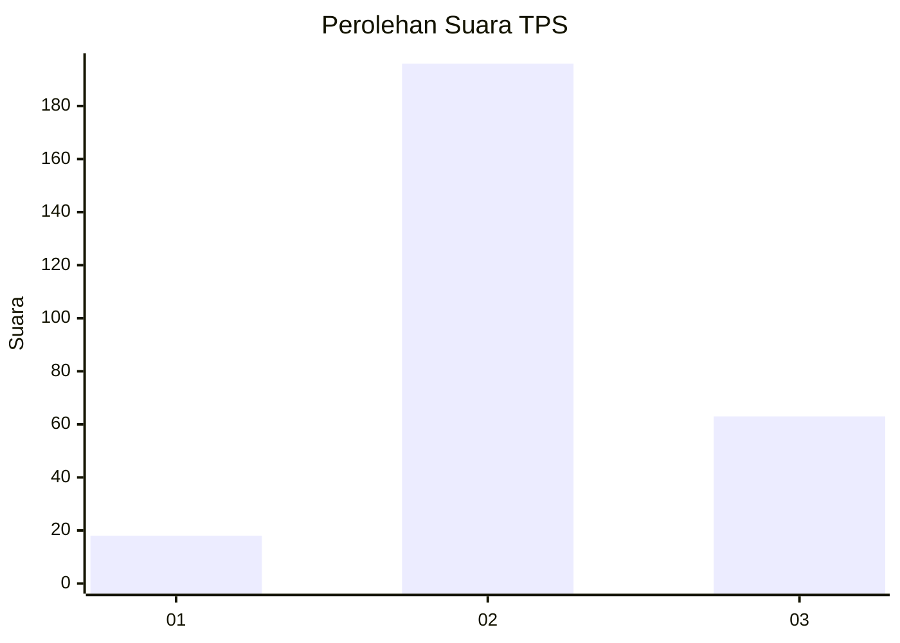
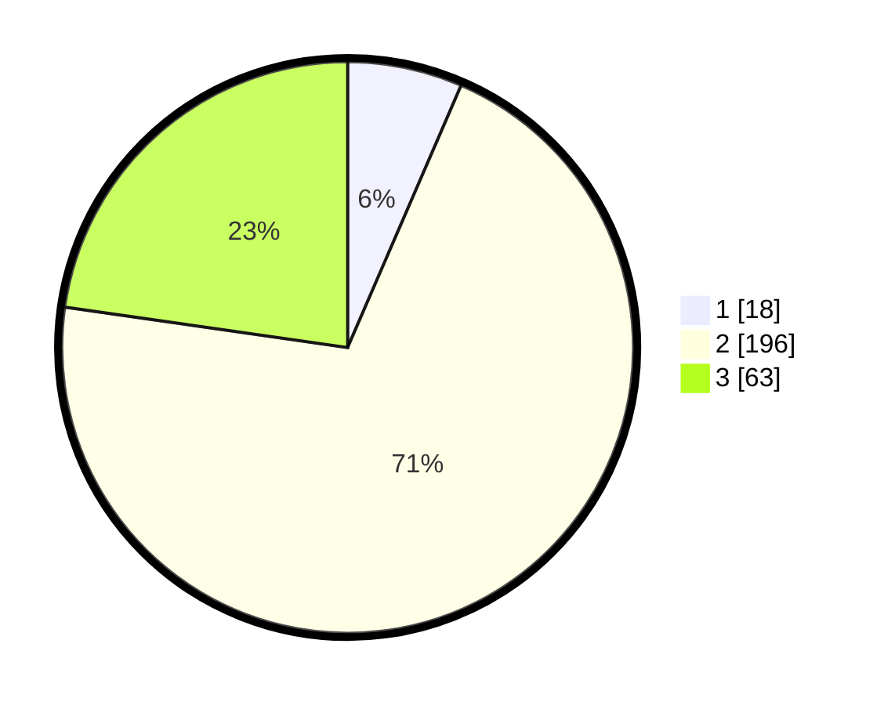

# Hasil

## Grafik

## Tabel

| No. | Nama Paslon    | Suara | Suara (raw) | Persentase |
|:--- |:-------------- | -----:| -----------:| ----------:|
| 1   | ANIES MUHAIMIN | 18    | [18][p-1]   | 6,50       |
| 2   | PRABOWO GIBRAN | 196   | [196][p-2]  | 70,76      |
| 3   | GANJAR MAHFUD  | 63    | [63][p-3]   | 22,74      |

[p-1]: https://github.com/gigit-pemilu/pemilu-2024-91-papua/blob/main/pilpres/hitung-suara/sub/91-papua/sub/71-kota-jayapura/sub/01-jayapura-utara/sub/1004-imbi/sub/031-tps/sub/paslon-1.txt
[p-2]: https://github.com/gigit-pemilu/pemilu-2024-91-papua/blob/main/pilpres/hitung-suara/sub/91-papua/sub/71-kota-jayapura/sub/01-jayapura-utara/sub/1004-imbi/sub/031-tps/sub/paslon-2.txt
[p-3]: https://github.com/gigit-pemilu/pemilu-2024-91-papua/blob/main/pilpres/hitung-suara/sub/91-papua/sub/71-kota-jayapura/sub/01-jayapura-utara/sub/1004-imbi/sub/031-tps/sub/paslon-3.txt

## Foto C Plano

https://sirekap-obj-formc.kpu.go.id/ac43/pemilu/ppwp/91/71/01/10/04/9171011004031-20240214-223429--8ab8689b-4386-4260-b131-83aef183f1ad.jpg

https://sirekap-obj-formc.kpu.go.id/ac43/pemilu/ppwp/91/71/01/10/04/9171011004031-20240214-223733--97dbc50b-356d-4264-b8ec-9716b7cff798.jpg

https://sirekap-obj-formc.kpu.go.id/ac43/pemilu/ppwp/91/71/01/10/04/9171011004031-20240214-223900--779bd073-295b-4a79-9c72-0e25eae50f2d.jpg

## Metadata

| Key        | Value               |
| ---------- | ------------------- |
| Time Stamp | 2024-02-25 11:00:00 |

