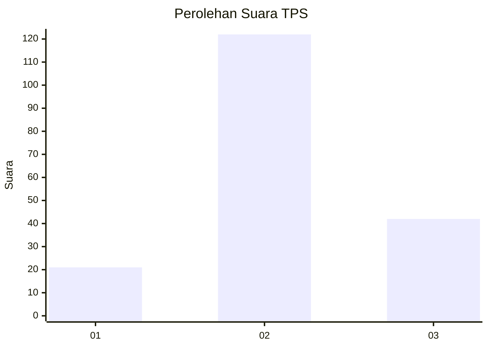
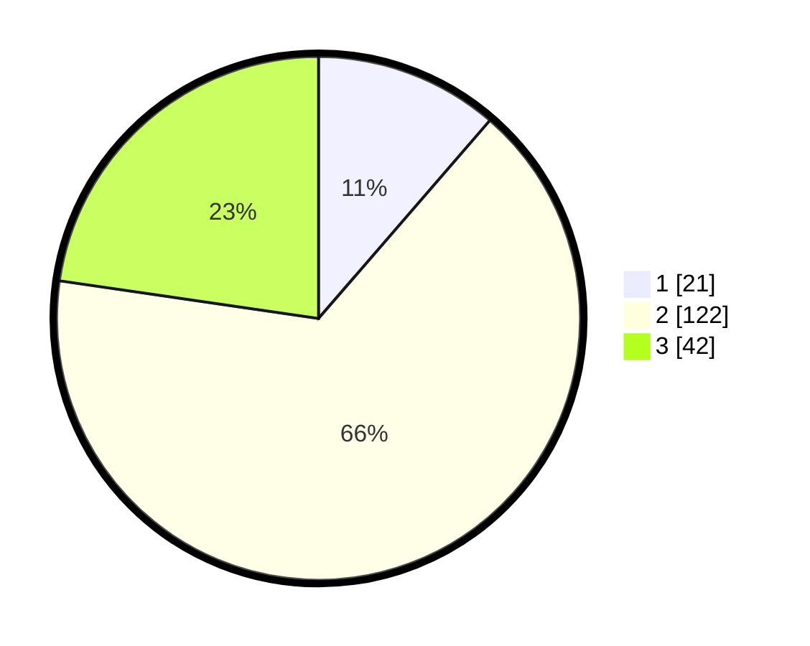

# Hasil

## Grafik

## Tabel

| No. | Nama Paslon    | Suara | Suara (raw) | Persentase |
|:--- |:-------------- | -----:| -----------:| ----------:|
| 1   | ANIES MUHAIMIN | 21    | [21][p-1]   | 11,35      |
| 2   | PRABOWO GIBRAN | 122   | [122][p-2]  | 65,95      |
| 3   | GANJAR MAHFUD  | 42    | [42][p-3]   | 22,70      |

[p-1]: https://github.com/gigit-pemilu/pemilu-2024-91-papua/blob/main/pilpres/hitung-suara/sub/91-papua/sub/71-kota-jayapura/sub/01-jayapura-utara/sub/1005-tanjung-ria/sub/009-tps/sub/paslon-1.txt
[p-2]: https://github.com/gigit-pemilu/pemilu-2024-91-papua/blob/main/pilpres/hitung-suara/sub/91-papua/sub/71-kota-jayapura/sub/01-jayapura-utara/sub/1005-tanjung-ria/sub/009-tps/sub/paslon-2.txt
[p-3]: https://github.com/gigit-pemilu/pemilu-2024-91-papua/blob/main/pilpres/hitung-suara/sub/91-papua/sub/71-kota-jayapura/sub/01-jayapura-utara/sub/1005-tanjung-ria/sub/009-tps/sub/paslon-3.txt

## Foto C Plano

https://sirekap-obj-formc.kpu.go.id/6d47/pemilu/ppwp/91/71/01/10/05/9171011005009-20240215-012225--89fe532e-a416-4aa7-93a6-2d0497ee2823.jpg

https://sirekap-obj-formc.kpu.go.id/6d47/pemilu/ppwp/91/71/01/10/05/9171011005009-20240215-012410--0d74e0a6-dfdd-40d7-a7b7-7a7d2ca11882.jpg

https://sirekap-obj-formc.kpu.go.id/6d47/pemilu/ppwp/91/71/01/10/05/9171011005009-20240215-012538--6c47936f-7fe5-40af-b58e-21ad03a618e6.jpg

## Metadata

| Key        | Value               |
| ---------- | ------------------- |
| Time Stamp | 2024-02-24 22:31:28 |

