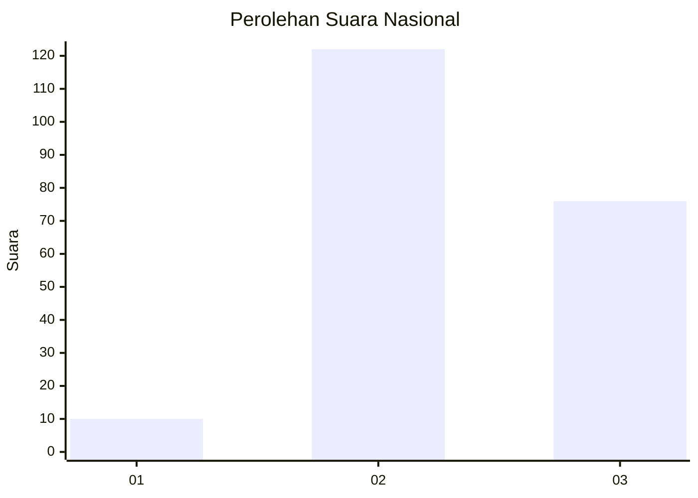
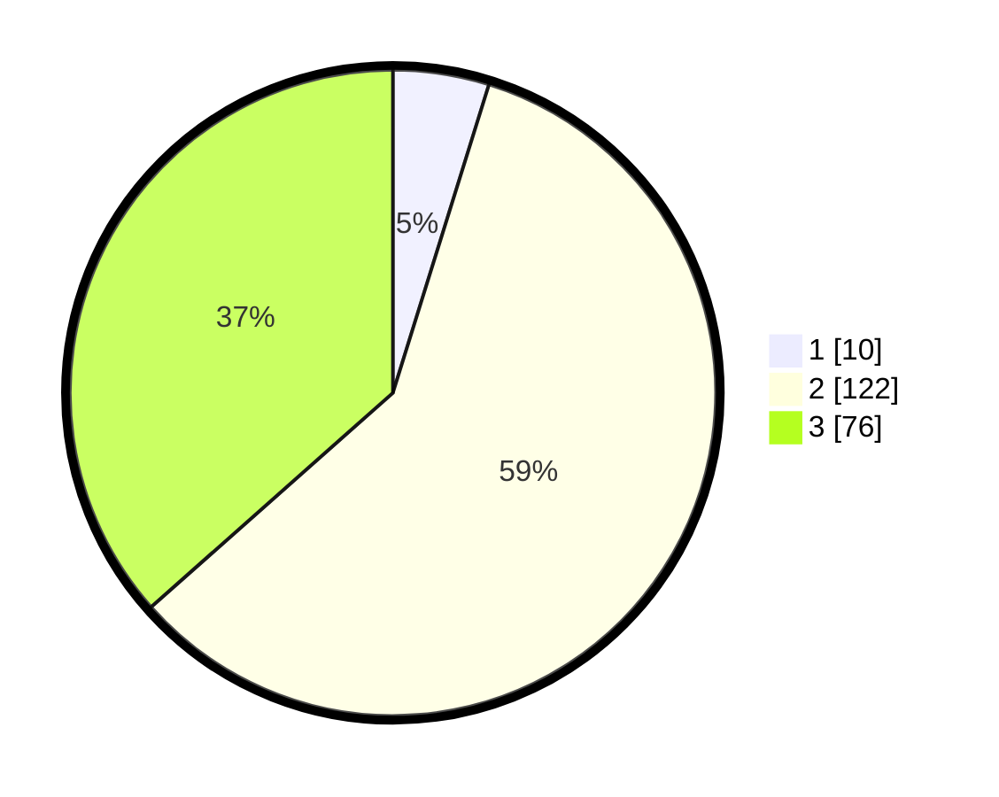

# Hasil

## Grafik

## Tabel

| No. | Nama Paslon    | Suara | Suara (raw) | Persentase |
|:--- |:-------------- | -----:| -----------:| ----------:|
| 1   | ANIES MUHAIMIN | 10    | [10][p-1]   | 4,81       |
| 2   | PRABOWO GIBRAN | 122   | [122][p-2]  | 58,65      |
| 3   | GANJAR MAHFUD  | 76    | [76][p-3]   | 36,54      |

[p-1]: https://github.com/gigit-pemilu/pemilu-2024/blob/main/pilpres/hitung-suara/sub/91-papua/sub/71-kota-jayapura/sub/01-jayapura-utara/sub/1005-tanjung-ria/sub/021-tps/sub/paslon-1.txt
[p-2]: https://github.com/gigit-pemilu/pemilu-2024/blob/main/pilpres/hitung-suara/sub/91-papua/sub/71-kota-jayapura/sub/01-jayapura-utara/sub/1005-tanjung-ria/sub/021-tps/sub/paslon-2.txt
[p-3]: https://github.com/gigit-pemilu/pemilu-2024/blob/main/pilpres/hitung-suara/sub/91-papua/sub/71-kota-jayapura/sub/01-jayapura-utara/sub/1005-tanjung-ria/sub/021-tps/sub/paslon-3.txt

## Foto C Plano

https://sirekap-obj-formc.kpu.go.id/510c/pemilu/ppwp/91/71/01/10/05/9171011005021-20240215-044952--1d8e9979-cfd2-4c57-903f-8eab3083e5c6.jpg

https://sirekap-obj-formc.kpu.go.id/510c/pemilu/ppwp/91/71/01/10/05/9171011005021-20240215-045036--86bb2b1d-af94-42bf-a157-55673254f57f.jpg

https://sirekap-obj-formc.kpu.go.id/510c/pemilu/ppwp/91/71/01/10/05/9171011005021-20240215-045125--fac2c522-958a-4cc3-9963-5d249d9ffd65.jpg

## Metadata

| Key        | Value               |
| ---------- | ------------------- |
| Time Stamp | 2024-02-25 16:00:00 |

