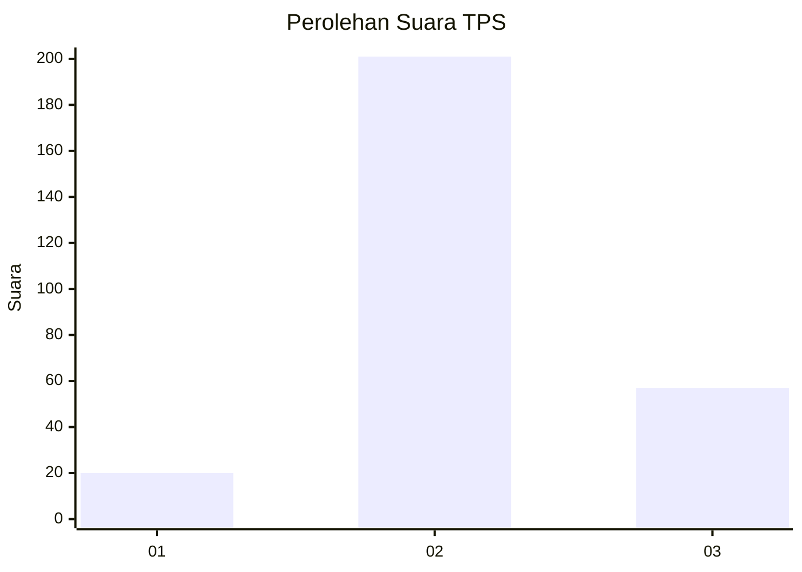

# Hasil

## Grafik

## Tabel

| No. | Nama Paslon    | Suara | Suara (raw) | Persentase |
|:--- |:-------------- | -----:| -----------:| ----------:|
| 1   | ANIES MUHAIMIN | 20    | [20][p-1]   | 7,19       |
| 2   | PRABOWO GIBRAN | 201   | [201][p-2]  | 72,30      |
| 3   | GANJAR MAHFUD  | 57    | [57][p-3]   | 20,50      |

[p-1]: https://github.com/gigit-pemilu/pemilu-2024-91-papua/blob/main/pilpres/hitung-suara/sub/91-papua/sub/71-kota-jayapura/sub/01-jayapura-utara/sub/1005-tanjung-ria/sub/037-tps/sub/paslon-1.txt
[p-2]: https://github.com/gigit-pemilu/pemilu-2024-91-papua/blob/main/pilpres/hitung-suara/sub/91-papua/sub/71-kota-jayapura/sub/01-jayapura-utara/sub/1005-tanjung-ria/sub/037-tps/sub/paslon-2.txt
[p-3]: https://github.com/gigit-pemilu/pemilu-2024-91-papua/blob/main/pilpres/hitung-suara/sub/91-papua/sub/71-kota-jayapura/sub/01-jayapura-utara/sub/1005-tanjung-ria/sub/037-tps/sub/paslon-3.txt

## Foto C Plano

https://sirekap-obj-formc.kpu.go.id/1c42/pemilu/ppwp/91/71/01/10/05/9171011005037-20240215-071628--4dc3c42b-8b7c-4be8-b0c2-22e416d1ba32.jpg

https://sirekap-obj-formc.kpu.go.id/1c42/pemilu/ppwp/91/71/01/10/05/9171011005037-20240215-072108--7fc8a91c-a738-45d4-8bd6-4a3731466080.jpg

https://sirekap-obj-formc.kpu.go.id/1c42/pemilu/ppwp/91/71/01/10/05/9171011005037-20240215-072208--b9710f87-324b-439e-8161-a5171670cafe.jpg

## Metadata

| Key        | Value               |
| ---------- | ------------------- |
| Time Stamp | 2024-02-25 18:00:00 |

