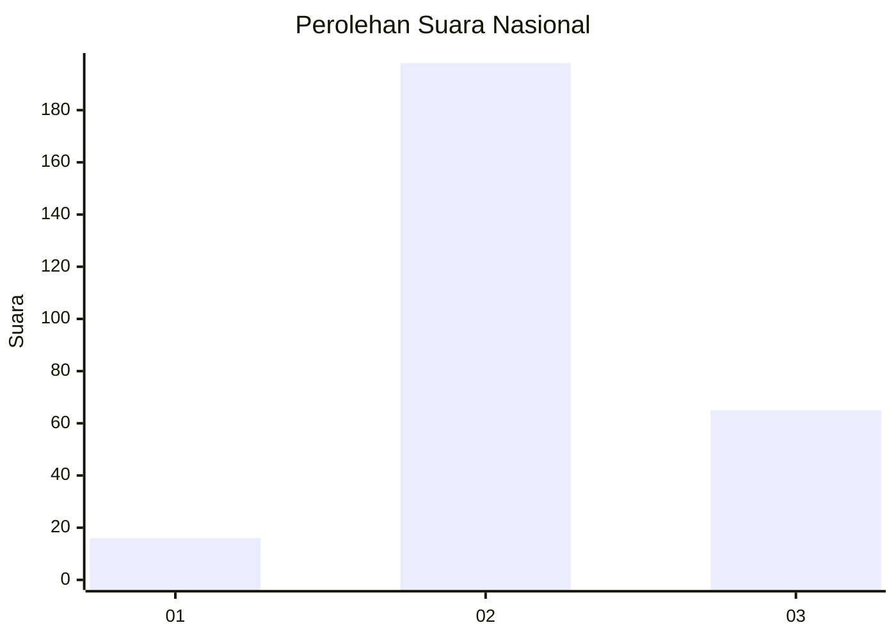
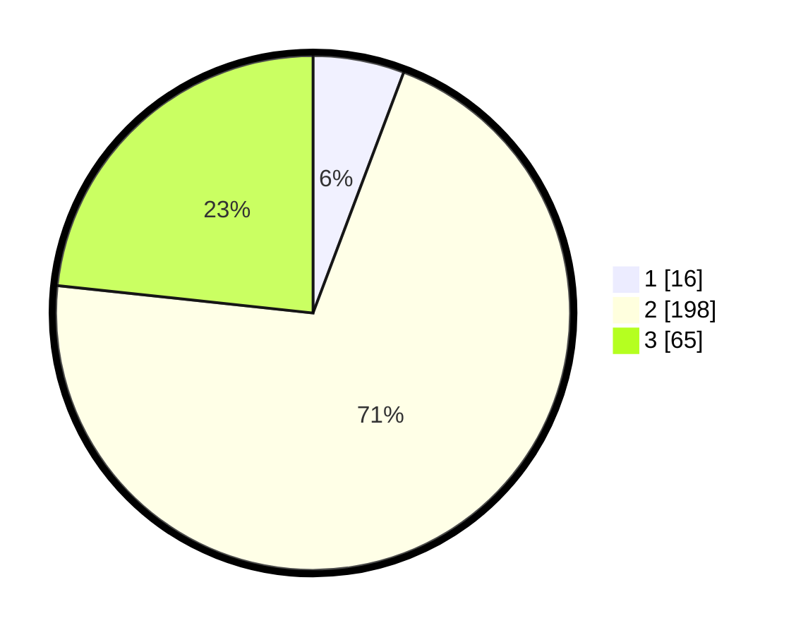

# Hasil

## Grafik

## Tabel

| No. | Nama Paslon    | Suara | Suara (raw) | Persentase |
|:--- |:-------------- | -----:| -----------:| ----------:|
| 1   | ANIES MUHAIMIN | 16    | [16][p-1]   | 5,73       |
| 2   | PRABOWO GIBRAN | 198   | [198][p-2]  | 70,97      |
| 3   | GANJAR MAHFUD  | 65    | [65][p-3]   | 23,30      |

[p-1]: https://github.com/gigit-pemilu/pemilu-2024/blob/main/pilpres/hitung-suara/sub/91-papua/sub/71-kota-jayapura/sub/01-jayapura-utara/sub/1005-tanjung-ria/sub/038-tps/sub/paslon-1.txt
[p-2]: https://github.com/gigit-pemilu/pemilu-2024/blob/main/pilpres/hitung-suara/sub/91-papua/sub/71-kota-jayapura/sub/01-jayapura-utara/sub/1005-tanjung-ria/sub/038-tps/sub/paslon-2.txt
[p-3]: https://github.com/gigit-pemilu/pemilu-2024/blob/main/pilpres/hitung-suara/sub/91-papua/sub/71-kota-jayapura/sub/01-jayapura-utara/sub/1005-tanjung-ria/sub/038-tps/sub/paslon-3.txt

## Foto C Plano

https://sirekap-obj-formc.kpu.go.id/62d1/pemilu/ppwp/91/71/01/10/05/9171011005038-20240214-231549--8e98c153-cd6c-48a9-bdab-7c846924bb89.jpg

https://sirekap-obj-formc.kpu.go.id/62d1/pemilu/ppwp/91/71/01/10/05/9171011005038-20240214-231816--831050d0-05fd-4b7c-8d3a-ce44035db15f.jpg

https://sirekap-obj-formc.kpu.go.id/62d1/pemilu/ppwp/91/71/01/10/05/9171011005038-20240214-232348--f699e720-be69-433c-aeae-741ae588a25d.jpg

## Metadata

| Key        | Value               |
| ---------- | ------------------- |
| Time Stamp | 2024-02-16 08:30:27 |

