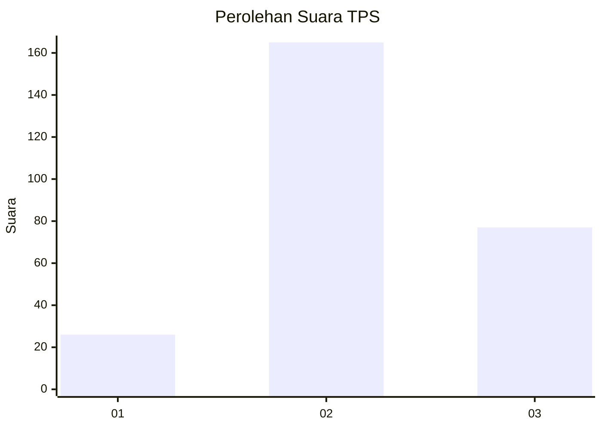
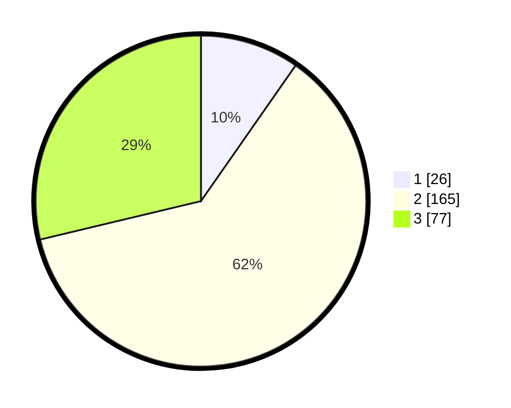

# Hasil

## Grafik

## Tabel

| No. | Nama Paslon    | Suara | Suara (raw) | Persentase |
|:--- |:-------------- | -----:| -----------:| ----------:|
| 1   | ANIES MUHAIMIN | 26    | [26][p-1]   | 9,70       |
| 2   | PRABOWO GIBRAN | 165   | [165][p-2]  | 61,57      |
| 3   | GANJAR MAHFUD  | 77    | [77][p-3]   | 28,73      |

[p-1]: https://github.com/gigit-pemilu/pemilu-2024-91-papua/blob/main/pilpres/hitung-suara/sub/91-papua/sub/71-kota-jayapura/sub/01-jayapura-utara/sub/1005-tanjung-ria/sub/044-tps/sub/paslon-1.txt
[p-2]: https://github.com/gigit-pemilu/pemilu-2024-91-papua/blob/main/pilpres/hitung-suara/sub/91-papua/sub/71-kota-jayapura/sub/01-jayapura-utara/sub/1005-tanjung-ria/sub/044-tps/sub/paslon-2.txt
[p-3]: https://github.com/gigit-pemilu/pemilu-2024-91-papua/blob/main/pilpres/hitung-suara/sub/91-papua/sub/71-kota-jayapura/sub/01-jayapura-utara/sub/1005-tanjung-ria/sub/044-tps/sub/paslon-3.txt

## Foto C Plano

https://sirekap-obj-formc.kpu.go.id/fd00/pemilu/ppwp/91/71/01/10/05/9171011005044-20240215-034407--0fb09560-6a8f-4ae4-bdc3-5426448da3af.jpg

https://sirekap-obj-formc.kpu.go.id/fd00/pemilu/ppwp/91/71/01/10/05/9171011005044-20240215-024233--32491b4f-faca-4d7a-a84e-fa0d0f79f16d.jpg

https://sirekap-obj-formc.kpu.go.id/fd00/pemilu/ppwp/91/71/01/10/05/9171011005044-20240215-024005--86fdeb59-34f2-4a74-a669-d7a4c44bc688.jpg

## Metadata

| Key        | Value               |
| ---------- | ------------------- |
| Time Stamp | 2024-02-25 22:00:00 |

