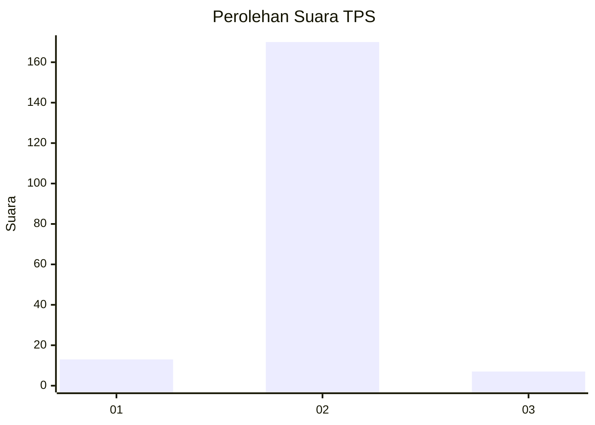
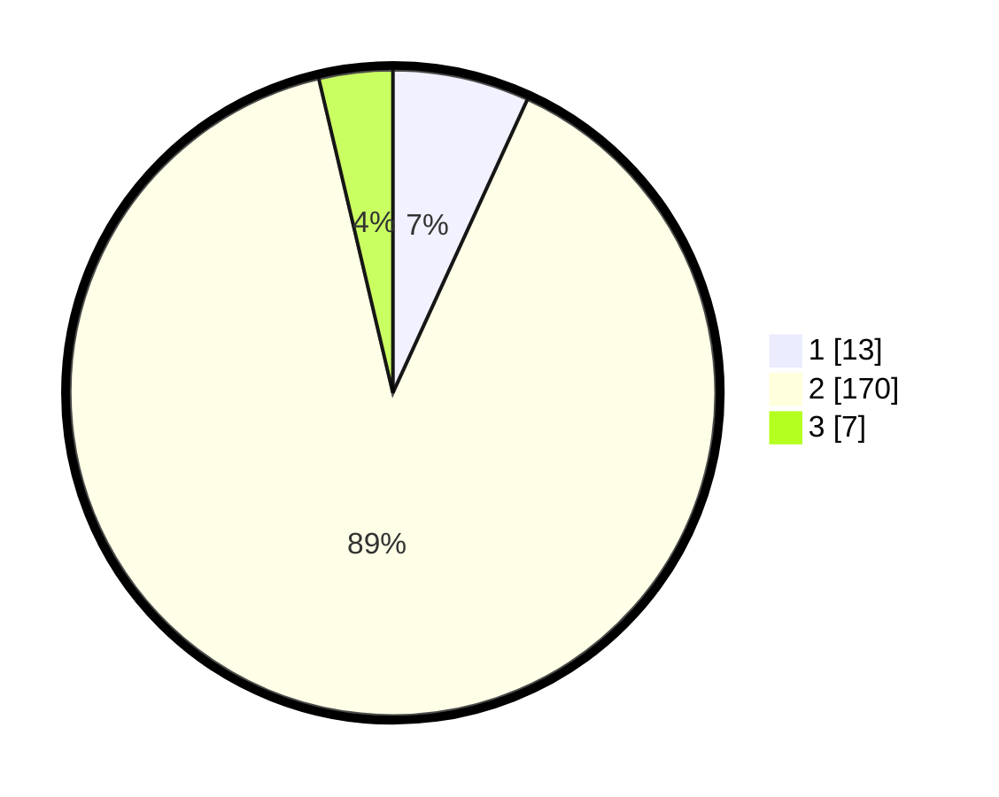

# Hasil

## Grafik

## Tabel

| No. | Nama Paslon    | Suara | Suara (raw) | Persentase |
|:--- |:-------------- | -----:| -----------:| ----------:|
| 1   | ANIES MUHAIMIN | 13    | [13][p-1]   | 6,84       |
| 2   | PRABOWO GIBRAN | 170   | [170][p-2]  | 89,47      |
| 3   | GANJAR MAHFUD  | 7     | [7][p-3]    | 3,68       |

[p-1]: https://github.com/gigit-pemilu/pemilu-2024-91-papua/blob/main/pilpres/hitung-suara/sub/91-papua/sub/71-kota-jayapura/sub/01-jayapura-utara/sub/1006-mandala/sub/009-tps/sub/paslon-1.txt
[p-2]: https://github.com/gigit-pemilu/pemilu-2024-91-papua/blob/main/pilpres/hitung-suara/sub/91-papua/sub/71-kota-jayapura/sub/01-jayapura-utara/sub/1006-mandala/sub/009-tps/sub/paslon-2.txt
[p-3]: https://github.com/gigit-pemilu/pemilu-2024-91-papua/blob/main/pilpres/hitung-suara/sub/91-papua/sub/71-kota-jayapura/sub/01-jayapura-utara/sub/1006-mandala/sub/009-tps/sub/paslon-3.txt

## Foto C Plano

https://sirekap-obj-formc.kpu.go.id/1d4c/pemilu/ppwp/91/71/01/10/06/9171011006009-20240215-074104--b16b7a95-b7e5-41a0-bb5c-6259aa1a88ec.jpg

https://sirekap-obj-formc.kpu.go.id/1d4c/pemilu/ppwp/91/71/01/10/06/9171011006009-20240215-073711--8cff42b3-3448-4206-b79c-ad614346ec08.jpg

https://sirekap-obj-formc.kpu.go.id/1d4c/pemilu/ppwp/91/71/01/10/06/9171011006009-20240215-073835--910d12a1-e3ad-45b0-ae78-916228112a0b.jpg

## Metadata

| Key        | Value               |
| ---------- | ------------------- |
| Time Stamp | 2024-02-25 00:00:00 |

