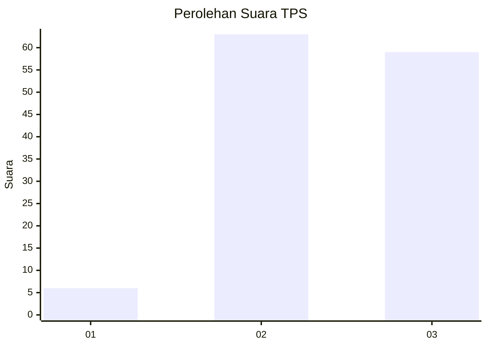
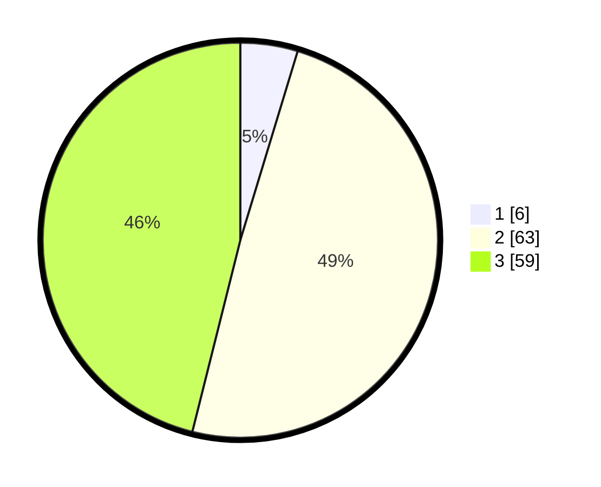

# Hasil

## Grafik

## Tabel

| No. | Nama Paslon    | Suara | Suara (raw) | Persentase |
|:--- |:-------------- | -----:| -----------:| ----------:|
| 1   | ANIES MUHAIMIN | 6     | [6][p-1]    | 4,69       |
| 2   | PRABOWO GIBRAN | 63    | [63][p-2]   | 49,22      |
| 3   | GANJAR MAHFUD  | 59    | [59][p-3]   | 46,09      |

[p-1]: https://github.com/gigit-pemilu/pemilu-2024-91-papua/blob/main/pilpres/hitung-suara/sub/91-papua/sub/71-kota-jayapura/sub/01-jayapura-utara/sub/2008-kayo-batu/sub/003-tps/sub/paslon-1.txt
[p-2]: https://github.com/gigit-pemilu/pemilu-2024-91-papua/blob/main/pilpres/hitung-suara/sub/91-papua/sub/71-kota-jayapura/sub/01-jayapura-utara/sub/2008-kayo-batu/sub/003-tps/sub/paslon-2.txt
[p-3]: https://github.com/gigit-pemilu/pemilu-2024-91-papua/blob/main/pilpres/hitung-suara/sub/91-papua/sub/71-kota-jayapura/sub/01-jayapura-utara/sub/2008-kayo-batu/sub/003-tps/sub/paslon-3.txt

## Foto C Plano

https://sirekap-obj-formc.kpu.go.id/6a97/pemilu/ppwp/91/71/01/20/08/9171012008003-20240214-225020--a0754f4a-20ea-4c4c-952a-bd0b6226dcfd.jpg

https://sirekap-obj-formc.kpu.go.id/6a97/pemilu/ppwp/91/71/01/20/08/9171012008003-20240214-225437--ed002609-4c1d-4925-a3e2-27d1c439bf6a.jpg

https://sirekap-obj-formc.kpu.go.id/6a97/pemilu/ppwp/91/71/01/20/08/9171012008003-20240214-225808--4b2d53a0-f3ad-4895-befd-7c08456a241c.jpg

## Metadata

| Key        | Value               |
| ---------- | ------------------- |
| Time Stamp | 2024-02-16 08:00:28 |

