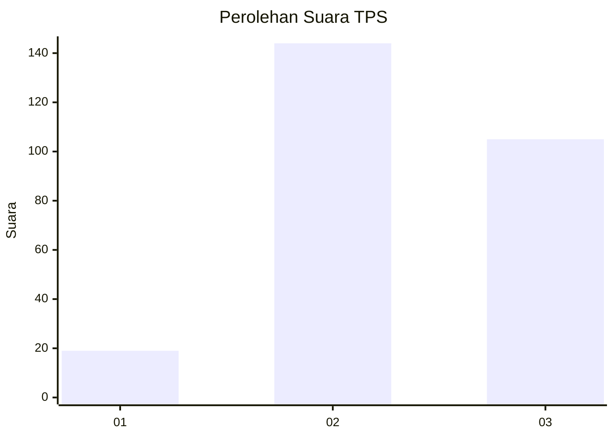
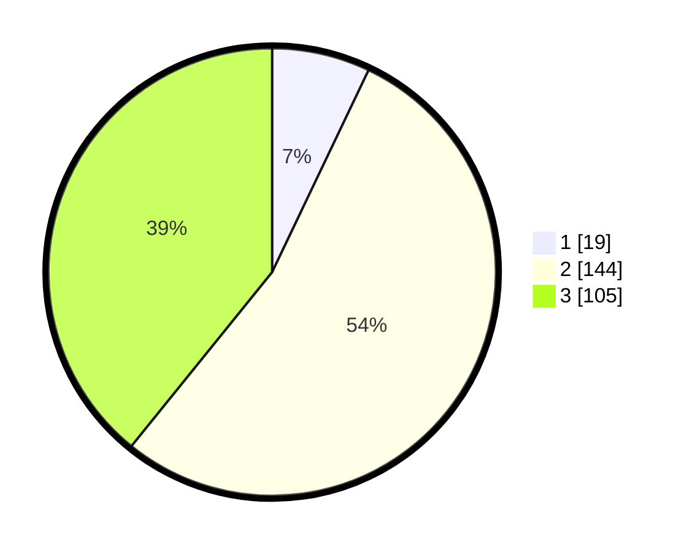

# Hasil

## Grafik

## Tabel

| No. | Nama Paslon    | Suara | Suara (raw) | Persentase |
|:--- |:-------------- | -----:| -----------:| ----------:|
| 1   | ANIES MUHAIMIN | 19    | [19][p-1]   | 7,09       |
| 2   | PRABOWO GIBRAN | 144   | [144][p-2]  | 53,73      |
| 3   | GANJAR MAHFUD  | 105   | [105][p-3]  | 39,18      |

[p-1]: https://github.com/gigit-pemilu/pemilu-2024-91-papua/blob/main/pilpres/hitung-suara/sub/91-papua/sub/71-kota-jayapura/sub/02-jayapura-selatan/sub/1001-argapura/sub/001-tps/sub/paslon-1.txt
[p-2]: https://github.com/gigit-pemilu/pemilu-2024-91-papua/blob/main/pilpres/hitung-suara/sub/91-papua/sub/71-kota-jayapura/sub/02-jayapura-selatan/sub/1001-argapura/sub/001-tps/sub/paslon-2.txt
[p-3]: https://github.com/gigit-pemilu/pemilu-2024-91-papua/blob/main/pilpres/hitung-suara/sub/91-papua/sub/71-kota-jayapura/sub/02-jayapura-selatan/sub/1001-argapura/sub/001-tps/sub/paslon-3.txt

## Foto C Plano

https://sirekap-obj-formc.kpu.go.id/7237/pemilu/ppwp/91/71/02/10/01/9171021001001-20240215-013648--f912dab5-a165-4748-a10f-2f5dde49a584.jpg

https://sirekap-obj-formc.kpu.go.id/7237/pemilu/ppwp/91/71/02/10/01/9171021001001-20240215-013713--2a808cd8-f061-49f2-8b1b-c0b9d65ba137.jpg

https://sirekap-obj-formc.kpu.go.id/7237/pemilu/ppwp/91/71/02/10/01/9171021001001-20240215-013728--d7dd9f34-c85d-485f-b6d9-771771ef3a7b.jpg

## Metadata

| Key        | Value               |
| ---------- | ------------------- |
| Time Stamp | 2024-02-25 01:00:00 |

