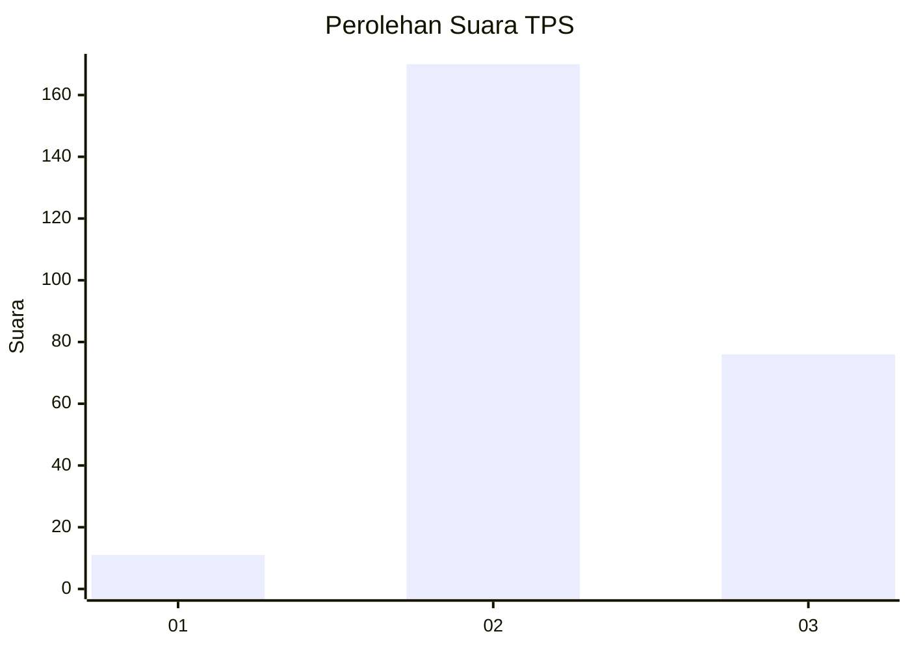

# Hasil

## Grafik

## Tabel

| No. | Nama Paslon    | Suara | Suara (raw) | Persentase |
|:--- |:-------------- | -----:| -----------:| ----------:|
| 1   | ANIES MUHAIMIN | 11    | [11][p-1]   | 4,28       |
| 2   | PRABOWO GIBRAN | 170   | [170][p-2]  | 66,15      |
| 3   | GANJAR MAHFUD  | 76    | [76][p-3]   | 29,57      |

[p-1]: https://github.com/gigit-pemilu/pemilu-2024-91-papua/blob/main/pilpres/hitung-suara/sub/91-papua/sub/71-kota-jayapura/sub/02-jayapura-selatan/sub/1001-argapura/sub/011-tps/sub/paslon-1.txt
[p-2]: https://github.com/gigit-pemilu/pemilu-2024-91-papua/blob/main/pilpres/hitung-suara/sub/91-papua/sub/71-kota-jayapura/sub/02-jayapura-selatan/sub/1001-argapura/sub/011-tps/sub/paslon-2.txt
[p-3]: https://github.com/gigit-pemilu/pemilu-2024-91-papua/blob/main/pilpres/hitung-suara/sub/91-papua/sub/71-kota-jayapura/sub/02-jayapura-selatan/sub/1001-argapura/sub/011-tps/sub/paslon-3.txt

## Foto C Plano

https://sirekap-obj-formc.kpu.go.id/a3a4/pemilu/ppwp/91/71/02/10/01/9171021001011-20240215-021936--41bc8145-5d04-4275-8eb2-ec1238c1cd01.jpg

https://sirekap-obj-formc.kpu.go.id/a3a4/pemilu/ppwp/91/71/02/10/01/9171021001011-20240215-022243--dbe02624-7789-448f-885d-8fa1743ecd48.jpg

https://sirekap-obj-formc.kpu.go.id/a3a4/pemilu/ppwp/91/71/02/10/01/9171021001011-20240215-022501--5d4eb1a7-4ef3-41c4-8ba5-9eed0c79dadb.jpg

## Metadata

| Key        | Value               |
| ---------- | ------------------- |
| Time Stamp | 2024-02-24 22:31:28 |

