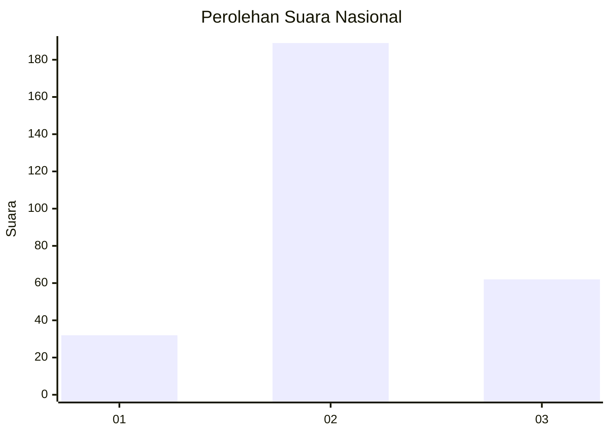
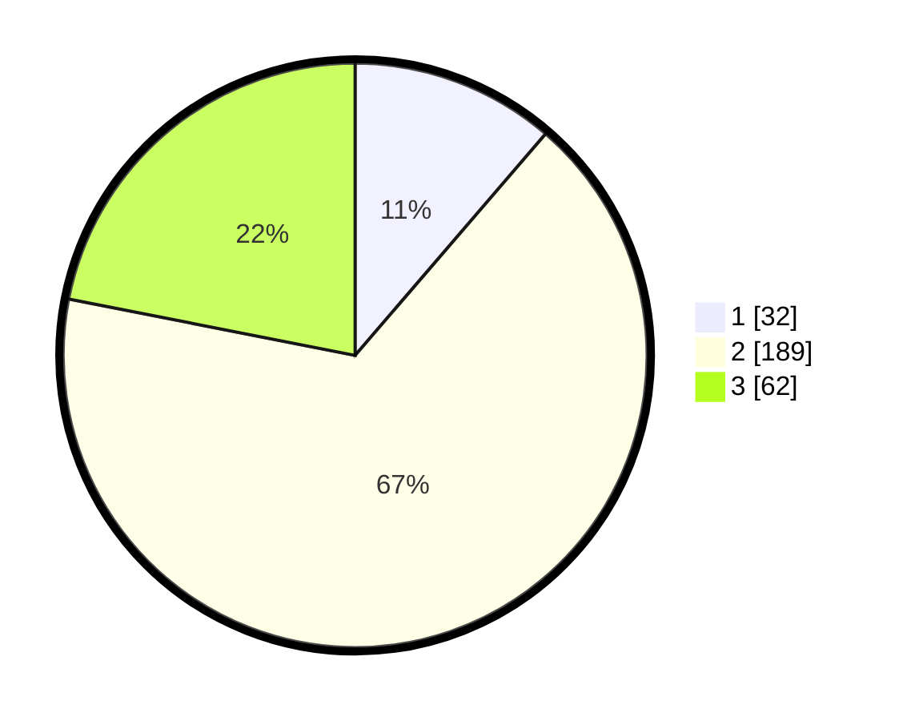

# Hasil

## Grafik

## Tabel

| No. | Nama Paslon    | Suara | Suara (raw) | Persentase |
|:--- |:-------------- | -----:| -----------:| ----------:|
| 1   | ANIES MUHAIMIN | 32    | [32][p-1]   | 11,31      |
| 2   | PRABOWO GIBRAN | 189   | [189][p-2]  | 66,78      |
| 3   | GANJAR MAHFUD  | 62    | [62][p-3]   | 21,91      |

[p-1]: https://github.com/gigit-pemilu/pemilu-2024/blob/main/pilpres/hitung-suara/sub/91-papua/sub/71-kota-jayapura/sub/02-jayapura-selatan/sub/1001-argapura/sub/022-tps/sub/paslon-1.txt
[p-2]: https://github.com/gigit-pemilu/pemilu-2024/blob/main/pilpres/hitung-suara/sub/91-papua/sub/71-kota-jayapura/sub/02-jayapura-selatan/sub/1001-argapura/sub/022-tps/sub/paslon-2.txt
[p-3]: https://github.com/gigit-pemilu/pemilu-2024/blob/main/pilpres/hitung-suara/sub/91-papua/sub/71-kota-jayapura/sub/02-jayapura-selatan/sub/1001-argapura/sub/022-tps/sub/paslon-3.txt

## Foto C Plano

https://sirekap-obj-formc.kpu.go.id/2156/pemilu/ppwp/91/71/02/10/01/9171021001022-20240214-155301--8753ce29-7acf-4cc4-a737-86f5478eeef6.jpg

https://sirekap-obj-formc.kpu.go.id/2156/pemilu/ppwp/91/71/02/10/01/9171021001022-20240214-155454--22ee8383-ffc3-41a8-989a-692afe17bd62.jpg

https://sirekap-obj-formc.kpu.go.id/2156/pemilu/ppwp/91/71/02/10/01/9171021001022-20240214-155659--c60a849c-2279-491b-b4c5-62af701b9a26.jpg

## Metadata

| Key        | Value               |
| ---------- | ------------------- |
| Time Stamp | 2024-02-25 01:00:00 |

