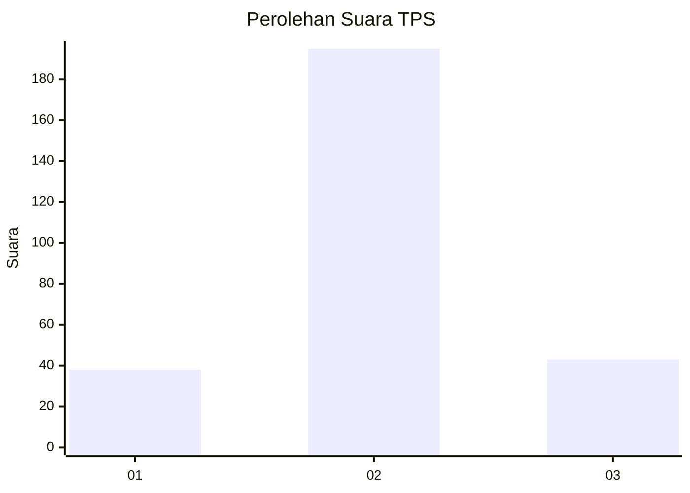

# Hasil

## Grafik

## Tabel

| No. | Nama Paslon    | Suara | Suara (raw) | Persentase |
|:--- |:-------------- | -----:| -----------:| ----------:|
| 1   | ANIES MUHAIMIN | 38    | [38][p-1]   | 13,77      |
| 2   | PRABOWO GIBRAN | 195   | [195][p-2]  | 70,65      |
| 3   | GANJAR MAHFUD  | 43    | [43][p-3]   | 15,58      |

[p-1]: https://github.com/gigit-pemilu/pemilu-2024-91-papua/blob/main/pilpres/hitung-suara/sub/91-papua/sub/71-kota-jayapura/sub/02-jayapura-selatan/sub/1001-argapura/sub/023-tps/sub/paslon-1.txt
[p-2]: https://github.com/gigit-pemilu/pemilu-2024-91-papua/blob/main/pilpres/hitung-suara/sub/91-papua/sub/71-kota-jayapura/sub/02-jayapura-selatan/sub/1001-argapura/sub/023-tps/sub/paslon-2.txt
[p-3]: https://github.com/gigit-pemilu/pemilu-2024-91-papua/blob/main/pilpres/hitung-suara/sub/91-papua/sub/71-kota-jayapura/sub/02-jayapura-selatan/sub/1001-argapura/sub/023-tps/sub/paslon-3.txt

## Foto C Plano

https://sirekap-obj-formc.kpu.go.id/ebdd/pemilu/ppwp/91/71/02/10/01/9171021001023-20240214-202758--2460a89e-65d9-4d7f-bad5-49e515c6f114.jpg

https://sirekap-obj-formc.kpu.go.id/ebdd/pemilu/ppwp/91/71/02/10/01/9171021001023-20240214-202226--c6aa4369-a026-4487-ae42-42dfc785f944.jpg

https://sirekap-obj-formc.kpu.go.id/ebdd/pemilu/ppwp/91/71/02/10/01/9171021001023-20240214-202414--3c59180e-8622-4c58-89e0-f19454b626a7.jpg

## Metadata

| Key        | Value               |
| ---------- | ------------------- |
| Time Stamp | 2024-02-15 01:47:43 |

## DATA PEMILIH TETAP

Jumlah pemilih dalam DPT: **278**.
 * L: **155**.
 * P: **123**.

## DATA PENGGUNA HAK PILIH

Jumlah pengguna hak pilih dalam DPT: **277**.
 * L: **155**.
 * P: **122**.

Jumlah pengguna hak pilih dalam DPTb: **1**.
 * L: **0**.
 * P: **1**.

Jumlah pengguna hak pilih dalam DPK: **0**.
 * L: **0**.
 * P: **0**.

Jumlah pengguna hak pilih: **278**.
 * L: **155**.
 * P: **123**.

## JUMLAH SUARA SAH DAN TIDAK SAH

JUMLAH SELURUH SUARA SAH: **276**.

JUMLAH SUARA TIDAK SAH: **2**.

JUMLAH SELURUH SUARA SAH DAN SUARA TIDAK SAH: **278**.

