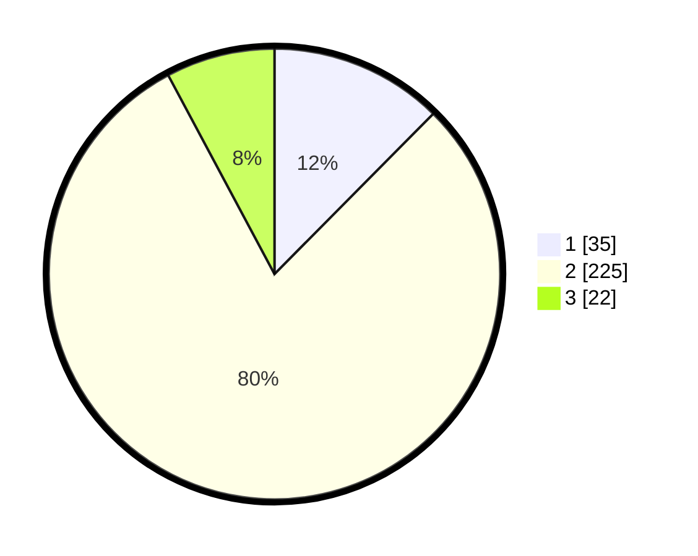

# Hasil

## Grafik

## Tabel

| No. | Nama Paslon    | Suara | Suara (raw) | Persentase |
|:--- |:-------------- | -----:| -----------:| ----------:|
| 1   | ANIES MUHAIMIN | 35    | [35][p-1]   | 12,41      |
| 2   | PRABOWO GIBRAN | 225   | [225][p-2]  | 79,79      |
| 3   | GANJAR MAHFUD  | 22    | [22][p-3]   | 7,80       |

[p-1]: https://github.com/gigit-pemilu/pemilu-2024-91-papua/blob/main/pilpres/hitung-suara/sub/91-papua/sub/71-kota-jayapura/sub/02-jayapura-selatan/sub/1002-ardipura/sub/013-tps/sub/paslon-1.txt
[p-2]: https://github.com/gigit-pemilu/pemilu-2024-91-papua/blob/main/pilpres/hitung-suara/sub/91-papua/sub/71-kota-jayapura/sub/02-jayapura-selatan/sub/1002-ardipura/sub/013-tps/sub/paslon-2.txt
[p-3]: https://github.com/gigit-pemilu/pemilu-2024-91-papua/blob/main/pilpres/hitung-suara/sub/91-papua/sub/71-kota-jayapura/sub/02-jayapura-selatan/sub/1002-ardipura/sub/013-tps/sub/paslon-3.txt

## Foto C Plano

https://sirekap-obj-formc.kpu.go.id/6e70/pemilu/ppwp/91/71/02/10/02/9171021002013-20240214-231607--3e9ed7a8-e21f-4e1c-af7b-065c7941980d.jpg

https://sirekap-obj-formc.kpu.go.id/6e70/pemilu/ppwp/91/71/02/10/02/9171021002013-20240214-232207--d5f5e955-9763-48dd-8750-7441f1d48d90.jpg

https://sirekap-obj-formc.kpu.go.id/6e70/pemilu/ppwp/91/71/02/10/02/9171021002013-20240214-232532--97728458-9f95-48bf-bf6f-ae9e492f5a44.jpg

## Metadata

| Key        | Value               |
| ---------- | ------------------- |
| Time Stamp | 2024-02-22 11:00:00 |

