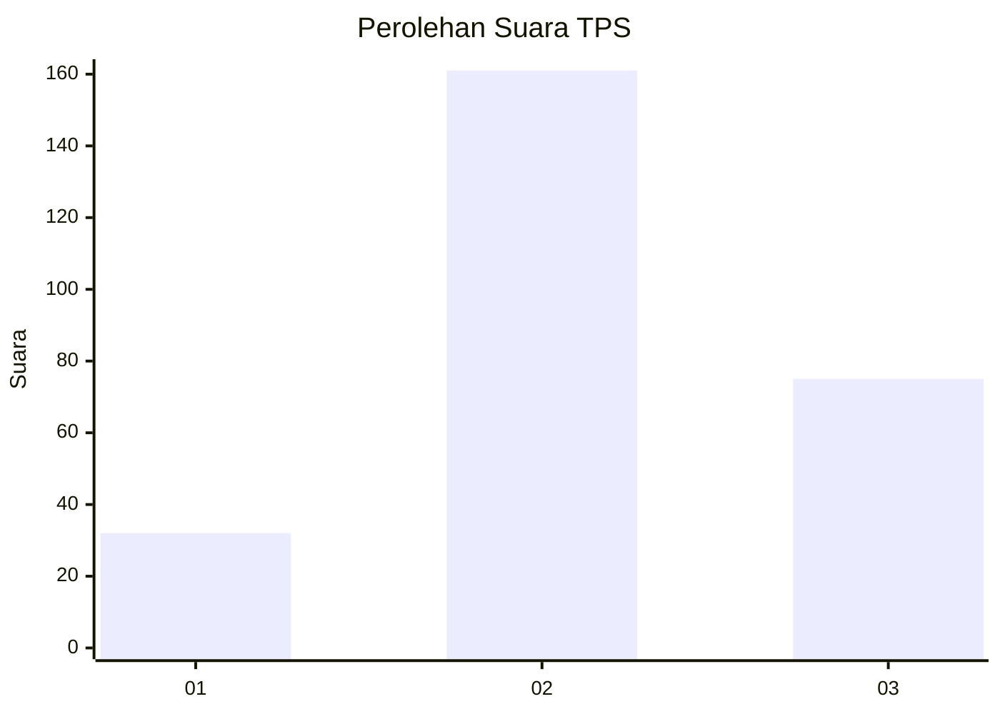
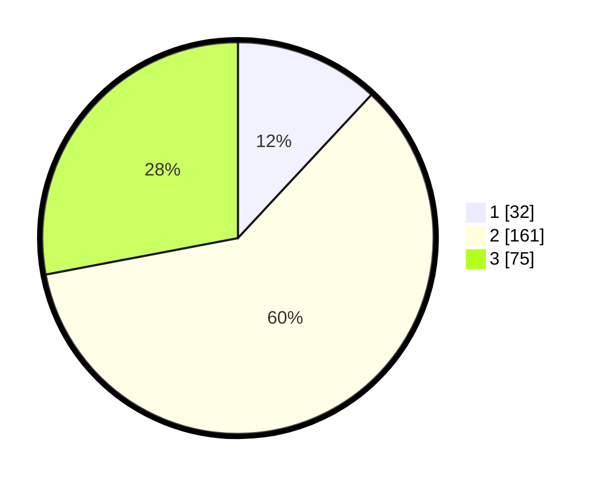

# Hasil

## Grafik

## Tabel

| No. | Nama Paslon    | Suara | Suara (raw) | Persentase |
|:--- |:-------------- | -----:| -----------:| ----------:|
| 1   | ANIES MUHAIMIN | 32    | [32][p-1]   | 11,94      |
| 2   | PRABOWO GIBRAN | 161   | [161][p-2]  | 60,07      |
| 3   | GANJAR MAHFUD  | 75    | [75][p-3]   | 27,99      |

[p-1]: https://github.com/gigit-pemilu/pemilu-2024-91-papua/blob/main/pilpres/hitung-suara/sub/91-papua/sub/71-kota-jayapura/sub/02-jayapura-selatan/sub/1002-ardipura/sub/025-tps/sub/paslon-1.txt
[p-2]: https://github.com/gigit-pemilu/pemilu-2024-91-papua/blob/main/pilpres/hitung-suara/sub/91-papua/sub/71-kota-jayapura/sub/02-jayapura-selatan/sub/1002-ardipura/sub/025-tps/sub/paslon-2.txt
[p-3]: https://github.com/gigit-pemilu/pemilu-2024-91-papua/blob/main/pilpres/hitung-suara/sub/91-papua/sub/71-kota-jayapura/sub/02-jayapura-selatan/sub/1002-ardipura/sub/025-tps/sub/paslon-3.txt

## Foto C Plano

https://sirekap-obj-formc.kpu.go.id/3fc5/pemilu/ppwp/91/71/02/10/02/9171021002025-20240215-082353--870b616c-287d-4efc-8621-7812f5bed60f.jpg

https://sirekap-obj-formc.kpu.go.id/3fc5/pemilu/ppwp/91/71/02/10/02/9171021002025-20240215-075746--756695ec-7a77-4ebf-bde4-25c89691f793.jpg

## Metadata

| Key        | Value               |
| ---------- | ------------------- |
| Time Stamp | 2024-02-25 09:00:00 |

