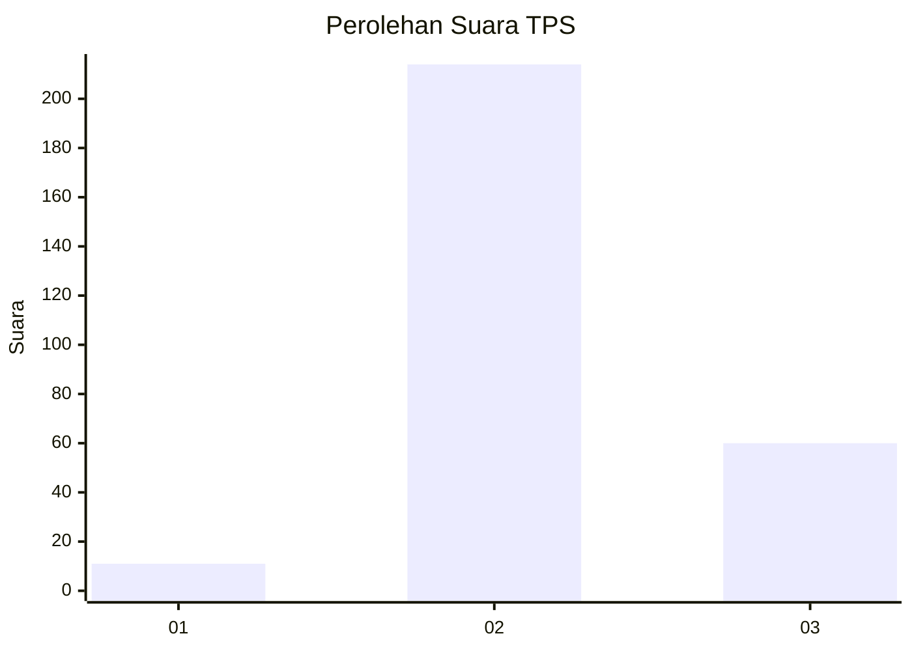

# Hasil

## Grafik

## Tabel

| No. | Nama Paslon    | Suara | Suara (raw) | Persentase |
|:--- |:-------------- | -----:| -----------:| ----------:|
| 1   | ANIES MUHAIMIN | 11    | [11][p-1]   | 3,86       |
| 2   | PRABOWO GIBRAN | 214   | [214][p-2]  | 75,09      |
| 3   | GANJAR MAHFUD  | 60    | [60][p-3]   | 21,05      |

[p-1]: https://github.com/gigit-pemilu/pemilu-2024-91-papua/blob/main/pilpres/hitung-suara/sub/91-papua/sub/71-kota-jayapura/sub/02-jayapura-selatan/sub/1002-ardipura/sub/043-tps/sub/paslon-1.txt
[p-2]: https://github.com/gigit-pemilu/pemilu-2024-91-papua/blob/main/pilpres/hitung-suara/sub/91-papua/sub/71-kota-jayapura/sub/02-jayapura-selatan/sub/1002-ardipura/sub/043-tps/sub/paslon-2.txt
[p-3]: https://github.com/gigit-pemilu/pemilu-2024-91-papua/blob/main/pilpres/hitung-suara/sub/91-papua/sub/71-kota-jayapura/sub/02-jayapura-selatan/sub/1002-ardipura/sub/043-tps/sub/paslon-3.txt

## Foto C Plano

https://sirekap-obj-formc.kpu.go.id/26a4/pemilu/ppwp/91/71/02/10/02/9171021002043-20240215-024453--7f7c9b9a-4481-4730-a06f-c8c4ccdb9ef7.jpg

https://sirekap-obj-formc.kpu.go.id/26a4/pemilu/ppwp/91/71/02/10/02/9171021002043-20240215-024648--b9f7bbcc-44b2-4fc2-a457-8f5411ae4907.jpg

https://sirekap-obj-formc.kpu.go.id/26a4/pemilu/ppwp/91/71/02/10/02/9171021002043-20240215-024831--c126890b-ef62-4464-9b6c-07460dab1cf5.jpg

## Metadata

| Key        | Value               |
| ---------- | ------------------- |
| Time Stamp | 2024-02-25 22:00:00 |

