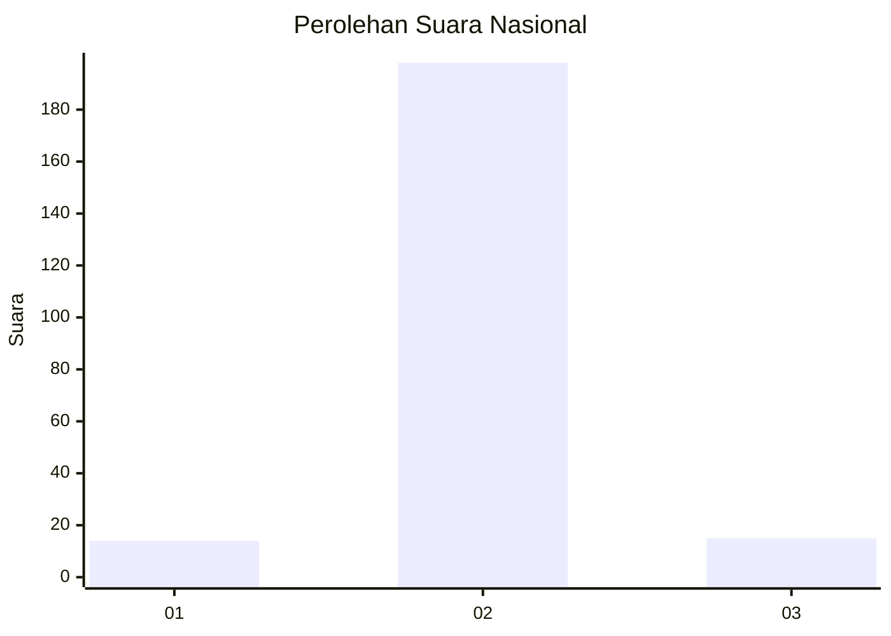
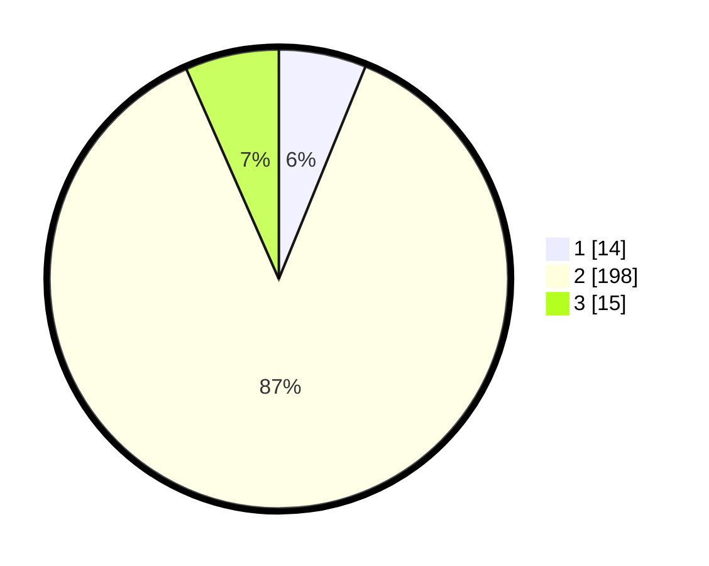

# Hasil

## Grafik

## Tabel

| No. | Nama Paslon    | Suara | Suara (raw) | Persentase |
|:--- |:-------------- | -----:| -----------:| ----------:|
| 1   | ANIES MUHAIMIN | 14    | [14][p-1]   | 6,17       |
| 2   | PRABOWO GIBRAN | 198   | [198][p-2]  | 87,22      |
| 3   | GANJAR MAHFUD  | 15    | [15][p-3]   | 6,61       |

[p-1]: https://github.com/gigit-pemilu/pemilu-2024/blob/main/pilpres/hitung-suara/sub/91-papua/sub/71-kota-jayapura/sub/02-jayapura-selatan/sub/1003-numbay/sub/007-tps/sub/paslon-1.txt
[p-2]: https://github.com/gigit-pemilu/pemilu-2024/blob/main/pilpres/hitung-suara/sub/91-papua/sub/71-kota-jayapura/sub/02-jayapura-selatan/sub/1003-numbay/sub/007-tps/sub/paslon-2.txt
[p-3]: https://github.com/gigit-pemilu/pemilu-2024/blob/main/pilpres/hitung-suara/sub/91-papua/sub/71-kota-jayapura/sub/02-jayapura-selatan/sub/1003-numbay/sub/007-tps/sub/paslon-3.txt

## Foto C Plano

https://sirekap-obj-formc.kpu.go.id/18ef/pemilu/ppwp/91/71/02/10/03/9171021003007-20240214-193226--6e569347-2db2-40ca-8095-b5f7cb09eac6.jpg

https://sirekap-obj-formc.kpu.go.id/18ef/pemilu/ppwp/91/71/02/10/03/9171021003007-20240214-194502--a8adbb34-74c4-45a0-a548-75bac4eee185.jpg

https://sirekap-obj-formc.kpu.go.id/18ef/pemilu/ppwp/91/71/02/10/03/9171021003007-20240214-203400--135fc673-3b89-4aa2-ac29-e4d34d97cf80.jpg

## Metadata

| Key        | Value               |
| ---------- | ------------------- |
| Time Stamp | 2024-02-24 22:31:28 |

