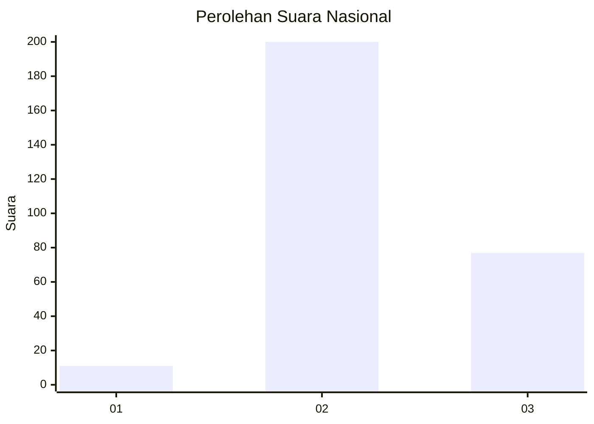

# Hasil

## Grafik

## Tabel

| No. | Nama Paslon    | Suara | Suara (raw) | Persentase |
|:--- |:-------------- | -----:| -----------:| ----------:|
| 1   | ANIES MUHAIMIN | 11    | [11][p-1]   | 3,82       |
| 2   | PRABOWO GIBRAN | 200   | [200][p-2]  | 69,44      |
| 3   | GANJAR MAHFUD  | 77    | [77][p-3]   | 26,74      |

[p-1]: https://github.com/gigit-pemilu/pemilu-2024/blob/main/pilpres/hitung-suara/sub/91-papua/sub/71-kota-jayapura/sub/02-jayapura-selatan/sub/1003-numbay/sub/010-tps/sub/paslon-1.txt
[p-2]: https://github.com/gigit-pemilu/pemilu-2024/blob/main/pilpres/hitung-suara/sub/91-papua/sub/71-kota-jayapura/sub/02-jayapura-selatan/sub/1003-numbay/sub/010-tps/sub/paslon-2.txt
[p-3]: https://github.com/gigit-pemilu/pemilu-2024/blob/main/pilpres/hitung-suara/sub/91-papua/sub/71-kota-jayapura/sub/02-jayapura-selatan/sub/1003-numbay/sub/010-tps/sub/paslon-3.txt

## Foto C Plano

https://sirekap-obj-formc.kpu.go.id/729b/pemilu/ppwp/91/71/02/10/03/9171021003010-20240215-043117--5e769ce4-ed95-40fa-8404-53eadc4bb379.jpg

https://sirekap-obj-formc.kpu.go.id/729b/pemilu/ppwp/91/71/02/10/03/9171021003010-20240215-043407--bbc6ef9c-0d5d-4fe6-a045-b1984399d6b0.jpg

https://sirekap-obj-formc.kpu.go.id/729b/pemilu/ppwp/91/71/02/10/03/9171021003010-20240215-043501--415d89ca-3d20-4e42-b0c3-e50dc14135cc.jpg

## Metadata

| Key        | Value               |
| ---------- | ------------------- |
| Time Stamp | 2024-02-22 11:00:00 |

