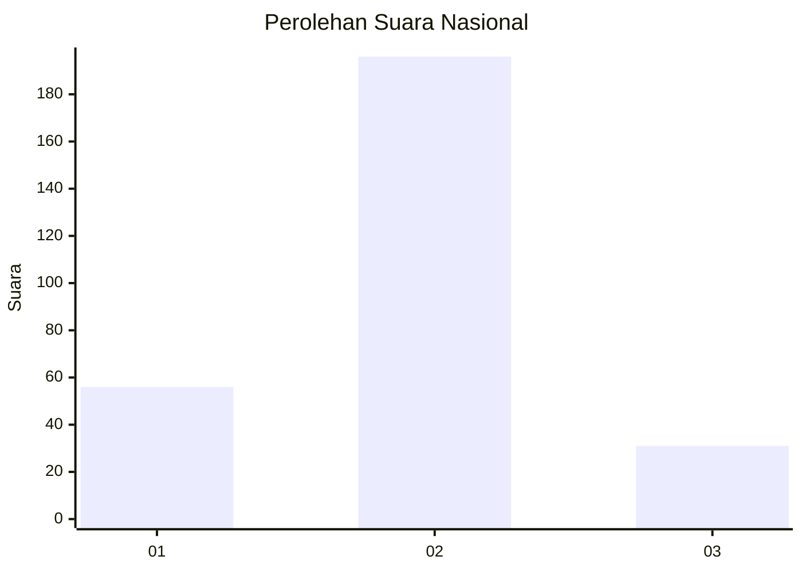
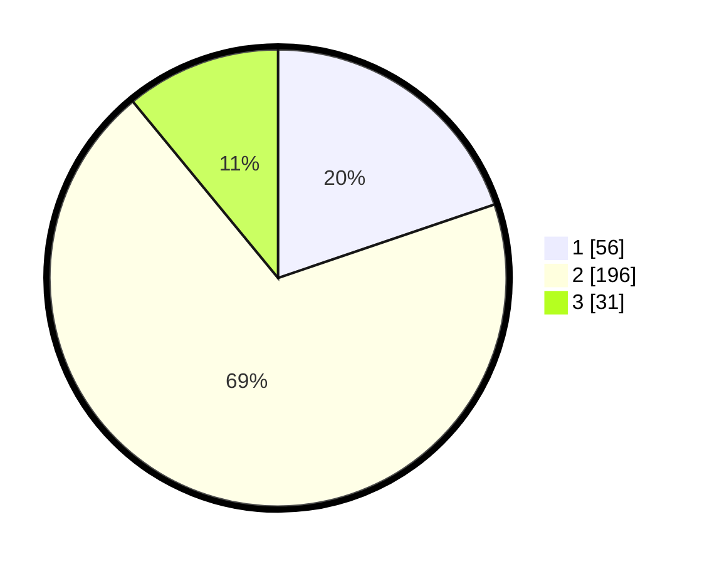

# Hasil

## Grafik

## Tabel

| No. | Nama Paslon    | Suara | Suara (raw) | Persentase |
|:--- |:-------------- | -----:| -----------:| ----------:|
| 1   | ANIES MUHAIMIN | 56    | [56][p-1]   | 19,79      |
| 2   | PRABOWO GIBRAN | 196   | [196][p-2]  | 69,26      |
| 3   | GANJAR MAHFUD  | 31    | [31][p-3]   | 10,95      |

[p-1]: https://github.com/gigit-pemilu/pemilu-2024/blob/main/pilpres/hitung-suara/sub/91-papua/sub/71-kota-jayapura/sub/02-jayapura-selatan/sub/1003-numbay/sub/024-tps/sub/paslon-1.txt
[p-2]: https://github.com/gigit-pemilu/pemilu-2024/blob/main/pilpres/hitung-suara/sub/91-papua/sub/71-kota-jayapura/sub/02-jayapura-selatan/sub/1003-numbay/sub/024-tps/sub/paslon-2.txt
[p-3]: https://github.com/gigit-pemilu/pemilu-2024/blob/main/pilpres/hitung-suara/sub/91-papua/sub/71-kota-jayapura/sub/02-jayapura-selatan/sub/1003-numbay/sub/024-tps/sub/paslon-3.txt

## Foto C Plano

https://sirekap-obj-formc.kpu.go.id/5dba/pemilu/ppwp/91/71/02/10/03/9171021003024-20240215-023941--62fa069b-ed6e-45bf-9416-f820ec76382c.jpg

https://sirekap-obj-formc.kpu.go.id/5dba/pemilu/ppwp/91/71/02/10/03/9171021003024-20240215-024103--b226969c-83a4-4dd8-adeb-da5e9ba99dac.jpg

https://sirekap-obj-formc.kpu.go.id/5dba/pemilu/ppwp/91/71/02/10/03/9171021003024-20240215-024234--4e5386d0-0d8b-48bd-96de-74f0346d5355.jpg

## Metadata

| Key        | Value               |
| ---------- | ------------------- |
| Time Stamp | 2024-02-22 11:00:00 |

