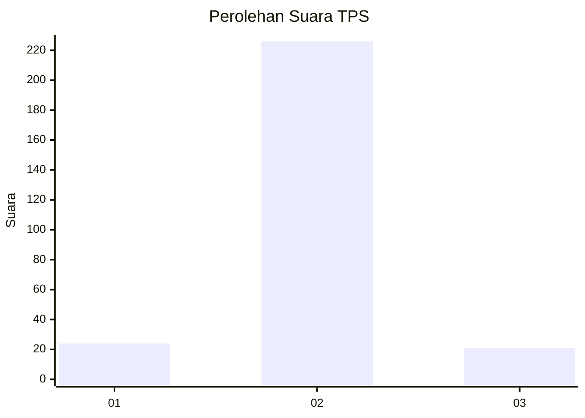
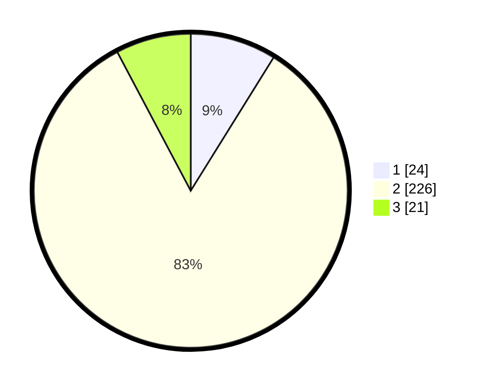

# Hasil

## Grafik

## Tabel

| No. | Nama Paslon    | Suara | Suara (raw) | Persentase |
|:--- |:-------------- | -----:| -----------:| ----------:|
| 1   | ANIES MUHAIMIN | 24    | [24][p-1]   | 8,86       |
| 2   | PRABOWO GIBRAN | 226   | [226][p-2]  | 83,39      |
| 3   | GANJAR MAHFUD  | 21    | [21][p-3]   | 7,75       |

[p-1]: https://github.com/gigit-pemilu/pemilu-2024-91-papua/blob/main/pilpres/hitung-suara/sub/91-papua/sub/71-kota-jayapura/sub/02-jayapura-selatan/sub/1005-entrop/sub/005-tps/sub/paslon-1.txt
[p-2]: https://github.com/gigit-pemilu/pemilu-2024-91-papua/blob/main/pilpres/hitung-suara/sub/91-papua/sub/71-kota-jayapura/sub/02-jayapura-selatan/sub/1005-entrop/sub/005-tps/sub/paslon-2.txt
[p-3]: https://github.com/gigit-pemilu/pemilu-2024-91-papua/blob/main/pilpres/hitung-suara/sub/91-papua/sub/71-kota-jayapura/sub/02-jayapura-selatan/sub/1005-entrop/sub/005-tps/sub/paslon-3.txt

## Foto C Plano

https://sirekap-obj-formc.kpu.go.id/a974/pemilu/ppwp/91/71/02/10/05/9171021005005-20240215-031423--f82b2276-aec4-4506-a3a9-c896e68c88e3.jpg

https://sirekap-obj-formc.kpu.go.id/a974/pemilu/ppwp/91/71/02/10/05/9171021005005-20240215-032519--52d7bd85-2158-4827-bd86-b75f926bb343.jpg

https://sirekap-obj-formc.kpu.go.id/a974/pemilu/ppwp/91/71/02/10/05/9171021005005-20240215-033155--c3352e4c-532b-4302-b820-4caa49beda90.jpg

## Metadata

| Key        | Value               |
| ---------- | ------------------- |
| Time Stamp | 2024-02-24 22:31:28 |

