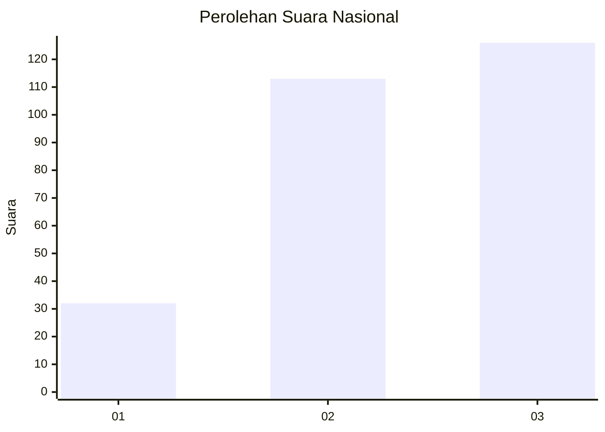
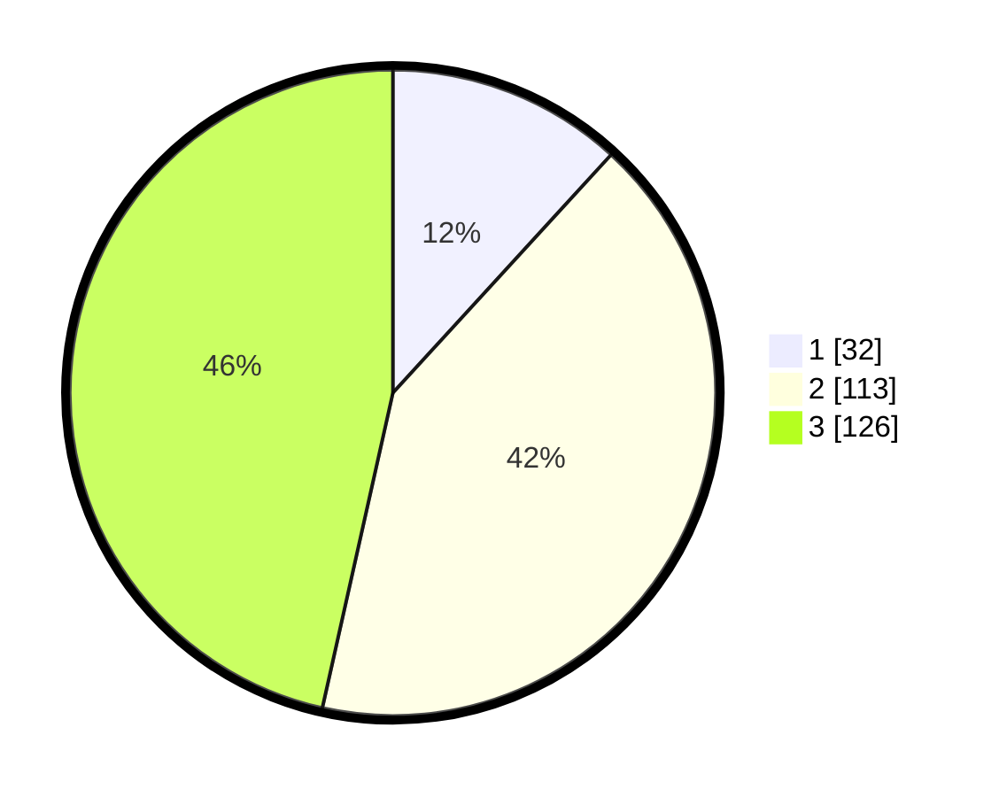

# Hasil

## Grafik

## Tabel

| No. | Nama Paslon    | Suara | Suara (raw) | Persentase |
|:--- |:-------------- | -----:| -----------:| ----------:|
| 1   | ANIES MUHAIMIN | 32    | [32][p-1]   | 11,81      |
| 2   | PRABOWO GIBRAN | 113   | [113][p-2]  | 41,70      |
| 3   | GANJAR MAHFUD  | 126   | [126][p-3]  | 46,49      |

[p-1]: https://github.com/gigit-pemilu/pemilu-2024/blob/main/pilpres/hitung-suara/sub/91-papua/sub/71-kota-jayapura/sub/02-jayapura-selatan/sub/1005-entrop/sub/012-tps/sub/paslon-1.txt
[p-2]: https://github.com/gigit-pemilu/pemilu-2024/blob/main/pilpres/hitung-suara/sub/91-papua/sub/71-kota-jayapura/sub/02-jayapura-selatan/sub/1005-entrop/sub/012-tps/sub/paslon-2.txt
[p-3]: https://github.com/gigit-pemilu/pemilu-2024/blob/main/pilpres/hitung-suara/sub/91-papua/sub/71-kota-jayapura/sub/02-jayapura-selatan/sub/1005-entrop/sub/012-tps/sub/paslon-3.txt

## Foto C Plano

https://sirekap-obj-formc.kpu.go.id/41ce/pemilu/ppwp/91/71/02/10/05/9171021005012-20240214-155118--dd786e42-81aa-4d67-ad08-af06d4bf35f9.jpg

https://sirekap-obj-formc.kpu.go.id/41ce/pemilu/ppwp/91/71/02/10/05/9171021005012-20240214-155253--310e48c3-9780-4cd9-b9e0-49fceed05baa.jpg

https://sirekap-obj-formc.kpu.go.id/41ce/pemilu/ppwp/91/71/02/10/05/9171021005012-20240214-155346--0b0cd8b2-7768-4a7b-80ca-c57142a0cf89.jpg

## Metadata

| Key        | Value               |
| ---------- | ------------------- |
| Time Stamp | 2024-02-24 22:31:28 |

