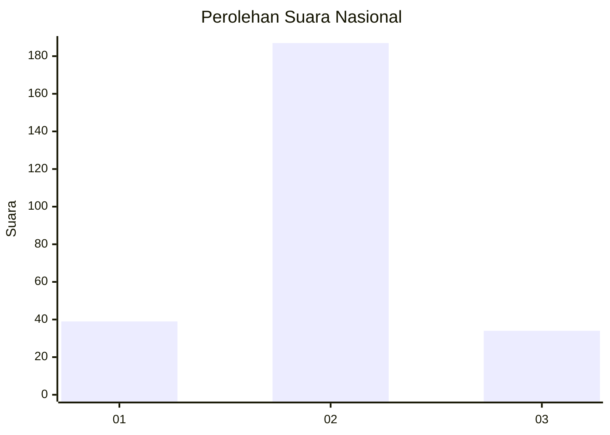
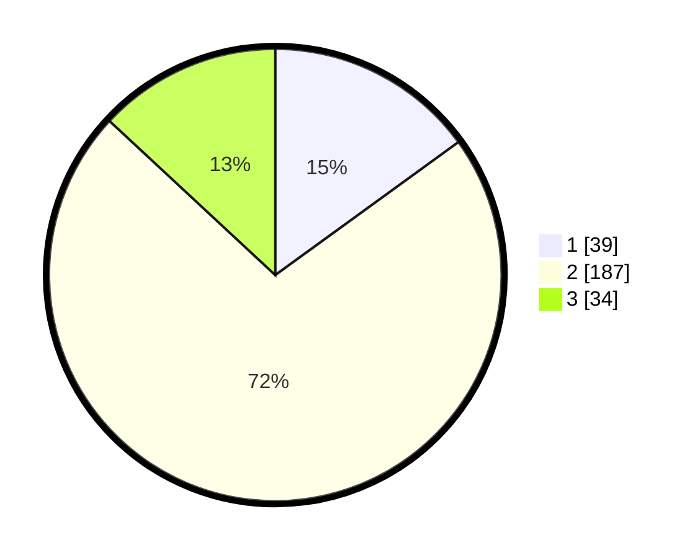

# Hasil

## Grafik

## Tabel

| No. | Nama Paslon    | Suara | Suara (raw) | Persentase |
|:--- |:-------------- | -----:| -----------:| ----------:|
| 1   | ANIES MUHAIMIN | 39    | [39][p-1]   | 15,00      |
| 2   | PRABOWO GIBRAN | 187   | [187][p-2]  | 71,92      |
| 3   | GANJAR MAHFUD  | 34    | [34][p-3]   | 13,08      |

[p-1]: https://github.com/gigit-pemilu/pemilu-2024/blob/main/pilpres/hitung-suara/sub/91-papua/sub/71-kota-jayapura/sub/02-jayapura-selatan/sub/1005-entrop/sub/014-tps/sub/paslon-1.txt
[p-2]: https://github.com/gigit-pemilu/pemilu-2024/blob/main/pilpres/hitung-suara/sub/91-papua/sub/71-kota-jayapura/sub/02-jayapura-selatan/sub/1005-entrop/sub/014-tps/sub/paslon-2.txt
[p-3]: https://github.com/gigit-pemilu/pemilu-2024/blob/main/pilpres/hitung-suara/sub/91-papua/sub/71-kota-jayapura/sub/02-jayapura-selatan/sub/1005-entrop/sub/014-tps/sub/paslon-3.txt

## Foto C Plano

https://sirekap-obj-formc.kpu.go.id/b19d/pemilu/ppwp/91/71/02/10/05/9171021005014-20240214-221945--5f0ec326-037f-446c-8093-935a205cebf0.jpg

https://sirekap-obj-formc.kpu.go.id/b19d/pemilu/ppwp/91/71/02/10/05/9171021005014-20240215-053040--c0e8d2f4-edc3-4f8a-a3ef-f9b1c17dfda1.jpg

https://sirekap-obj-formc.kpu.go.id/b19d/pemilu/ppwp/91/71/02/10/05/9171021005014-20240214-222240--e5dda9b1-a2d6-4ad5-b323-0c775ce20921.jpg

## Metadata

| Key        | Value               |
| ---------- | ------------------- |
| Time Stamp | 2024-02-24 22:31:28 |

