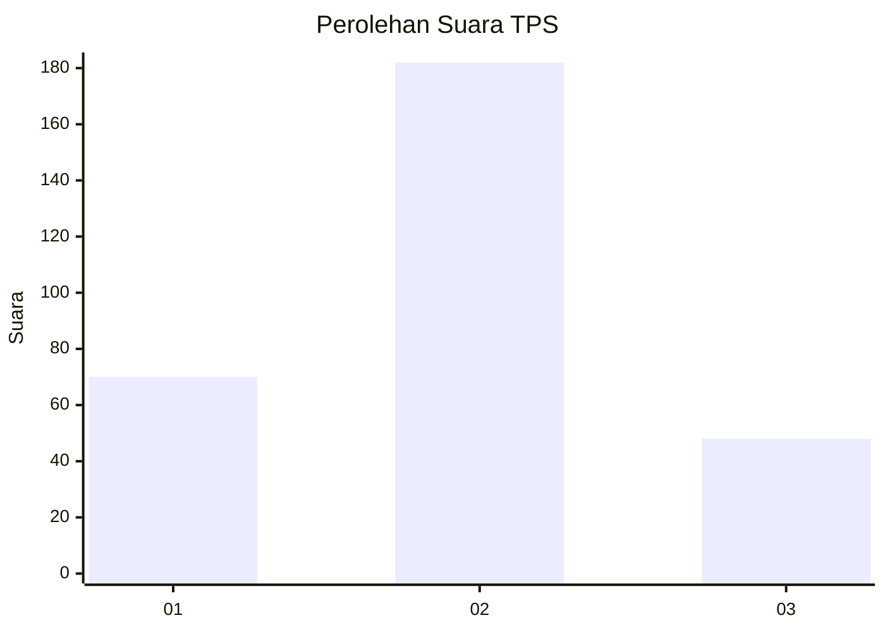

# Hasil

## Grafik

## Tabel

| No. | Nama Paslon    | Suara | Suara (raw) | Persentase |
|:--- |:-------------- | -----:| -----------:| ----------:|
| 1   | ANIES MUHAIMIN | 70    | [70][p-1]   | 23,33      |
| 2   | PRABOWO GIBRAN | 182   | [182][p-2]  | 60,67      |
| 3   | GANJAR MAHFUD  | 48    | [48][p-3]   | 16,00      |

[p-1]: https://github.com/gigit-pemilu/pemilu-2024-91-papua/blob/main/pilpres/hitung-suara/sub/91-papua/sub/71-kota-jayapura/sub/02-jayapura-selatan/sub/1005-entrop/sub/028-tps/sub/paslon-1.txt
[p-2]: https://github.com/gigit-pemilu/pemilu-2024-91-papua/blob/main/pilpres/hitung-suara/sub/91-papua/sub/71-kota-jayapura/sub/02-jayapura-selatan/sub/1005-entrop/sub/028-tps/sub/paslon-2.txt
[p-3]: https://github.com/gigit-pemilu/pemilu-2024-91-papua/blob/main/pilpres/hitung-suara/sub/91-papua/sub/71-kota-jayapura/sub/02-jayapura-selatan/sub/1005-entrop/sub/028-tps/sub/paslon-3.txt

## Foto C Plano

https://sirekap-obj-formc.kpu.go.id/6ae8/pemilu/ppwp/91/71/02/10/05/9171021005028-20240214-203524--a3f383cf-b3fc-4fbe-baca-83d6496b3a63.jpg

https://sirekap-obj-formc.kpu.go.id/6ae8/pemilu/ppwp/91/71/02/10/05/9171021005028-20240214-203645--70355d8e-3f7b-4189-9855-f1fcd209c53d.jpg

https://sirekap-obj-formc.kpu.go.id/6ae8/pemilu/ppwp/91/71/02/10/05/9171021005028-20240214-203800--e1843881-c8b9-4406-b6e2-cf56ea6b8285.jpg

## Metadata

| Key        | Value               |
| ---------- | ------------------- |
| Time Stamp | 2024-02-15 01:47:43 |

