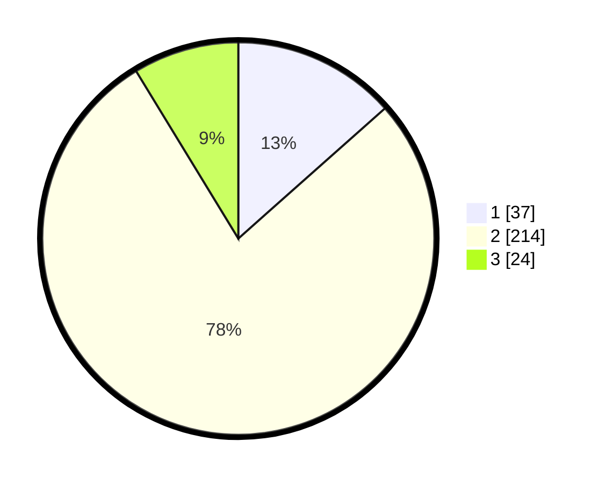

# Hasil

## Grafik

## Tabel

| No. | Nama Paslon    | Suara | Suara (raw) | Persentase |
|:--- |:-------------- | -----:| -----------:| ----------:|
| 1   | ANIES MUHAIMIN | 37    | [37][p-1]   | 13,45      |
| 2   | PRABOWO GIBRAN | 214   | [214][p-2]  | 77,82      |
| 3   | GANJAR MAHFUD  | 24    | [24][p-3]   | 8,73       |

[p-1]: https://github.com/gigit-pemilu/pemilu-2024-91-papua/blob/main/pilpres/hitung-suara/sub/91-papua/sub/71-kota-jayapura/sub/02-jayapura-selatan/sub/1005-entrop/sub/040-tps/sub/paslon-1.txt
[p-2]: https://github.com/gigit-pemilu/pemilu-2024-91-papua/blob/main/pilpres/hitung-suara/sub/91-papua/sub/71-kota-jayapura/sub/02-jayapura-selatan/sub/1005-entrop/sub/040-tps/sub/paslon-2.txt
[p-3]: https://github.com/gigit-pemilu/pemilu-2024-91-papua/blob/main/pilpres/hitung-suara/sub/91-papua/sub/71-kota-jayapura/sub/02-jayapura-selatan/sub/1005-entrop/sub/040-tps/sub/paslon-3.txt

## Foto C Plano

https://sirekap-obj-formc.kpu.go.id/c781/pemilu/ppwp/91/71/02/10/05/9171021005040-20240215-003838--f2f06e12-b8a6-43b5-982a-1796c790fa96.jpg

https://sirekap-obj-formc.kpu.go.id/c781/pemilu/ppwp/91/71/02/10/05/9171021005040-20240215-004324--cf5c3b27-d442-4453-a0fb-47c6a533542e.jpg

https://sirekap-obj-formc.kpu.go.id/c781/pemilu/ppwp/91/71/02/10/05/9171021005040-20240215-004500--4ae25ade-b46f-4a78-af9d-06995dbd3b45.jpg

## Metadata

| Key        | Value               |
| ---------- | ------------------- |
| Time Stamp | 2024-02-15 12:00:28 |

## DATA PEMILIH TETAP

Jumlah pemilih dalam DPT: **274**.
 * L: **134**.
 * P: **140**.

## DATA PENGGUNA HAK PILIH

Jumlah pengguna hak pilih dalam DPT: **206**.
 * L: **106**.
 * P: **100**.

Jumlah pengguna hak pilih dalam DPTb: **44**.
 * L: **25**.
 * P: **19**.

Jumlah pengguna hak pilih dalam DPK: **30**.
 * L: **13**.
 * P: **17**.

Jumlah pengguna hak pilih: **280**.
 * L: **144**.
 * P: **136**.

## JUMLAH SUARA SAH DAN TIDAK SAH

JUMLAH SELURUH SUARA SAH: **275**.

JUMLAH SUARA TIDAK SAH: **5**.

JUMLAH SELURUH SUARA SAH DAN SUARA TIDAK SAH: **280**.

