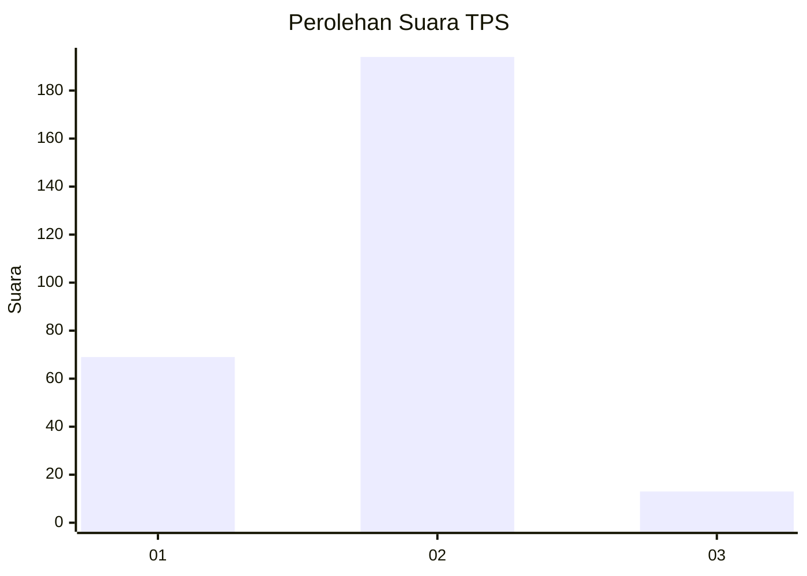
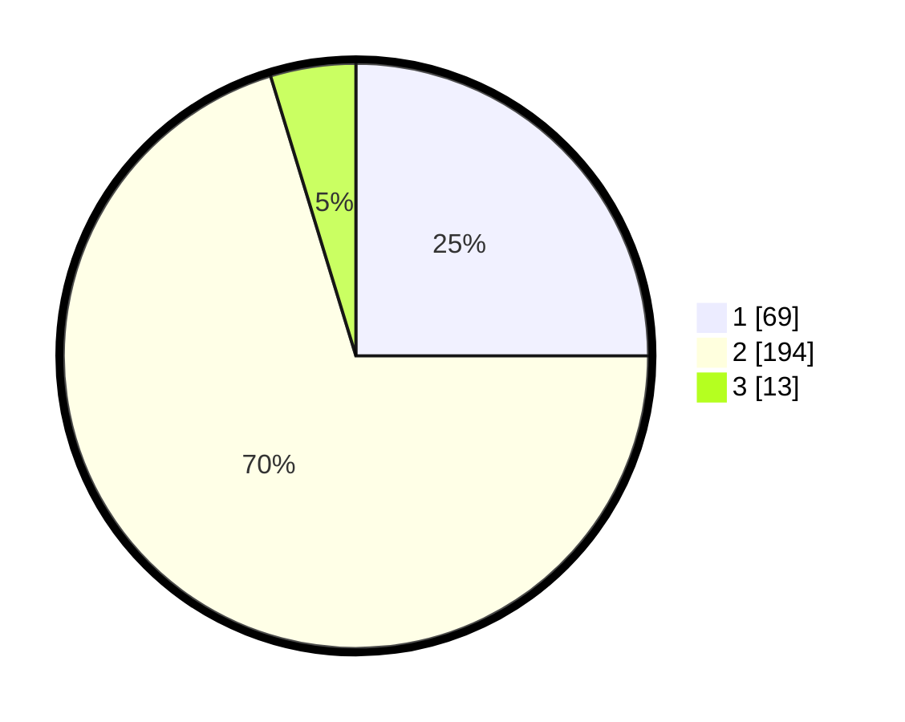

# Hasil

## Grafik

## Tabel

| No. | Nama Paslon    | Suara | Suara (raw) | Persentase |
|:--- |:-------------- | -----:| -----------:| ----------:|
| 1   | ANIES MUHAIMIN | 69    | [69][p-1]   | 25,00      |
| 2   | PRABOWO GIBRAN | 194   | [194][p-2]  | 70,29      |
| 3   | GANJAR MAHFUD  | 13    | [13][p-3]   | 4,71       |

[p-1]: https://github.com/gigit-pemilu/pemilu-2024-91-papua/blob/main/pilpres/hitung-suara/sub/91-papua/sub/71-kota-jayapura/sub/02-jayapura-selatan/sub/1005-entrop/sub/041-tps/sub/paslon-1.txt
[p-2]: https://github.com/gigit-pemilu/pemilu-2024-91-papua/blob/main/pilpres/hitung-suara/sub/91-papua/sub/71-kota-jayapura/sub/02-jayapura-selatan/sub/1005-entrop/sub/041-tps/sub/paslon-2.txt
[p-3]: https://github.com/gigit-pemilu/pemilu-2024-91-papua/blob/main/pilpres/hitung-suara/sub/91-papua/sub/71-kota-jayapura/sub/02-jayapura-selatan/sub/1005-entrop/sub/041-tps/sub/paslon-3.txt

## Foto C Plano

https://sirekap-obj-formc.kpu.go.id/e79f/pemilu/ppwp/91/71/02/10/05/9171021005041-20240215-052317--f93eaa9d-0c53-4c0f-9b27-6edbcea8e406.jpg

https://sirekap-obj-formc.kpu.go.id/e79f/pemilu/ppwp/91/71/02/10/05/9171021005041-20240215-052455--6de92d04-aee5-4a04-98d0-9e97464cb520.jpg

https://sirekap-obj-formc.kpu.go.id/e79f/pemilu/ppwp/91/71/02/10/05/9171021005041-20240215-052619--13a649da-c581-41dd-881c-ea77eae664a4.jpg

## Metadata

| Key        | Value               |
| ---------- | ------------------- |
| Time Stamp | 2024-02-25 23:00:00 |

