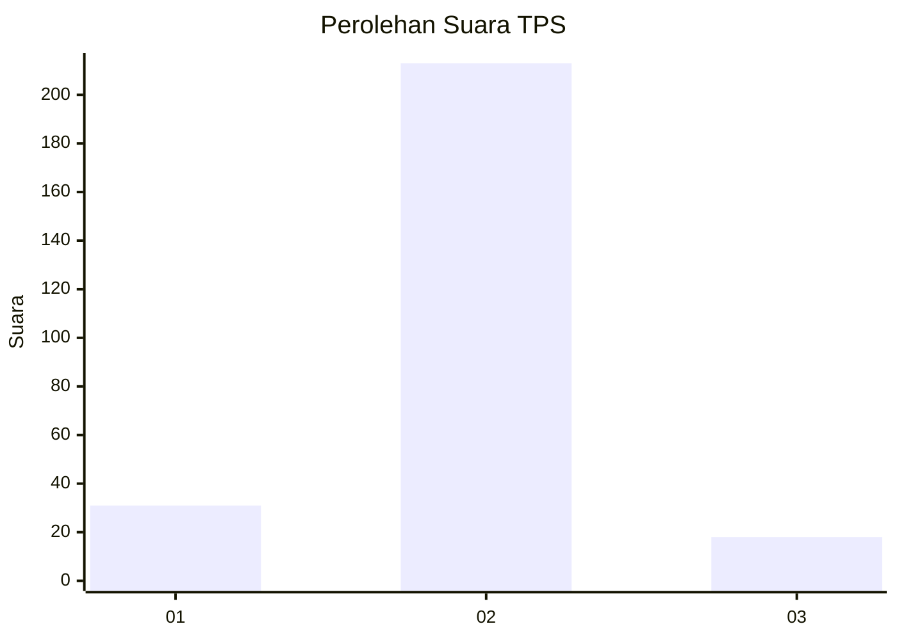
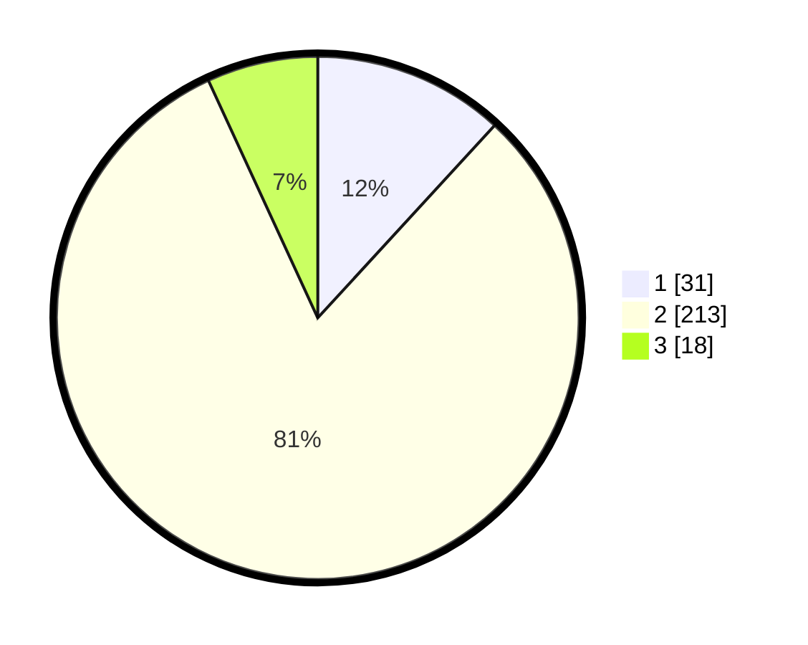

# Hasil

## Grafik

## Tabel

| No. | Nama Paslon    | Suara | Suara (raw) | Persentase |
|:--- |:-------------- | -----:| -----------:| ----------:|
| 1   | ANIES MUHAIMIN | 31    | [31][p-1]   | 11,83      |
| 2   | PRABOWO GIBRAN | 213   | [213][p-2]  | 81,30      |
| 3   | GANJAR MAHFUD  | 18    | [18][p-3]   | 6,87       |

[p-1]: https://github.com/gigit-pemilu/pemilu-2024-91-papua/blob/main/pilpres/hitung-suara/sub/91-papua/sub/71-kota-jayapura/sub/02-jayapura-selatan/sub/1005-entrop/sub/055-tps/sub/paslon-1.txt
[p-2]: https://github.com/gigit-pemilu/pemilu-2024-91-papua/blob/main/pilpres/hitung-suara/sub/91-papua/sub/71-kota-jayapura/sub/02-jayapura-selatan/sub/1005-entrop/sub/055-tps/sub/paslon-2.txt
[p-3]: https://github.com/gigit-pemilu/pemilu-2024-91-papua/blob/main/pilpres/hitung-suara/sub/91-papua/sub/71-kota-jayapura/sub/02-jayapura-selatan/sub/1005-entrop/sub/055-tps/sub/paslon-3.txt

## Foto C Plano

https://sirekap-obj-formc.kpu.go.id/be9a/pemilu/ppwp/91/71/02/10/05/9171021005055-20240215-054737--45f6a1bb-0d48-4aa4-b0fc-94ddb14d97b8.jpg

https://sirekap-obj-formc.kpu.go.id/be9a/pemilu/ppwp/91/71/02/10/05/9171021005055-20240215-055001--f3ac23a4-a14a-4a4a-b5d3-acfc63dac762.jpg

https://sirekap-obj-formc.kpu.go.id/be9a/pemilu/ppwp/91/71/02/10/05/9171021005055-20240215-055910--5a30b62a-4e10-46a3-9899-222b9bcb9e43.jpg

## Metadata

| Key        | Value               |
| ---------- | ------------------- |
| Time Stamp | 2024-02-22 11:00:00 |

