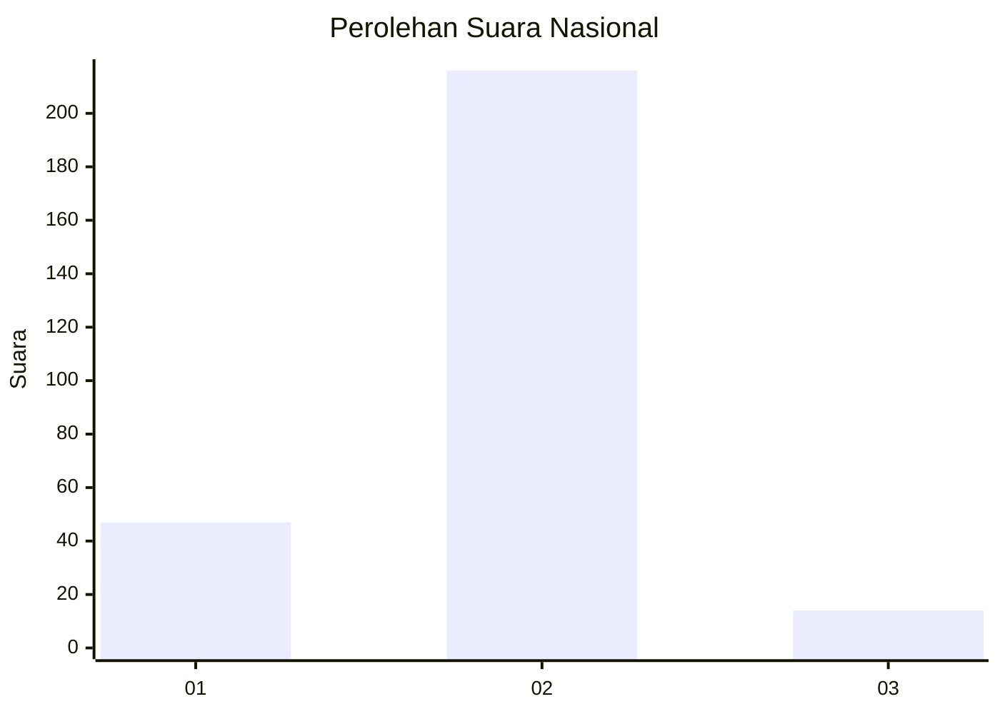
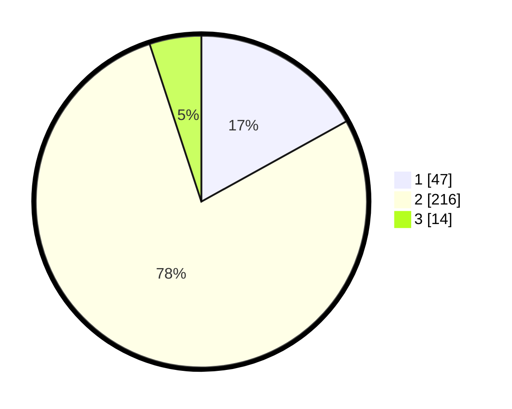

# Hasil

## Grafik

## Tabel

| No. | Nama Paslon    | Suara | Suara (raw) | Persentase |
|:--- |:-------------- | -----:| -----------:| ----------:|
| 1   | ANIES MUHAIMIN | 47    | [47][p-1]   | 16,97      |
| 2   | PRABOWO GIBRAN | 216   | [216][p-2]  | 77,98      |
| 3   | GANJAR MAHFUD  | 14    | [14][p-3]   | 5,05       |

[p-1]: https://github.com/gigit-pemilu/pemilu-2024/blob/main/pilpres/hitung-suara/sub/91-papua/sub/71-kota-jayapura/sub/02-jayapura-selatan/sub/1005-entrop/sub/059-tps/sub/paslon-1.txt
[p-2]: https://github.com/gigit-pemilu/pemilu-2024/blob/main/pilpres/hitung-suara/sub/91-papua/sub/71-kota-jayapura/sub/02-jayapura-selatan/sub/1005-entrop/sub/059-tps/sub/paslon-2.txt
[p-3]: https://github.com/gigit-pemilu/pemilu-2024/blob/main/pilpres/hitung-suara/sub/91-papua/sub/71-kota-jayapura/sub/02-jayapura-selatan/sub/1005-entrop/sub/059-tps/sub/paslon-3.txt

## Foto C Plano

https://sirekap-obj-formc.kpu.go.id/2061/pemilu/ppwp/91/71/02/10/05/9171021005059-20240215-085843--88ddd96f-d48e-469a-999a-ad921f593005.jpg

https://sirekap-obj-formc.kpu.go.id/2061/pemilu/ppwp/91/71/02/10/05/9171021005059-20240215-085935--b3c090b7-e7a0-4f8b-a613-566e4a692d09.jpg

https://sirekap-obj-formc.kpu.go.id/2061/pemilu/ppwp/91/71/02/10/05/9171021005059-20240215-090044--0f381dbd-a412-4384-b111-d7d72080736f.jpg

## Metadata

| Key        | Value               |
| ---------- | ------------------- |
| Time Stamp | 2024-02-25 01:00:00 |

