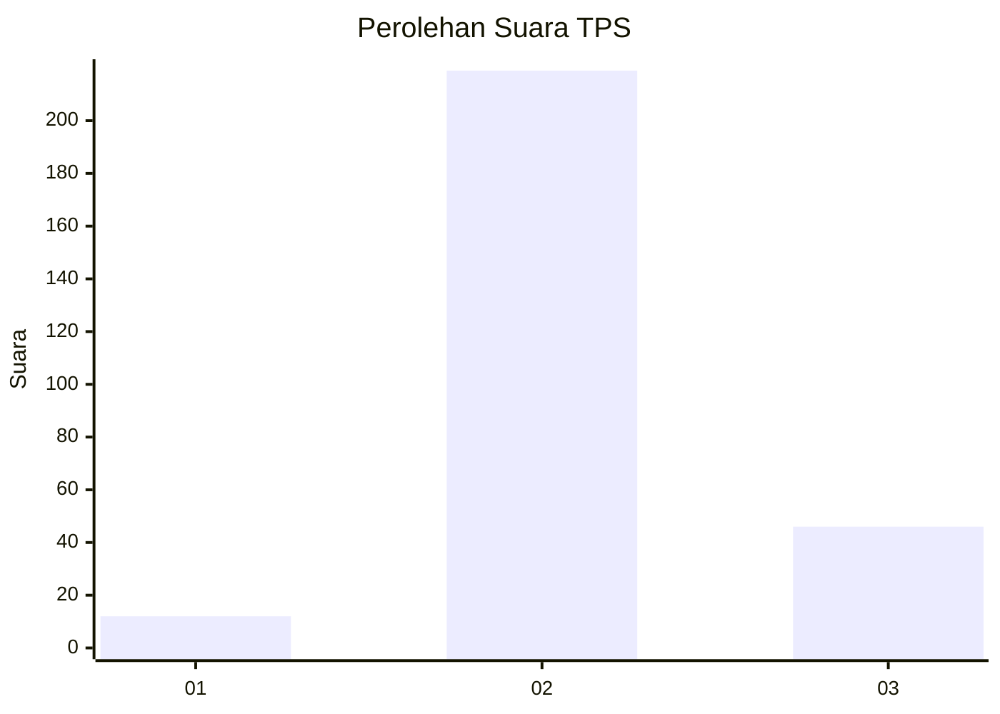
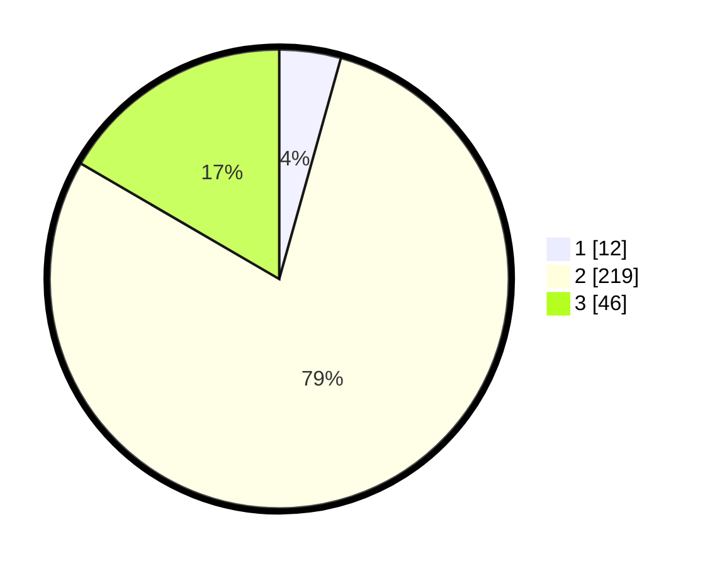

# Hasil

## Grafik

## Tabel

| No. | Nama Paslon    | Suara | Suara (raw) | Persentase |
|:--- |:-------------- | -----:| -----------:| ----------:|
| 1   | ANIES MUHAIMIN | 12    | [12][p-1]   | 4,33       |
| 2   | PRABOWO GIBRAN | 219   | [219][p-2]  | 79,06      |
| 3   | GANJAR MAHFUD  | 46    | [46][p-3]   | 16,61      |

[p-1]: https://github.com/gigit-pemilu/pemilu-2024-91-papua/blob/main/pilpres/hitung-suara/sub/91-papua/sub/71-kota-jayapura/sub/02-jayapura-selatan/sub/1006-hamadi/sub/009-tps/sub/paslon-1.txt
[p-2]: https://github.com/gigit-pemilu/pemilu-2024-91-papua/blob/main/pilpres/hitung-suara/sub/91-papua/sub/71-kota-jayapura/sub/02-jayapura-selatan/sub/1006-hamadi/sub/009-tps/sub/paslon-2.txt
[p-3]: https://github.com/gigit-pemilu/pemilu-2024-91-papua/blob/main/pilpres/hitung-suara/sub/91-papua/sub/71-kota-jayapura/sub/02-jayapura-selatan/sub/1006-hamadi/sub/009-tps/sub/paslon-3.txt

## Foto C Plano

https://sirekap-obj-formc.kpu.go.id/de79/pemilu/ppwp/91/71/02/10/06/9171021006009-20240215-100741--846fdd14-1ec0-4a0d-86c3-22a688045e21.jpg

https://sirekap-obj-formc.kpu.go.id/de79/pemilu/ppwp/91/71/02/10/06/9171021006009-20240215-100804--3f5f154b-9b2b-445b-93ad-1c6b46aa324f.jpg

https://sirekap-obj-formc.kpu.go.id/de79/pemilu/ppwp/91/71/02/10/06/9171021006009-20240215-100822--dbb0efa7-ff55-4bf3-b945-911b23a8521a.jpg

## Metadata

| Key        | Value               |
| ---------- | ------------------- |
| Time Stamp | 2024-02-22 11:00:00 |

