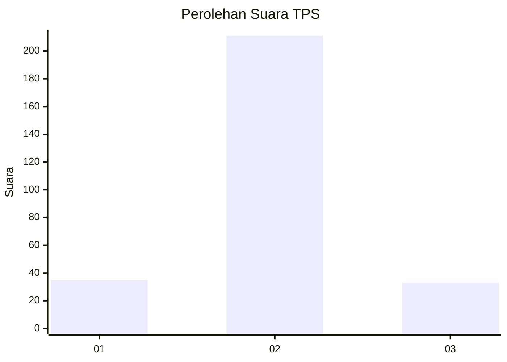
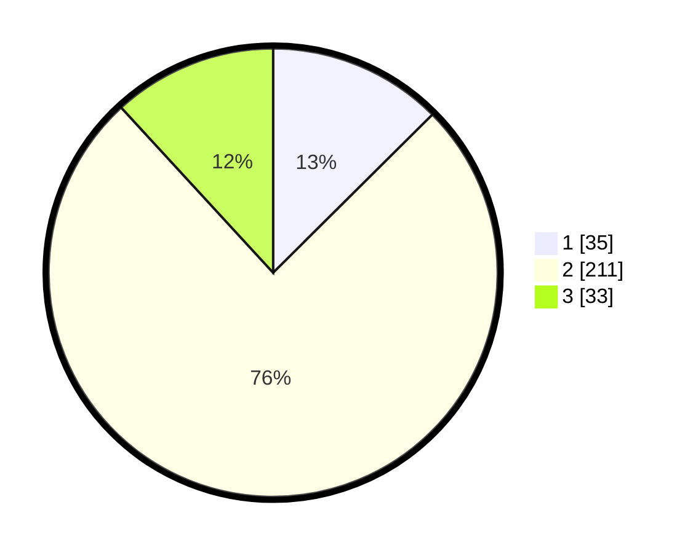

# Hasil

## Grafik

## Tabel

| No. | Nama Paslon    | Suara | Suara (raw) | Persentase |
|:--- |:-------------- | -----:| -----------:| ----------:|
| 1   | ANIES MUHAIMIN | 35    | [35][p-1]   | 12,54      |
| 2   | PRABOWO GIBRAN | 211   | [211][p-2]  | 75,63      |
| 3   | GANJAR MAHFUD  | 33    | [33][p-3]   | 11,83      |

[p-1]: https://github.com/gigit-pemilu/pemilu-2024-91-papua/blob/main/pilpres/hitung-suara/sub/91-papua/sub/71-kota-jayapura/sub/02-jayapura-selatan/sub/1006-hamadi/sub/067-tps/sub/paslon-1.txt
[p-2]: https://github.com/gigit-pemilu/pemilu-2024-91-papua/blob/main/pilpres/hitung-suara/sub/91-papua/sub/71-kota-jayapura/sub/02-jayapura-selatan/sub/1006-hamadi/sub/067-tps/sub/paslon-2.txt
[p-3]: https://github.com/gigit-pemilu/pemilu-2024-91-papua/blob/main/pilpres/hitung-suara/sub/91-papua/sub/71-kota-jayapura/sub/02-jayapura-selatan/sub/1006-hamadi/sub/067-tps/sub/paslon-3.txt

## Foto C Plano

https://sirekap-obj-formc.kpu.go.id/e489/pemilu/ppwp/91/71/02/10/06/9171021006067-20240215-004851--320b362e-16e4-4562-b929-980b550d0c0d.jpg

https://sirekap-obj-formc.kpu.go.id/e489/pemilu/ppwp/91/71/02/10/06/9171021006067-20240215-005111--9215187b-c8f9-4921-876f-8e211fac0dd6.jpg

https://sirekap-obj-formc.kpu.go.id/e489/pemilu/ppwp/91/71/02/10/06/9171021006067-20240215-005701--106ec5f6-9a45-4ca3-ad5d-51afff4d3dd3.jpg

## Metadata

| Key        | Value               |
| ---------- | ------------------- |
| Time Stamp | 2024-02-28 11:00:00 |

