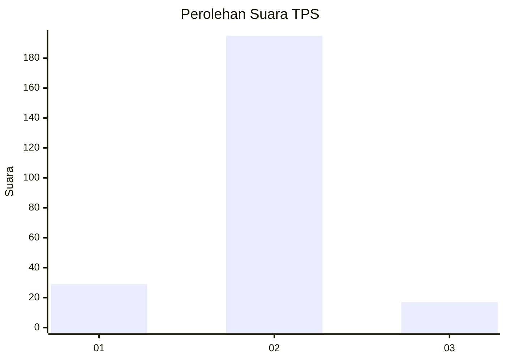
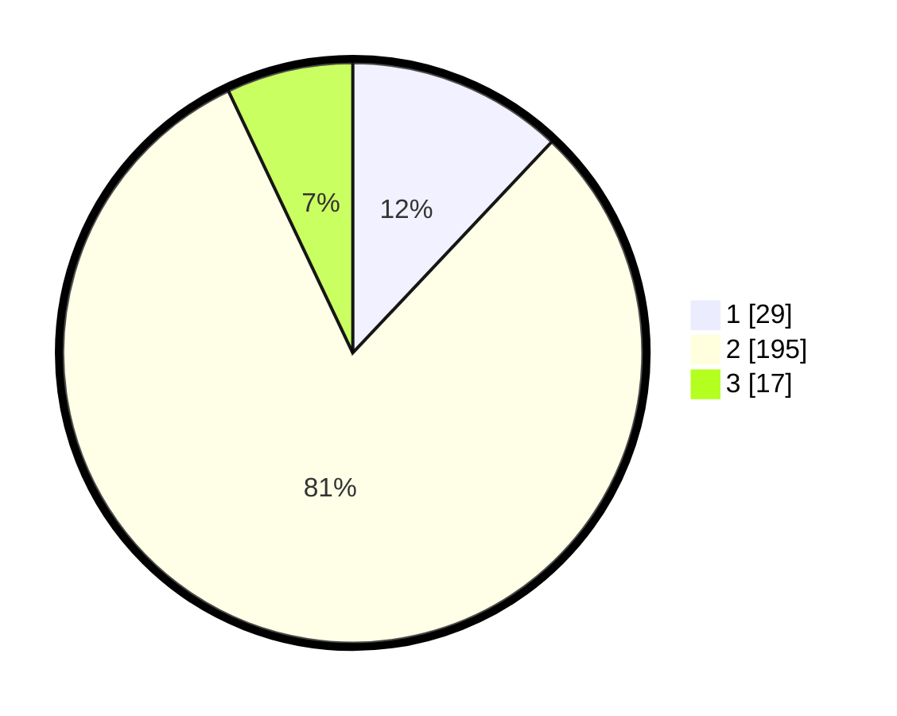

# Hasil

## Grafik

## Tabel

| No. | Nama Paslon    | Suara | Suara (raw) | Persentase |
|:--- |:-------------- | -----:| -----------:| ----------:|
| 1   | ANIES MUHAIMIN | 29    | [29][p-1]   | 12,03      |
| 2   | PRABOWO GIBRAN | 195   | [195][p-2]  | 80,91      |
| 3   | GANJAR MAHFUD  | 17    | [17][p-3]   | 7,05       |

[p-1]: https://github.com/gigit-pemilu/pemilu-2024-91-papua/blob/main/pilpres/hitung-suara/sub/91-papua/sub/71-kota-jayapura/sub/03-abepura/sub/1002-asano/sub/003-tps/sub/paslon-1.txt
[p-2]: https://github.com/gigit-pemilu/pemilu-2024-91-papua/blob/main/pilpres/hitung-suara/sub/91-papua/sub/71-kota-jayapura/sub/03-abepura/sub/1002-asano/sub/003-tps/sub/paslon-2.txt
[p-3]: https://github.com/gigit-pemilu/pemilu-2024-91-papua/blob/main/pilpres/hitung-suara/sub/91-papua/sub/71-kota-jayapura/sub/03-abepura/sub/1002-asano/sub/003-tps/sub/paslon-3.txt

## Foto C Plano

https://sirekap-obj-formc.kpu.go.id/bd32/pemilu/ppwp/91/71/03/10/02/9171031002003-20240215-172617--97578e76-38f8-4363-b207-21b2d89e66bd.jpg

https://sirekap-obj-formc.kpu.go.id/bd32/pemilu/ppwp/91/71/03/10/02/9171031002003-20240215-172748--cd0b7589-8ef8-40f8-93d2-484db46a190d.jpg

https://sirekap-obj-formc.kpu.go.id/bd32/pemilu/ppwp/91/71/03/10/02/9171031002003-20240215-172901--2dfd7b7c-cbfa-4e68-9f11-63257c7ee3e0.jpg

## Metadata

| Key        | Value               |
| ---------- | ------------------- |
| Time Stamp | 2024-02-25 21:00:00 |

