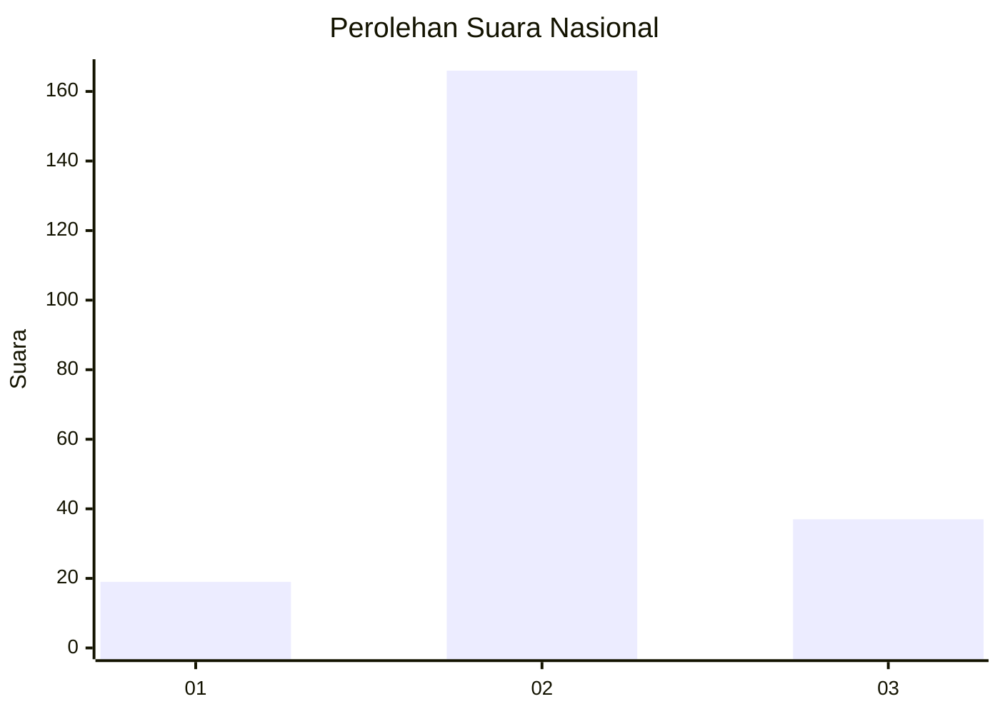
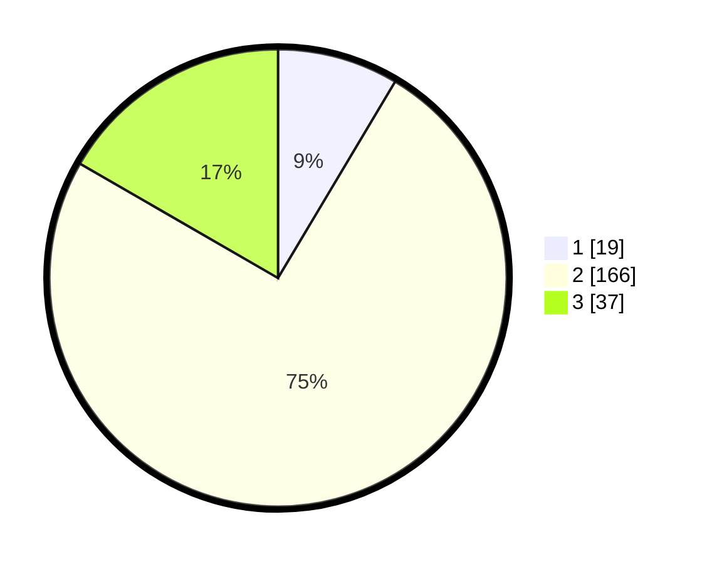

# Hasil

## Grafik

## Tabel

| No. | Nama Paslon    | Suara | Suara (raw) | Persentase |
|:--- |:-------------- | -----:| -----------:| ----------:|
| 1   | ANIES MUHAIMIN | 19    | [19][p-1]   | 8,56       |
| 2   | PRABOWO GIBRAN | 166   | [166][p-2]  | 74,77      |
| 3   | GANJAR MAHFUD  | 37    | [37][p-3]   | 16,67      |

[p-1]: https://github.com/gigit-pemilu/pemilu-2024/blob/main/pilpres/hitung-suara/sub/91-papua/sub/71-kota-jayapura/sub/03-abepura/sub/1002-asano/sub/005-tps/sub/paslon-1.txt
[p-2]: https://github.com/gigit-pemilu/pemilu-2024/blob/main/pilpres/hitung-suara/sub/91-papua/sub/71-kota-jayapura/sub/03-abepura/sub/1002-asano/sub/005-tps/sub/paslon-2.txt
[p-3]: https://github.com/gigit-pemilu/pemilu-2024/blob/main/pilpres/hitung-suara/sub/91-papua/sub/71-kota-jayapura/sub/03-abepura/sub/1002-asano/sub/005-tps/sub/paslon-3.txt

## Foto C Plano

https://sirekap-obj-formc.kpu.go.id/17f9/pemilu/ppwp/91/71/03/10/02/9171031002005-20240215-003945--c4f414fe-422f-42bb-9ca9-81ed38a8bdfc.jpg

https://sirekap-obj-formc.kpu.go.id/17f9/pemilu/ppwp/91/71/03/10/02/9171031002005-20240215-002903--5593c2ed-ef89-4170-b4ac-aa7e49e75495.jpg

https://sirekap-obj-formc.kpu.go.id/17f9/pemilu/ppwp/91/71/03/10/02/9171031002005-20240215-003214--f0a78fb4-8e23-4327-90e6-f6e583194603.jpg

## Metadata

| Key        | Value               |
| ---------- | ------------------- |
| Time Stamp | 2024-02-24 22:31:28 |

