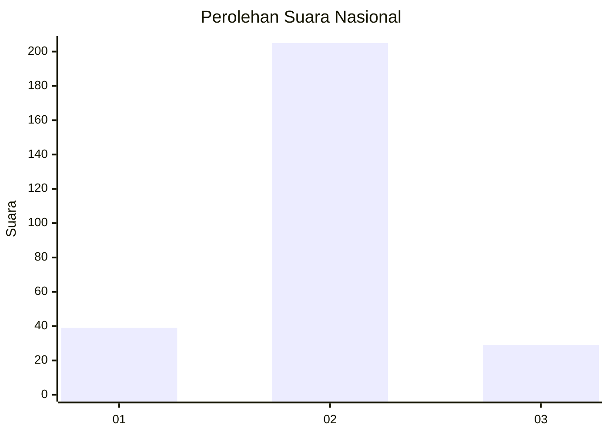
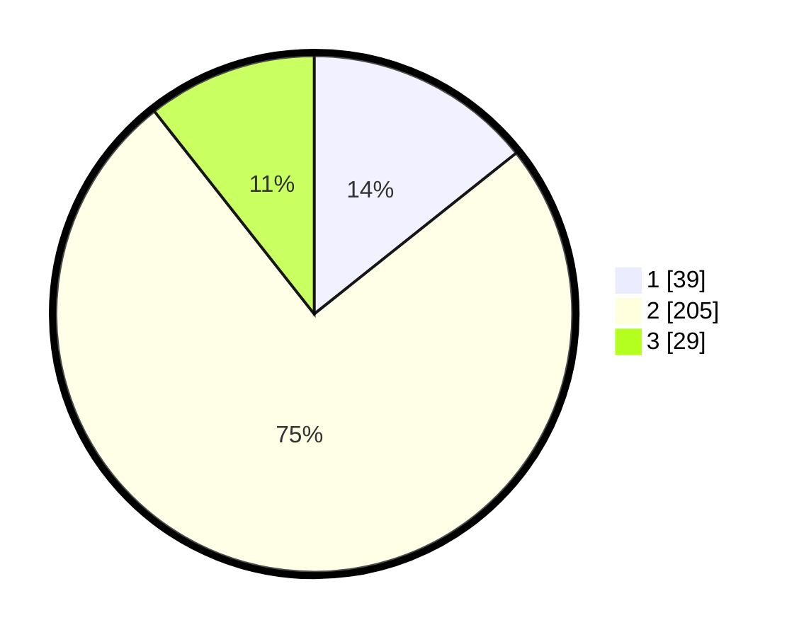

# Hasil

## Grafik

## Tabel

| No. | Nama Paslon    | Suara | Suara (raw) | Persentase |
|:--- |:-------------- | -----:| -----------:| ----------:|
| 1   | ANIES MUHAIMIN | 39    | [39][p-1]   | 14,29      |
| 2   | PRABOWO GIBRAN | 205   | [205][p-2]  | 75,09      |
| 3   | GANJAR MAHFUD  | 29    | [29][p-3]   | 10,62      |

[p-1]: https://github.com/gigit-pemilu/pemilu-2024/blob/main/pilpres/hitung-suara/sub/91-papua/sub/71-kota-jayapura/sub/03-abepura/sub/1002-asano/sub/014-tps/sub/paslon-1.txt
[p-2]: https://github.com/gigit-pemilu/pemilu-2024/blob/main/pilpres/hitung-suara/sub/91-papua/sub/71-kota-jayapura/sub/03-abepura/sub/1002-asano/sub/014-tps/sub/paslon-2.txt
[p-3]: https://github.com/gigit-pemilu/pemilu-2024/blob/main/pilpres/hitung-suara/sub/91-papua/sub/71-kota-jayapura/sub/03-abepura/sub/1002-asano/sub/014-tps/sub/paslon-3.txt

## Foto C Plano

https://sirekap-obj-formc.kpu.go.id/5a86/pemilu/ppwp/91/71/03/10/02/9171031002014-20240214-234100--f9e07356-4b27-47fa-a361-190d142c6365.jpg

https://sirekap-obj-formc.kpu.go.id/5a86/pemilu/ppwp/91/71/03/10/02/9171031002014-20240214-234843--b0d9b723-6b0f-4c10-a98f-21dd7f00c9e6.jpg

## Metadata

| Key        | Value               |
| ---------- | ------------------- |
| Time Stamp | 2024-02-25 21:00:00 |

