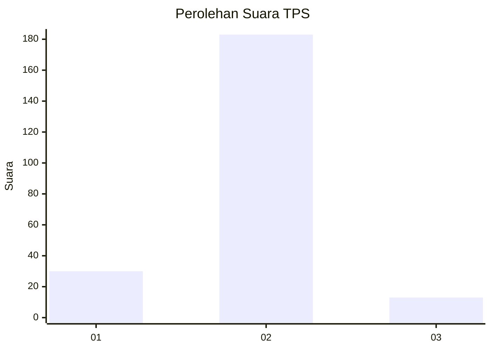
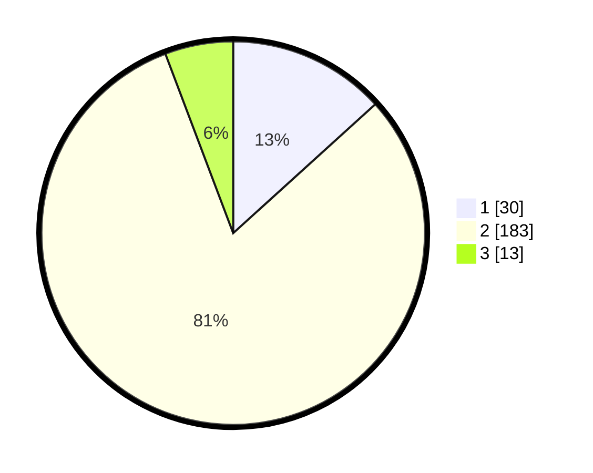

# Hasil

## Grafik

## Tabel

| No. | Nama Paslon    | Suara | Suara (raw) | Persentase |
|:--- |:-------------- | -----:| -----------:| ----------:|
| 1   | ANIES MUHAIMIN | 30    | [30][p-1]   | 13,27      |
| 2   | PRABOWO GIBRAN | 183   | [183][p-2]  | 80,97      |
| 3   | GANJAR MAHFUD  | 13    | [13][p-3]   | 5,75       |

[p-1]: https://github.com/gigit-pemilu/pemilu-2024-91-papua/blob/main/pilpres/hitung-suara/sub/91-papua/sub/71-kota-jayapura/sub/03-abepura/sub/1002-asano/sub/015-tps/sub/paslon-1.txt
[p-2]: https://github.com/gigit-pemilu/pemilu-2024-91-papua/blob/main/pilpres/hitung-suara/sub/91-papua/sub/71-kota-jayapura/sub/03-abepura/sub/1002-asano/sub/015-tps/sub/paslon-2.txt
[p-3]: https://github.com/gigit-pemilu/pemilu-2024-91-papua/blob/main/pilpres/hitung-suara/sub/91-papua/sub/71-kota-jayapura/sub/03-abepura/sub/1002-asano/sub/015-tps/sub/paslon-3.txt

## Foto C Plano

https://sirekap-obj-formc.kpu.go.id/16be/pemilu/ppwp/91/71/03/10/02/9171031002015-20240215-030808--487fe9d2-733c-4db3-8514-9a5d522a3d68.jpg

https://sirekap-obj-formc.kpu.go.id/16be/pemilu/ppwp/91/71/03/10/02/9171031002015-20240215-031416--6716cb91-b848-4bc4-8583-4e7b94269c22.jpg

https://sirekap-obj-formc.kpu.go.id/16be/pemilu/ppwp/91/71/03/10/02/9171031002015-20240215-031522--96f9e2f6-7040-4f17-9698-d8968f090625.jpg

## Metadata

| Key        | Value               |
| ---------- | ------------------- |
| Time Stamp | 2024-02-16 08:30:27 |

