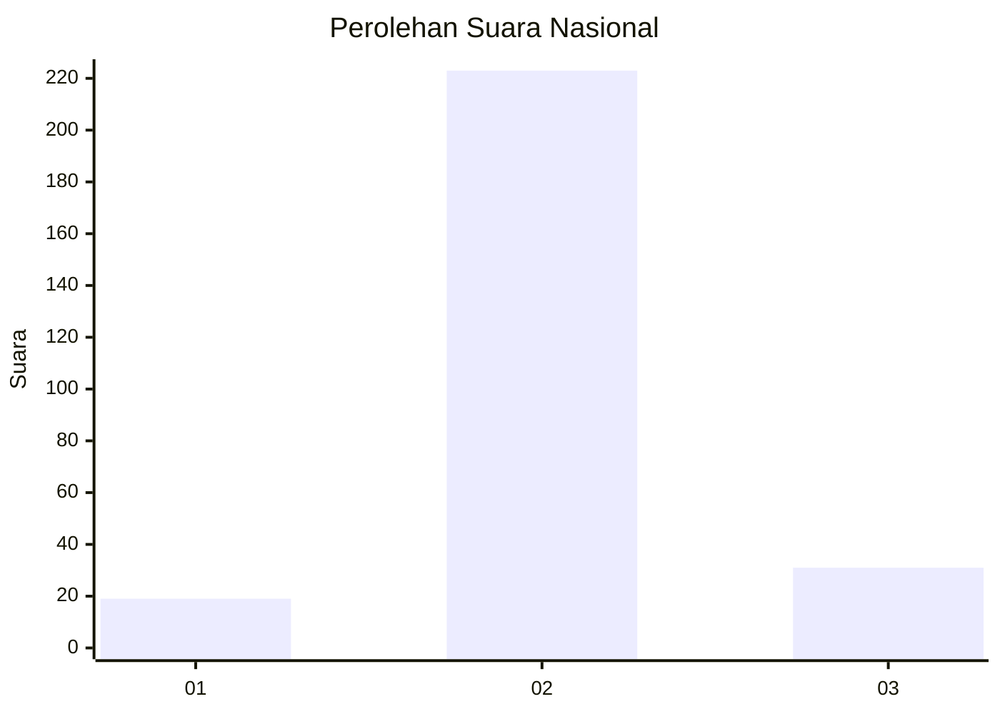
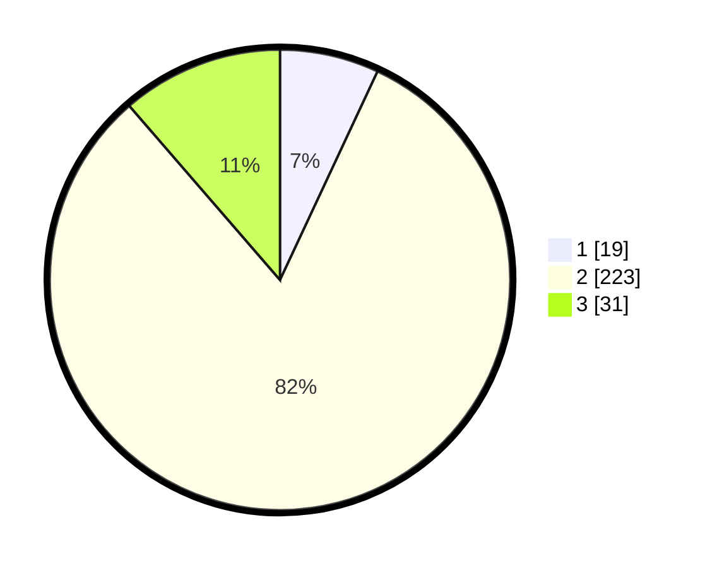

# Hasil

## Grafik

## Tabel

| No. | Nama Paslon    | Suara | Suara (raw) | Persentase |
|:--- |:-------------- | -----:| -----------:| ----------:|
| 1   | ANIES MUHAIMIN | 19    | [19][p-1]   | 6,96       |
| 2   | PRABOWO GIBRAN | 223   | [223][p-2]  | 81,68      |
| 3   | GANJAR MAHFUD  | 31    | [31][p-3]   | 11,36      |

[p-1]: https://github.com/gigit-pemilu/pemilu-2024/blob/main/pilpres/hitung-suara/sub/91-papua/sub/71-kota-jayapura/sub/03-abepura/sub/1002-asano/sub/020-tps/sub/paslon-1.txt
[p-2]: https://github.com/gigit-pemilu/pemilu-2024/blob/main/pilpres/hitung-suara/sub/91-papua/sub/71-kota-jayapura/sub/03-abepura/sub/1002-asano/sub/020-tps/sub/paslon-2.txt
[p-3]: https://github.com/gigit-pemilu/pemilu-2024/blob/main/pilpres/hitung-suara/sub/91-papua/sub/71-kota-jayapura/sub/03-abepura/sub/1002-asano/sub/020-tps/sub/paslon-3.txt

## Foto C Plano

https://sirekap-obj-formc.kpu.go.id/f20a/pemilu/ppwp/91/71/03/10/02/9171031002020-20240215-065526--287f08eb-54a9-4bd6-b46c-3731798a2aa7.jpg

https://sirekap-obj-formc.kpu.go.id/f20a/pemilu/ppwp/91/71/03/10/02/9171031002020-20240215-071700--fd83cba2-303d-4de6-b087-4fc74d51a2ce.jpg

https://sirekap-obj-formc.kpu.go.id/f20a/pemilu/ppwp/91/71/03/10/02/9171031002020-20240215-072158--cf49d8a3-92b6-484b-ac68-9f0297003a98.jpg

## Metadata

| Key        | Value               |
| ---------- | ------------------- |
| Time Stamp | 2024-02-16 08:30:27 |

