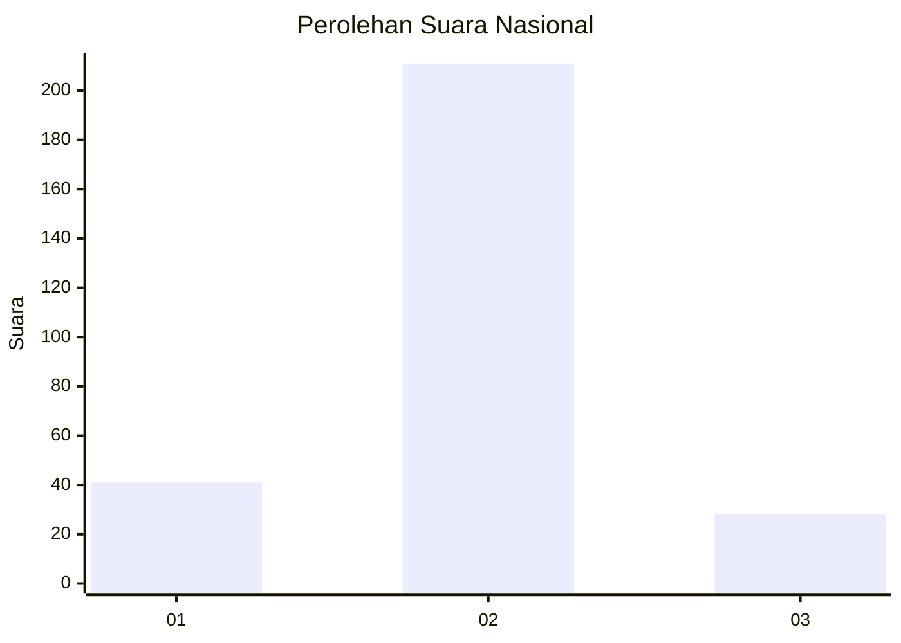
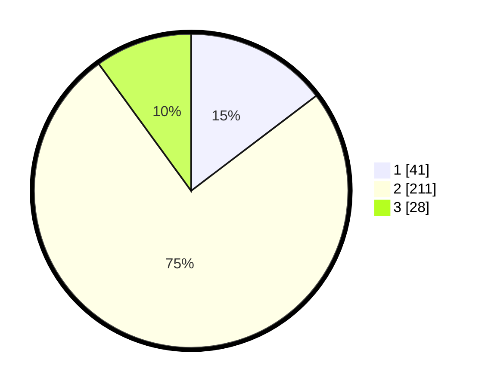

# Hasil

## Grafik

## Tabel

| No. | Nama Paslon    | Suara | Suara (raw) | Persentase |
|:--- |:-------------- | -----:| -----------:| ----------:|
| 1   | ANIES MUHAIMIN | 41    | [41][p-1]   | 14,64      |
| 2   | PRABOWO GIBRAN | 211   | [211][p-2]  | 75,36      |
| 3   | GANJAR MAHFUD  | 28    | [28][p-3]   | 10,00      |

[p-1]: https://github.com/gigit-pemilu/pemilu-2024/blob/main/pilpres/hitung-suara/sub/91-papua/sub/71-kota-jayapura/sub/03-abepura/sub/1002-asano/sub/021-tps/sub/paslon-1.txt
[p-2]: https://github.com/gigit-pemilu/pemilu-2024/blob/main/pilpres/hitung-suara/sub/91-papua/sub/71-kota-jayapura/sub/03-abepura/sub/1002-asano/sub/021-tps/sub/paslon-2.txt
[p-3]: https://github.com/gigit-pemilu/pemilu-2024/blob/main/pilpres/hitung-suara/sub/91-papua/sub/71-kota-jayapura/sub/03-abepura/sub/1002-asano/sub/021-tps/sub/paslon-3.txt

## Foto C Plano

https://sirekap-obj-formc.kpu.go.id/300b/pemilu/ppwp/91/71/03/10/02/9171031002021-20240215-043853--6f71f4b9-c65c-4e75-a017-0d6330c4e6e6.jpg

https://sirekap-obj-formc.kpu.go.id/300b/pemilu/ppwp/91/71/03/10/02/9171031002021-20240215-044014--824d0448-359f-41a0-a48d-e26658e72cee.jpg

https://sirekap-obj-formc.kpu.go.id/300b/pemilu/ppwp/91/71/03/10/02/9171031002021-20240215-044143--14cf0a70-0e1b-4104-a174-1cdc9e5f39a5.jpg

## Metadata

| Key        | Value               |
| ---------- | ------------------- |
| Time Stamp | 2024-02-16 08:30:27 |

