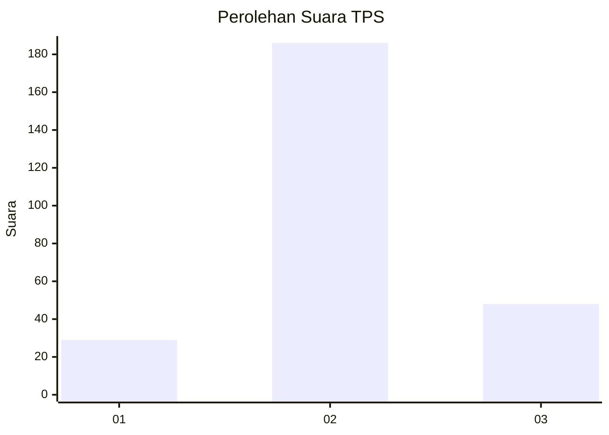
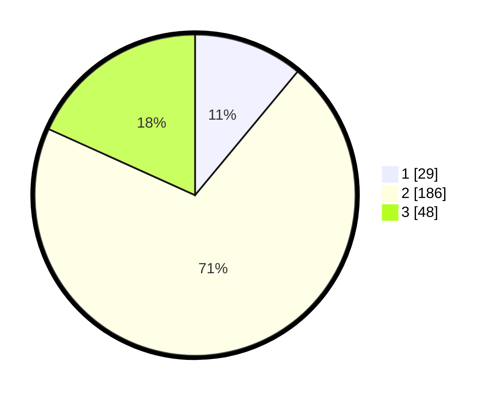

# Hasil

## Grafik

## Tabel

| No. | Nama Paslon    | Suara | Suara (raw) | Persentase |
|:--- |:-------------- | -----:| -----------:| ----------:|
| 1   | ANIES MUHAIMIN | 29    | [29][p-1]   | 11,03      |
| 2   | PRABOWO GIBRAN | 186   | [186][p-2]  | 70,72      |
| 3   | GANJAR MAHFUD  | 48    | [48][p-3]   | 18,25      |

[p-1]: https://github.com/gigit-pemilu/pemilu-2024-91-papua/blob/main/pilpres/hitung-suara/sub/91-papua/sub/71-kota-jayapura/sub/03-abepura/sub/1002-asano/sub/025-tps/sub/paslon-1.txt
[p-2]: https://github.com/gigit-pemilu/pemilu-2024-91-papua/blob/main/pilpres/hitung-suara/sub/91-papua/sub/71-kota-jayapura/sub/03-abepura/sub/1002-asano/sub/025-tps/sub/paslon-2.txt
[p-3]: https://github.com/gigit-pemilu/pemilu-2024-91-papua/blob/main/pilpres/hitung-suara/sub/91-papua/sub/71-kota-jayapura/sub/03-abepura/sub/1002-asano/sub/025-tps/sub/paslon-3.txt

## Foto C Plano

https://sirekap-obj-formc.kpu.go.id/05ea/pemilu/ppwp/91/71/03/10/02/9171031002025-20240214-220436--57106c9e-e012-40bb-b81c-61b24983de19.jpg

https://sirekap-obj-formc.kpu.go.id/05ea/pemilu/ppwp/91/71/03/10/02/9171031002025-20240214-220458--b664d9b7-08bb-4290-ac9e-44b765893ddc.jpg

https://sirekap-obj-formc.kpu.go.id/05ea/pemilu/ppwp/91/71/03/10/02/9171031002025-20240214-220517--7308c895-d43a-4f57-b0e1-67944a0e519a.jpg

## Metadata

| Key        | Value               |
| ---------- | ------------------- |
| Time Stamp | 2024-02-25 11:00:00 |

