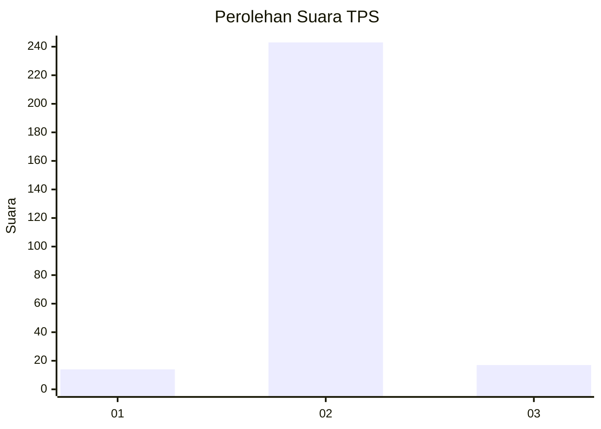
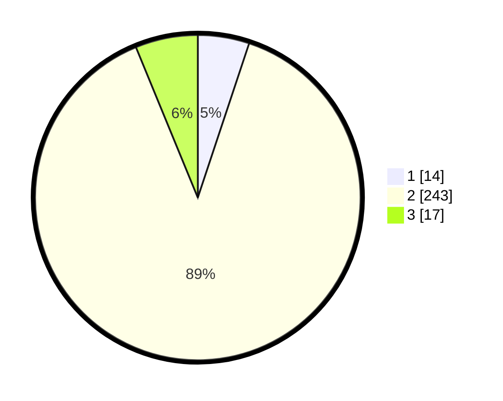

# Hasil

## Grafik

## Tabel

| No. | Nama Paslon    | Suara | Suara (raw) | Persentase |
|:--- |:-------------- | -----:| -----------:| ----------:|
| 1   | ANIES MUHAIMIN | 14    | [14][p-1]   | 5,11       |
| 2   | PRABOWO GIBRAN | 243   | [243][p-2]  | 88,69      |
| 3   | GANJAR MAHFUD  | 17    | [17][p-3]   | 6,20       |

[p-1]: https://github.com/gigit-pemilu/pemilu-2024-91-papua/blob/main/pilpres/hitung-suara/sub/91-papua/sub/71-kota-jayapura/sub/03-abepura/sub/1008-awiyo/sub/008-tps/sub/paslon-1.txt
[p-2]: https://github.com/gigit-pemilu/pemilu-2024-91-papua/blob/main/pilpres/hitung-suara/sub/91-papua/sub/71-kota-jayapura/sub/03-abepura/sub/1008-awiyo/sub/008-tps/sub/paslon-2.txt
[p-3]: https://github.com/gigit-pemilu/pemilu-2024-91-papua/blob/main/pilpres/hitung-suara/sub/91-papua/sub/71-kota-jayapura/sub/03-abepura/sub/1008-awiyo/sub/008-tps/sub/paslon-3.txt

## Foto C Plano

https://sirekap-obj-formc.kpu.go.id/521e/pemilu/ppwp/91/71/03/10/08/9171031008008-20240215-053226--1b316eb2-8ea9-4a0d-b858-6f17c34a7daf.jpg

https://sirekap-obj-formc.kpu.go.id/521e/pemilu/ppwp/91/71/03/10/08/9171031008008-20240214-232102--7d0f5301-0494-49d1-b2a9-5ebdde64ce95.jpg

https://sirekap-obj-formc.kpu.go.id/521e/pemilu/ppwp/91/71/03/10/08/9171031008008-20240214-232116--0a97c2d8-c553-469b-81b0-623c1e65153e.jpg

## Metadata

| Key        | Value               |
| ---------- | ------------------- |
| Time Stamp | 2024-02-16 08:30:27 |

