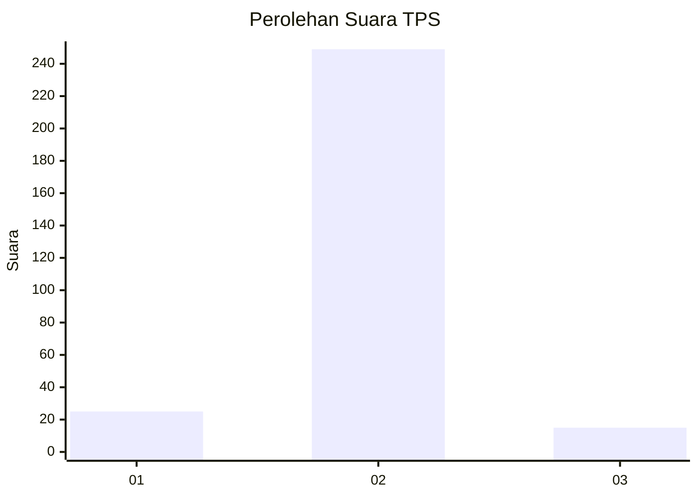
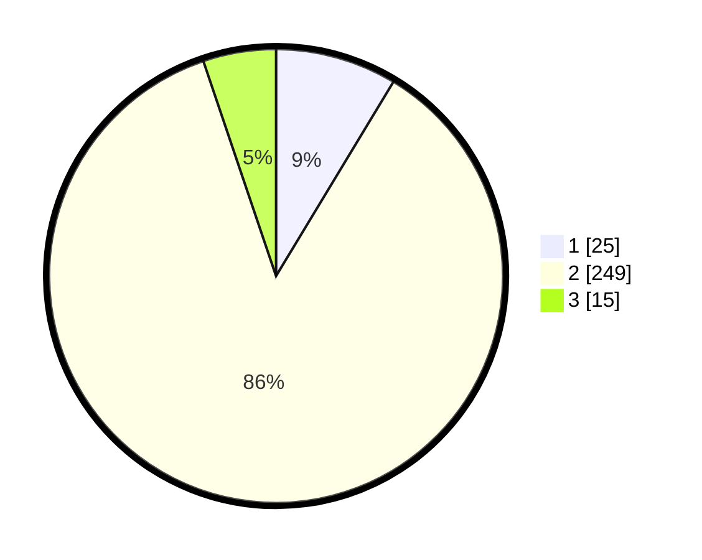

# Hasil

## Grafik

## Tabel

| No. | Nama Paslon    | Suara | Suara (raw) | Persentase |
|:--- |:-------------- | -----:| -----------:| ----------:|
| 1   | ANIES MUHAIMIN | 25    | [25][p-1]   | 8,65       |
| 2   | PRABOWO GIBRAN | 249   | [249][p-2]  | 86,16      |
| 3   | GANJAR MAHFUD  | 15    | [15][p-3]   | 5,19       |

[p-1]: https://github.com/gigit-pemilu/pemilu-2024-91-papua/blob/main/pilpres/hitung-suara/sub/91-papua/sub/71-kota-jayapura/sub/03-abepura/sub/1008-awiyo/sub/011-tps/sub/paslon-1.txt
[p-2]: https://github.com/gigit-pemilu/pemilu-2024-91-papua/blob/main/pilpres/hitung-suara/sub/91-papua/sub/71-kota-jayapura/sub/03-abepura/sub/1008-awiyo/sub/011-tps/sub/paslon-2.txt
[p-3]: https://github.com/gigit-pemilu/pemilu-2024-91-papua/blob/main/pilpres/hitung-suara/sub/91-papua/sub/71-kota-jayapura/sub/03-abepura/sub/1008-awiyo/sub/011-tps/sub/paslon-3.txt

## Foto C Plano

https://sirekap-obj-formc.kpu.go.id/4d96/pemilu/ppwp/91/71/03/10/08/9171031008011-20240215-050543--f3f5a892-aefa-45b3-b42a-a12ba53db345.jpg

https://sirekap-obj-formc.kpu.go.id/4d96/pemilu/ppwp/91/71/03/10/08/9171031008011-20240215-050646--4b27d518-7379-4e94-a7f8-e00317922e2e.jpg

https://sirekap-obj-formc.kpu.go.id/4d96/pemilu/ppwp/91/71/03/10/08/9171031008011-20240215-050756--29e3481b-abda-4295-a7d9-bd58c88caaa6.jpg

## Metadata

| Key        | Value               |
| ---------- | ------------------- |
| Time Stamp | 2024-02-24 22:31:28 |

