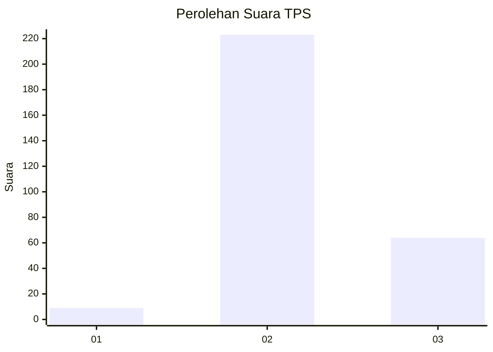

# Hasil

## Grafik

## Tabel

| No. | Nama Paslon    | Suara | Suara (raw) | Persentase |
|:--- |:-------------- | -----:| -----------:| ----------:|
| 1   | ANIES MUHAIMIN | 9     | [9][p-1]    | 3,04       |
| 2   | PRABOWO GIBRAN | 223   | [223][p-2]  | 75,34      |
| 3   | GANJAR MAHFUD  | 64    | [64][p-3]   | 21,62      |

[p-1]: https://github.com/gigit-pemilu/pemilu-2024-91-papua/blob/main/pilpres/hitung-suara/sub/91-papua/sub/71-kota-jayapura/sub/03-abepura/sub/1008-awiyo/sub/034-tps/sub/paslon-1.txt
[p-2]: https://github.com/gigit-pemilu/pemilu-2024-91-papua/blob/main/pilpres/hitung-suara/sub/91-papua/sub/71-kota-jayapura/sub/03-abepura/sub/1008-awiyo/sub/034-tps/sub/paslon-2.txt
[p-3]: https://github.com/gigit-pemilu/pemilu-2024-91-papua/blob/main/pilpres/hitung-suara/sub/91-papua/sub/71-kota-jayapura/sub/03-abepura/sub/1008-awiyo/sub/034-tps/sub/paslon-3.txt

## Foto C Plano

https://sirekap-obj-formc.kpu.go.id/384a/pemilu/ppwp/91/71/03/10/08/9171031008034-20240215-041358--535c50c4-a339-4043-b0f2-37ce0cbdef12.jpg

https://sirekap-obj-formc.kpu.go.id/384a/pemilu/ppwp/91/71/03/10/08/9171031008034-20240215-041421--7108638f-71ed-45e7-9974-8f55844ea1eb.jpg

https://sirekap-obj-formc.kpu.go.id/384a/pemilu/ppwp/91/71/03/10/08/9171031008034-20240215-041442--53bfce80-727a-443d-b37d-ffa1c997da6d.jpg

## Metadata

| Key        | Value               |
| ---------- | ------------------- |
| Time Stamp | 2024-02-16 08:30:27 |

