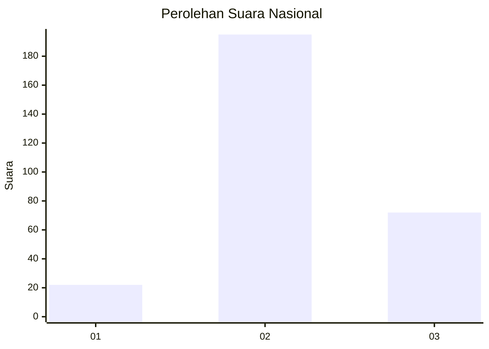
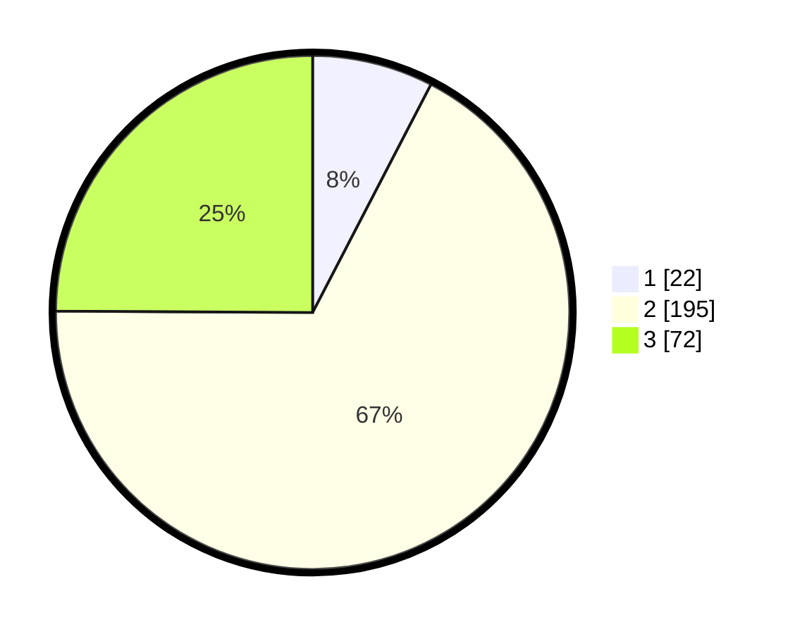

# Hasil

## Grafik

## Tabel

| No. | Nama Paslon    | Suara | Suara (raw) | Persentase |
|:--- |:-------------- | -----:| -----------:| ----------:|
| 1   | ANIES MUHAIMIN | 22    | [22][p-1]   | 7,61       |
| 2   | PRABOWO GIBRAN | 195   | [195][p-2]  | 67,47      |
| 3   | GANJAR MAHFUD  | 72    | [72][p-3]   | 24,91      |

[p-1]: https://github.com/gigit-pemilu/pemilu-2024/blob/main/pilpres/hitung-suara/sub/91-papua/sub/71-kota-jayapura/sub/03-abepura/sub/1008-awiyo/sub/035-tps/sub/paslon-1.txt
[p-2]: https://github.com/gigit-pemilu/pemilu-2024/blob/main/pilpres/hitung-suara/sub/91-papua/sub/71-kota-jayapura/sub/03-abepura/sub/1008-awiyo/sub/035-tps/sub/paslon-2.txt
[p-3]: https://github.com/gigit-pemilu/pemilu-2024/blob/main/pilpres/hitung-suara/sub/91-papua/sub/71-kota-jayapura/sub/03-abepura/sub/1008-awiyo/sub/035-tps/sub/paslon-3.txt

## Foto C Plano

https://sirekap-obj-formc.kpu.go.id/a8e6/pemilu/ppwp/91/71/03/10/08/9171031008035-20240215-031636--f8a5b0a4-6357-49d1-9d61-65cb7bfe4f9d.jpg

https://sirekap-obj-formc.kpu.go.id/a8e6/pemilu/ppwp/91/71/03/10/08/9171031008035-20240215-031818--9923e035-8c3e-4f17-bb75-fc53491bb1c5.jpg

https://sirekap-obj-formc.kpu.go.id/a8e6/pemilu/ppwp/91/71/03/10/08/9171031008035-20240215-032041--9b87d8e4-ca05-4043-aa77-eab20d00b2c7.jpg

## Metadata

| Key        | Value               |
| ---------- | ------------------- |
| Time Stamp | 2024-02-24 22:31:28 |

