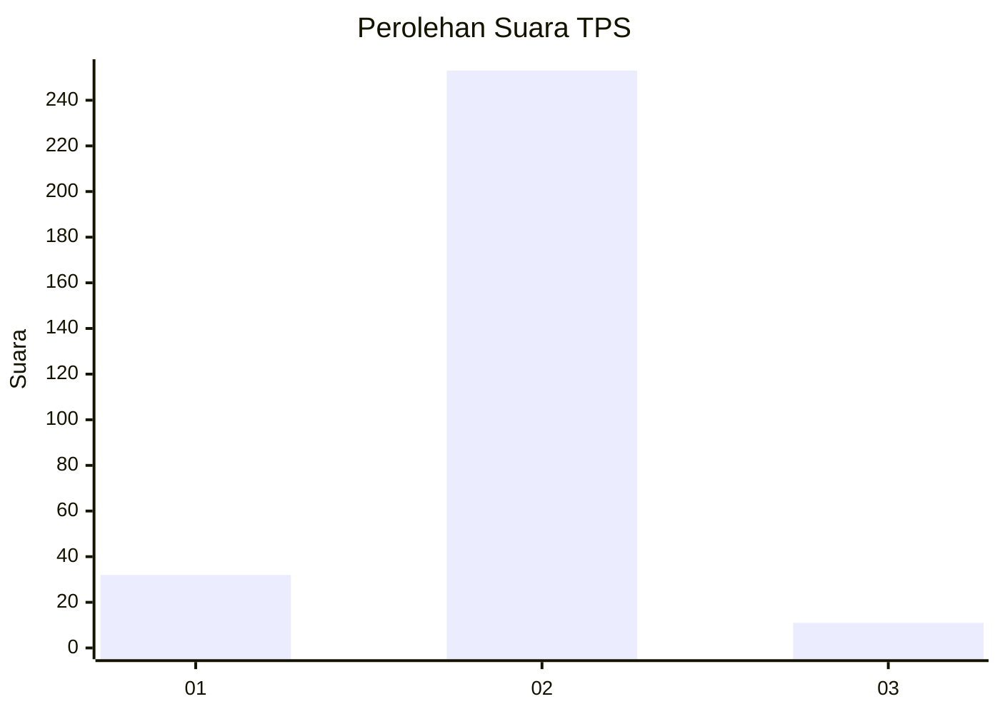
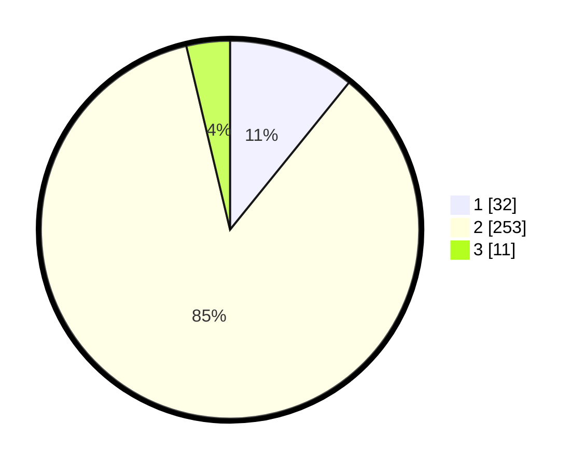

# Hasil

## Grafik

## Tabel

| No. | Nama Paslon    | Suara | Suara (raw) | Persentase |
|:--- |:-------------- | -----:| -----------:| ----------:|
| 1   | ANIES MUHAIMIN | 32    | [32][p-1]   | 10,81      |
| 2   | PRABOWO GIBRAN | 253   | [253][p-2]  | 85,47      |
| 3   | GANJAR MAHFUD  | 11    | [11][p-3]   | 3,72       |

[p-1]: https://github.com/gigit-pemilu/pemilu-2024-91-papua/blob/main/pilpres/hitung-suara/sub/91-papua/sub/71-kota-jayapura/sub/03-abepura/sub/1008-awiyo/sub/036-tps/sub/paslon-1.txt
[p-2]: https://github.com/gigit-pemilu/pemilu-2024-91-papua/blob/main/pilpres/hitung-suara/sub/91-papua/sub/71-kota-jayapura/sub/03-abepura/sub/1008-awiyo/sub/036-tps/sub/paslon-2.txt
[p-3]: https://github.com/gigit-pemilu/pemilu-2024-91-papua/blob/main/pilpres/hitung-suara/sub/91-papua/sub/71-kota-jayapura/sub/03-abepura/sub/1008-awiyo/sub/036-tps/sub/paslon-3.txt

## Foto C Plano

https://sirekap-obj-formc.kpu.go.id/5e1b/pemilu/ppwp/91/71/03/10/08/9171031008036-20240215-004121--15eeebf0-2477-494c-bb59-b77cfc320b54.jpg

https://sirekap-obj-formc.kpu.go.id/5e1b/pemilu/ppwp/91/71/03/10/08/9171031008036-20240215-004348--f6ec7da7-4c7f-40aa-a8a4-3578e06952ce.jpg

https://sirekap-obj-formc.kpu.go.id/5e1b/pemilu/ppwp/91/71/03/10/08/9171031008036-20240215-004607--2f045427-68f0-4c87-b11d-5f9b710c000b.jpg

## Metadata

| Key        | Value               |
| ---------- | ------------------- |
| Time Stamp | 2024-02-25 22:00:00 |

