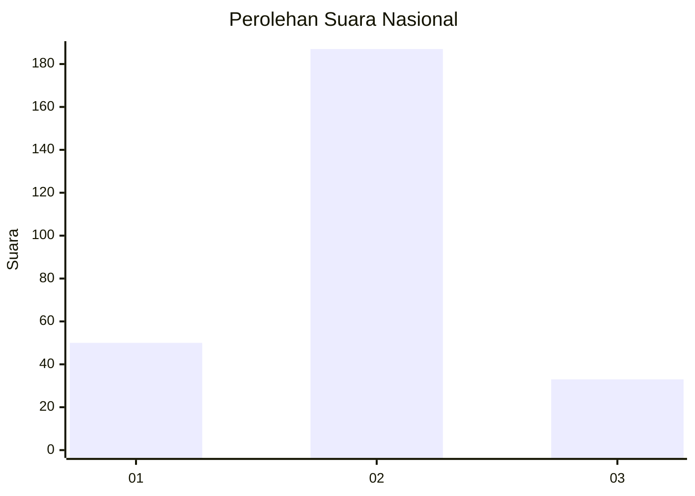
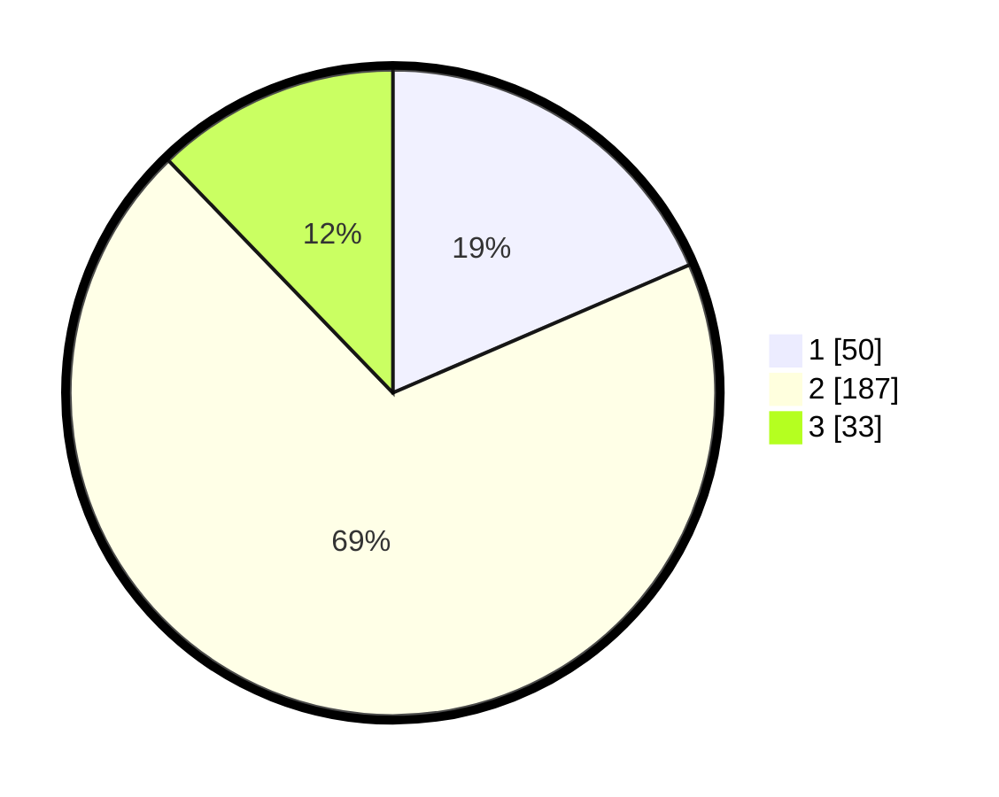

# Hasil

## Grafik

## Tabel

| No. | Nama Paslon    | Suara | Suara (raw) | Persentase |
|:--- |:-------------- | -----:| -----------:| ----------:|
| 1   | ANIES MUHAIMIN | 50    | [50][p-1]   | 18,52      |
| 2   | PRABOWO GIBRAN | 187   | [187][p-2]  | 69,26      |
| 3   | GANJAR MAHFUD  | 33    | [33][p-3]   | 12,22      |

[p-1]: https://github.com/gigit-pemilu/pemilu-2024/blob/main/pilpres/hitung-suara/sub/91-papua/sub/71-kota-jayapura/sub/03-abepura/sub/1008-awiyo/sub/037-tps/sub/paslon-1.txt
[p-2]: https://github.com/gigit-pemilu/pemilu-2024/blob/main/pilpres/hitung-suara/sub/91-papua/sub/71-kota-jayapura/sub/03-abepura/sub/1008-awiyo/sub/037-tps/sub/paslon-2.txt
[p-3]: https://github.com/gigit-pemilu/pemilu-2024/blob/main/pilpres/hitung-suara/sub/91-papua/sub/71-kota-jayapura/sub/03-abepura/sub/1008-awiyo/sub/037-tps/sub/paslon-3.txt

## Foto C Plano

https://sirekap-obj-formc.kpu.go.id/cc98/pemilu/ppwp/91/71/03/10/08/9171031008037-20240215-010757--e3ff4177-a13f-42ad-8d4b-91207d207db5.jpg

https://sirekap-obj-formc.kpu.go.id/cc98/pemilu/ppwp/91/71/03/10/08/9171031008037-20240215-010914--08f0e694-39e4-49ab-857a-1e07d3288b59.jpg

https://sirekap-obj-formc.kpu.go.id/cc98/pemilu/ppwp/91/71/03/10/08/9171031008037-20240215-011046--b194651e-31d3-4b80-ab58-5454e3095a07.jpg

## Metadata

| Key        | Value               |
| ---------- | ------------------- |
| Time Stamp | 2024-02-25 12:00:00 |

