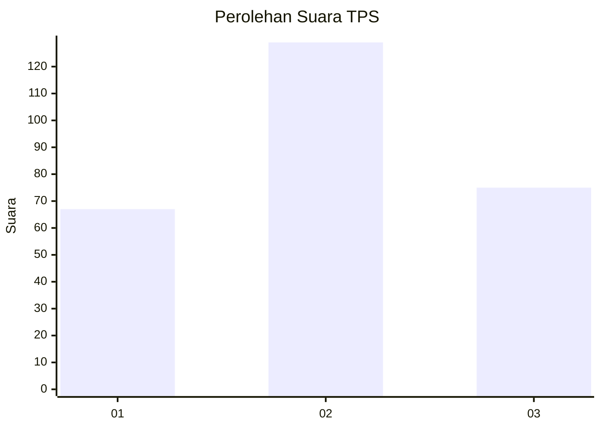
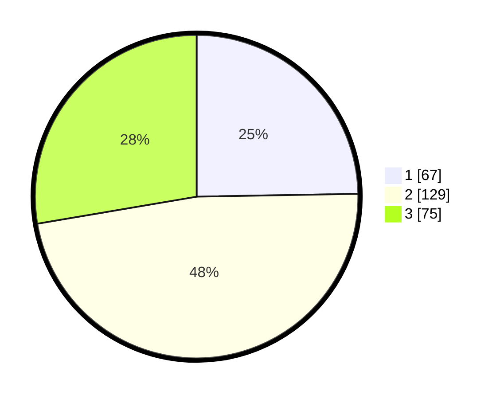

# Hasil

## Grafik

## Tabel

| No. | Nama Paslon    | Suara | Suara (raw) | Persentase |
|:--- |:-------------- | -----:| -----------:| ----------:|
| 1   | ANIES MUHAIMIN | 67    | [67][p-1]   | 24,72      |
| 2   | PRABOWO GIBRAN | 129   | [129][p-2]  | 47,60      |
| 3   | GANJAR MAHFUD  | 75    | [75][p-3]   | 27,68      |

[p-1]: https://github.com/gigit-pemilu/pemilu-2024-91-papua/blob/main/pilpres/hitung-suara/sub/91-papua/sub/71-kota-jayapura/sub/03-abepura/sub/1008-awiyo/sub/044-tps/sub/paslon-1.txt
[p-2]: https://github.com/gigit-pemilu/pemilu-2024-91-papua/blob/main/pilpres/hitung-suara/sub/91-papua/sub/71-kota-jayapura/sub/03-abepura/sub/1008-awiyo/sub/044-tps/sub/paslon-2.txt
[p-3]: https://github.com/gigit-pemilu/pemilu-2024-91-papua/blob/main/pilpres/hitung-suara/sub/91-papua/sub/71-kota-jayapura/sub/03-abepura/sub/1008-awiyo/sub/044-tps/sub/paslon-3.txt

## Foto C Plano

https://sirekap-obj-formc.kpu.go.id/6bd2/pemilu/ppwp/91/71/03/10/08/9171031008044-20240215-033626--cf950e23-ead9-41ba-b1c5-085ed55079ce.jpg

https://sirekap-obj-formc.kpu.go.id/6bd2/pemilu/ppwp/91/71/03/10/08/9171031008044-20240215-033618--7c208aa2-354c-459d-a59b-215e3783b2cd.jpg

https://sirekap-obj-formc.kpu.go.id/6bd2/pemilu/ppwp/91/71/03/10/08/9171031008044-20240214-202041--1dee3b7e-0537-4042-b805-4a7a8fd80558.jpg

## Metadata

| Key        | Value               |
| ---------- | ------------------- |
| Time Stamp | 2024-02-25 12:00:00 |

