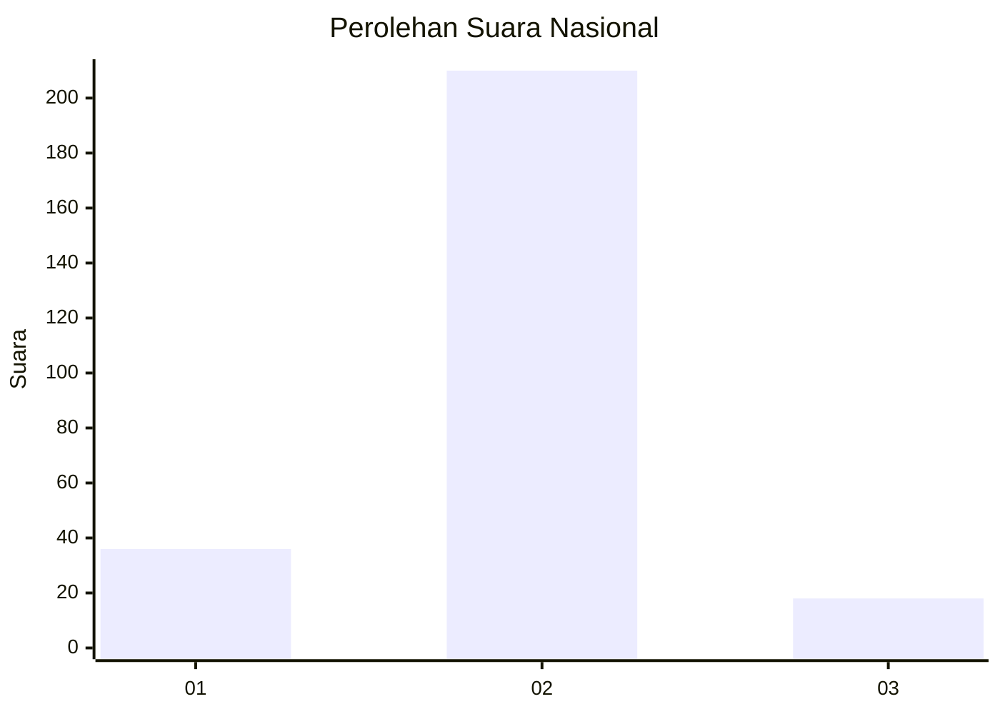
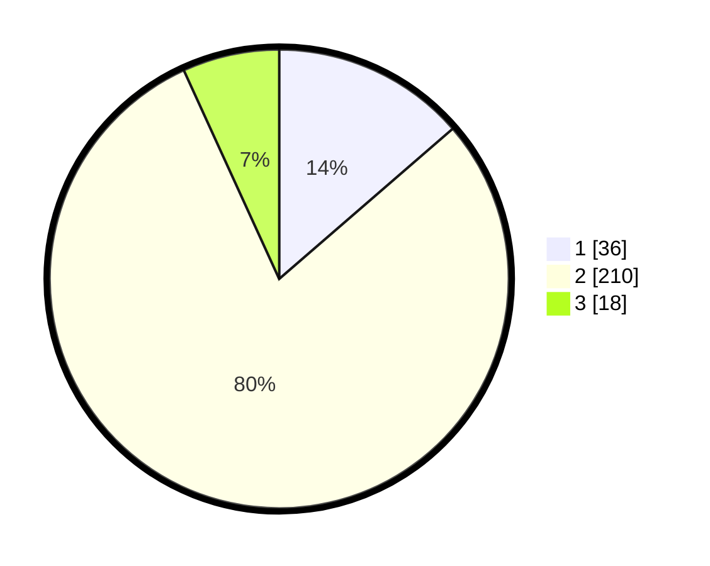

# Hasil

## Grafik

## Tabel

| No. | Nama Paslon    | Suara | Suara (raw) | Persentase |
|:--- |:-------------- | -----:| -----------:| ----------:|
| 1   | ANIES MUHAIMIN | 36    | [36][p-1]   | 13,64      |
| 2   | PRABOWO GIBRAN | 210   | [210][p-2]  | 79,55      |
| 3   | GANJAR MAHFUD  | 18    | [18][p-3]   | 6,82       |

[p-1]: https://github.com/gigit-pemilu/pemilu-2024/blob/main/pilpres/hitung-suara/sub/91-papua/sub/71-kota-jayapura/sub/03-abepura/sub/1010-yobe/sub/006-tps/sub/paslon-1.txt
[p-2]: https://github.com/gigit-pemilu/pemilu-2024/blob/main/pilpres/hitung-suara/sub/91-papua/sub/71-kota-jayapura/sub/03-abepura/sub/1010-yobe/sub/006-tps/sub/paslon-2.txt
[p-3]: https://github.com/gigit-pemilu/pemilu-2024/blob/main/pilpres/hitung-suara/sub/91-papua/sub/71-kota-jayapura/sub/03-abepura/sub/1010-yobe/sub/006-tps/sub/paslon-3.txt

## Foto C Plano

https://sirekap-obj-formc.kpu.go.id/2ace/pemilu/ppwp/91/71/03/10/10/9171031010006-20240215-093339--7f84b218-c31f-41b4-8cf0-27c11b87f56b.jpg

https://sirekap-obj-formc.kpu.go.id/2ace/pemilu/ppwp/91/71/03/10/10/9171031010006-20240215-053346--db586910-f641-470e-a3b5-0a5001ed77ac.jpg

https://sirekap-obj-formc.kpu.go.id/2ace/pemilu/ppwp/91/71/03/10/10/9171031010006-20240215-093622--0c01c346-cf81-4eb9-a46c-42d73d9d93ea.jpg

## Metadata

| Key        | Value               |
| ---------- | ------------------- |
| Time Stamp | 2024-02-16 09:00:28 |

