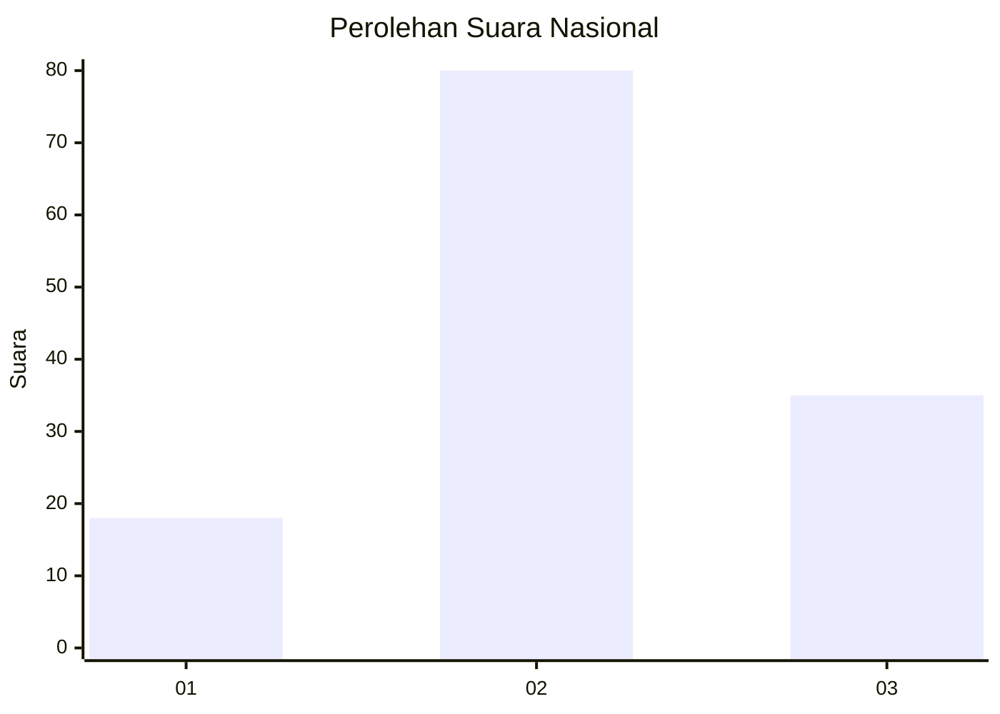
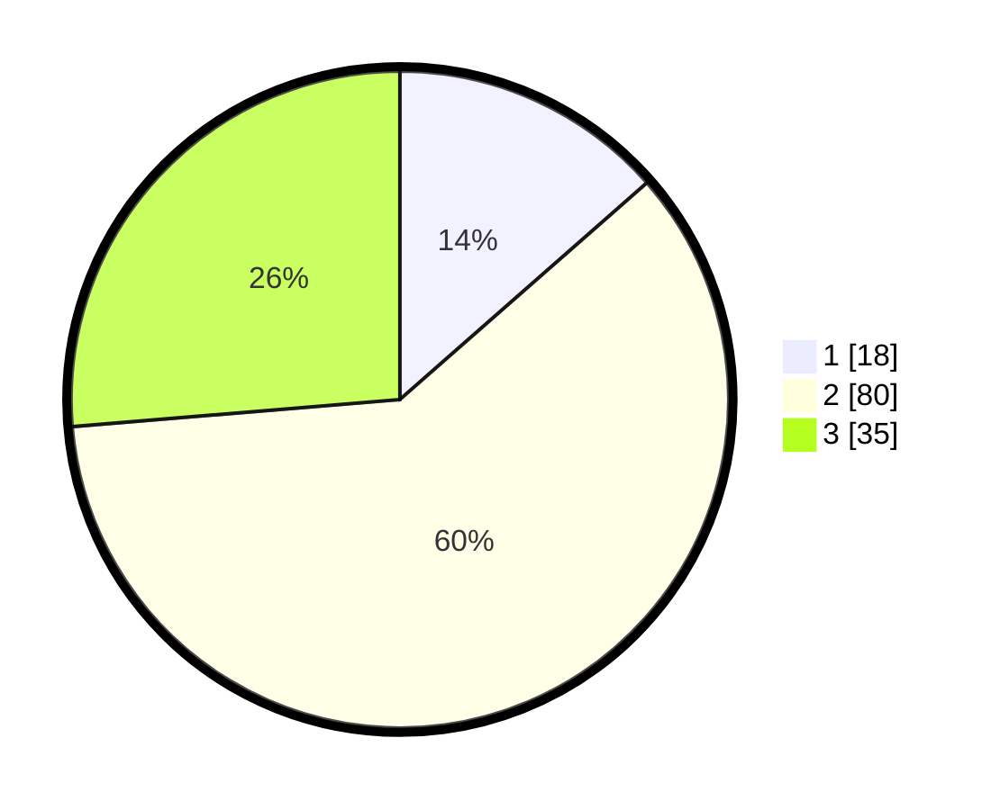

# Hasil

## Grafik

## Tabel

| No. | Nama Paslon    | Suara | Suara (raw) | Persentase |
|:--- |:-------------- | -----:| -----------:| ----------:|
| 1   | ANIES MUHAIMIN | 18    | [18][p-1]   | 13,53      |
| 2   | PRABOWO GIBRAN | 80    | [80][p-2]   | 60,15      |
| 3   | GANJAR MAHFUD  | 35    | [35][p-3]   | 26,32      |

[p-1]: https://github.com/gigit-pemilu/pemilu-2024/blob/main/pilpres/hitung-suara/sub/91-papua/sub/71-kota-jayapura/sub/03-abepura/sub/1010-yobe/sub/013-tps/sub/paslon-1.txt
[p-2]: https://github.com/gigit-pemilu/pemilu-2024/blob/main/pilpres/hitung-suara/sub/91-papua/sub/71-kota-jayapura/sub/03-abepura/sub/1010-yobe/sub/013-tps/sub/paslon-2.txt
[p-3]: https://github.com/gigit-pemilu/pemilu-2024/blob/main/pilpres/hitung-suara/sub/91-papua/sub/71-kota-jayapura/sub/03-abepura/sub/1010-yobe/sub/013-tps/sub/paslon-3.txt

## Foto C Plano

https://sirekap-obj-formc.kpu.go.id/7f41/pemilu/ppwp/91/71/03/10/10/9171031010013-20240214-210726--0c08d555-cc52-4105-9c84-d333c82bd6ef.jpg

https://sirekap-obj-formc.kpu.go.id/7f41/pemilu/ppwp/91/71/03/10/10/9171031010013-20240214-210831--7752b056-07ba-46ba-9568-afa0d9939a45.jpg

https://sirekap-obj-formc.kpu.go.id/7f41/pemilu/ppwp/91/71/03/10/10/9171031010013-20240214-211125--260e1a13-0d7a-4a80-a954-561852cf82fd.jpg

## Metadata

| Key        | Value               |
| ---------- | ------------------- |
| Time Stamp | 2024-02-16 09:30:28 |

