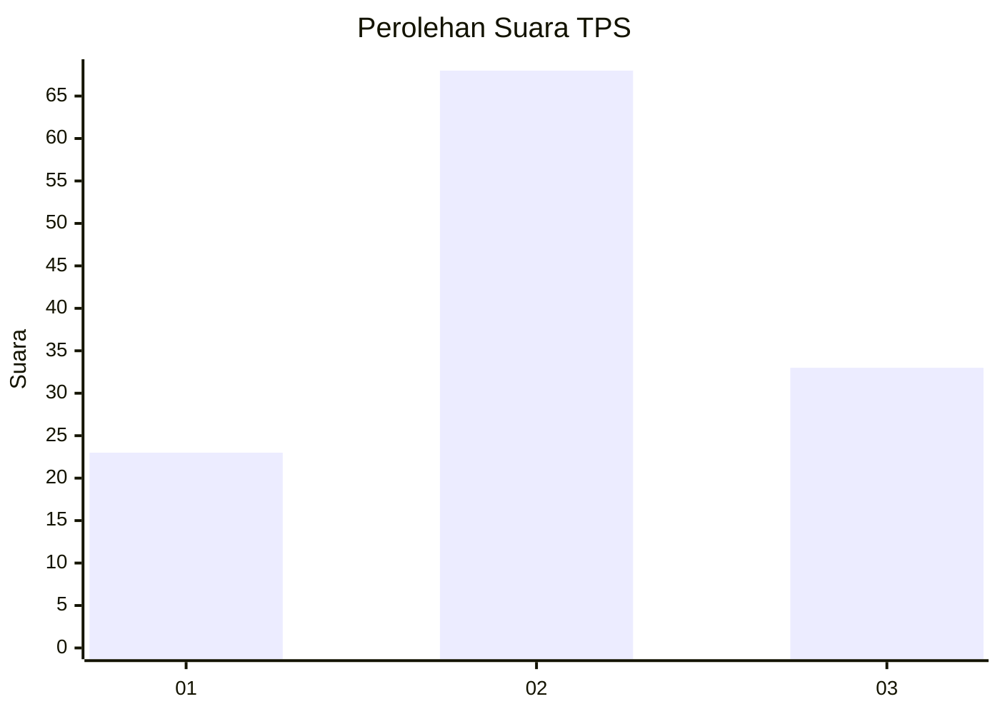
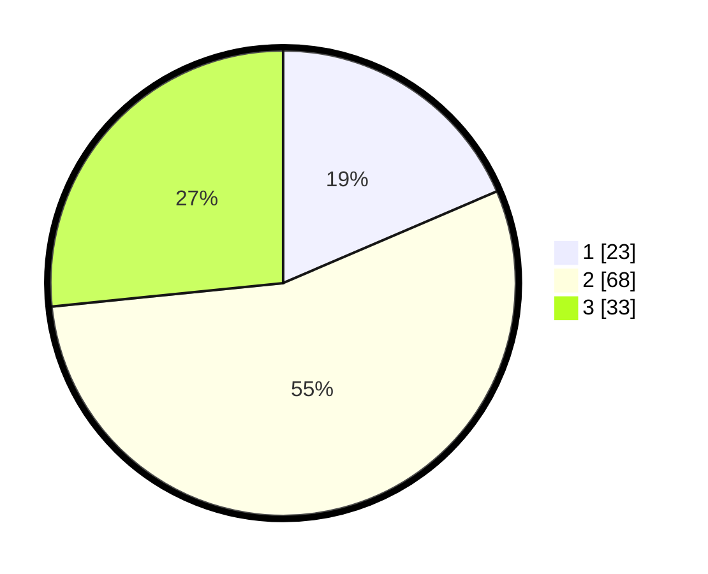

# Hasil

## Grafik

## Tabel

| No. | Nama Paslon    | Suara | Suara (raw) | Persentase |
|:--- |:-------------- | -----:| -----------:| ----------:|
| 1   | ANIES MUHAIMIN | 23    | [23][p-1]   | 18,55      |
| 2   | PRABOWO GIBRAN | 68    | [68][p-2]   | 54,84      |
| 3   | GANJAR MAHFUD  | 33    | [33][p-3]   | 26,61      |

[p-1]: https://github.com/gigit-pemilu/pemilu-2024-91-papua/blob/main/pilpres/hitung-suara/sub/91-papua/sub/71-kota-jayapura/sub/03-abepura/sub/1010-yobe/sub/015-tps/sub/paslon-1.txt
[p-2]: https://github.com/gigit-pemilu/pemilu-2024-91-papua/blob/main/pilpres/hitung-suara/sub/91-papua/sub/71-kota-jayapura/sub/03-abepura/sub/1010-yobe/sub/015-tps/sub/paslon-2.txt
[p-3]: https://github.com/gigit-pemilu/pemilu-2024-91-papua/blob/main/pilpres/hitung-suara/sub/91-papua/sub/71-kota-jayapura/sub/03-abepura/sub/1010-yobe/sub/015-tps/sub/paslon-3.txt

## Foto C Plano

https://sirekap-obj-formc.kpu.go.id/f308/pemilu/ppwp/91/71/03/10/10/9171031010015-20240214-195722--40727c6f-cf0b-4b84-bef5-f9e01c328675.jpg

https://sirekap-obj-formc.kpu.go.id/f308/pemilu/ppwp/91/71/03/10/10/9171031010015-20240214-200545--0f462034-ff9a-4d7e-9022-f81d071e3f6c.jpg

https://sirekap-obj-formc.kpu.go.id/f308/pemilu/ppwp/91/71/03/10/10/9171031010015-20240214-200652--2ffdaadd-47cf-400b-89fe-56dbe9010e7d.jpg

## Metadata

| Key        | Value               |
| ---------- | ------------------- |
| Time Stamp | 2024-02-16 09:30:28 |

