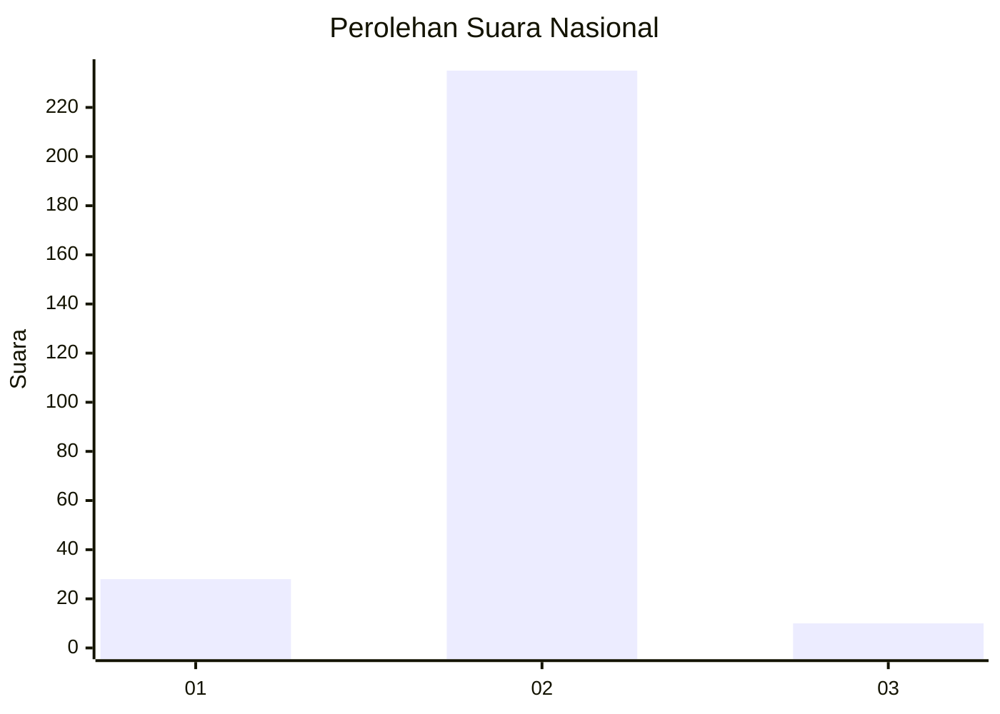
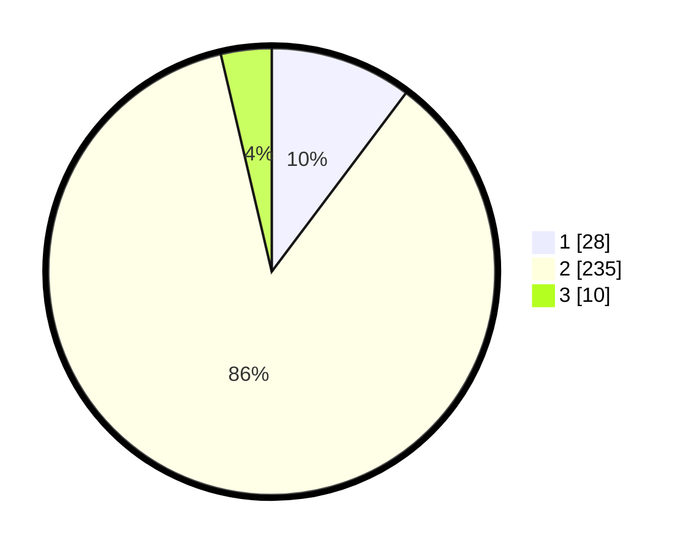

# Hasil

## Grafik

## Tabel

| No. | Nama Paslon    | Suara | Suara (raw) | Persentase |
|:--- |:-------------- | -----:| -----------:| ----------:|
| 1   | ANIES MUHAIMIN | 28    | [28][p-1]   | 10,26      |
| 2   | PRABOWO GIBRAN | 235   | [235][p-2]  | 86,08      |
| 3   | GANJAR MAHFUD  | 10    | [10][p-3]   | 3,66       |

[p-1]: https://github.com/gigit-pemilu/pemilu-2024/blob/main/pilpres/hitung-suara/sub/91-papua/sub/71-kota-jayapura/sub/03-abepura/sub/1011-abepantai/sub/002-tps/sub/paslon-1.txt
[p-2]: https://github.com/gigit-pemilu/pemilu-2024/blob/main/pilpres/hitung-suara/sub/91-papua/sub/71-kota-jayapura/sub/03-abepura/sub/1011-abepantai/sub/002-tps/sub/paslon-2.txt
[p-3]: https://github.com/gigit-pemilu/pemilu-2024/blob/main/pilpres/hitung-suara/sub/91-papua/sub/71-kota-jayapura/sub/03-abepura/sub/1011-abepantai/sub/002-tps/sub/paslon-3.txt

## Foto C Plano

https://sirekap-obj-formc.kpu.go.id/44ff/pemilu/ppwp/91/71/03/10/11/9171031011002-20240219-133657--4eb3cf3b-da6b-435a-a0e6-7b9b38edc810.jpg

https://sirekap-obj-formc.kpu.go.id/44ff/pemilu/ppwp/91/71/03/10/11/9171031011002-20240219-133859--c6393ee2-5eef-4051-8985-344c7d3865c6.jpg

https://sirekap-obj-formc.kpu.go.id/44ff/pemilu/ppwp/91/71/03/10/11/9171031011002-20240219-133942--3c77b11f-6e3b-465c-8007-3d2089a175c8.jpg

## Metadata

| Key        | Value               |
| ---------- | ------------------- |
| Time Stamp | 2024-02-22 12:00:00 |

