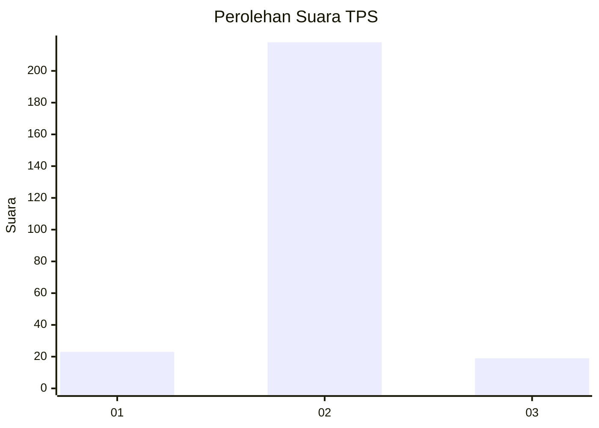
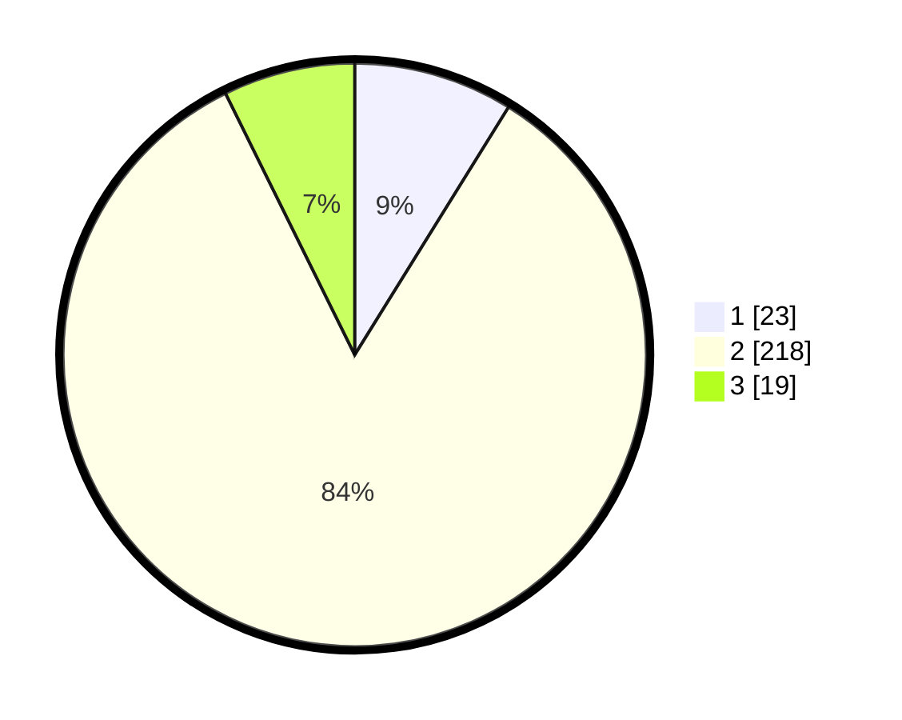

# Hasil

## Grafik

## Tabel

| No. | Nama Paslon    | Suara | Suara (raw) | Persentase |
|:--- |:-------------- | -----:| -----------:| ----------:|
| 1   | ANIES MUHAIMIN | 23    | [23][p-1]   | 8,85       |
| 2   | PRABOWO GIBRAN | 218   | [218][p-2]  | 83,85      |
| 3   | GANJAR MAHFUD  | 19    | [19][p-3]   | 7,31       |

[p-1]: https://github.com/gigit-pemilu/pemilu-2024-91-papua/blob/main/pilpres/hitung-suara/sub/91-papua/sub/71-kota-jayapura/sub/03-abepura/sub/1011-abepantai/sub/003-tps/sub/paslon-1.txt
[p-2]: https://github.com/gigit-pemilu/pemilu-2024-91-papua/blob/main/pilpres/hitung-suara/sub/91-papua/sub/71-kota-jayapura/sub/03-abepura/sub/1011-abepantai/sub/003-tps/sub/paslon-2.txt
[p-3]: https://github.com/gigit-pemilu/pemilu-2024-91-papua/blob/main/pilpres/hitung-suara/sub/91-papua/sub/71-kota-jayapura/sub/03-abepura/sub/1011-abepantai/sub/003-tps/sub/paslon-3.txt

## Foto C Plano

https://sirekap-obj-formc.kpu.go.id/ddba/pemilu/ppwp/91/71/03/10/11/9171031011003-20240219-134348--914df552-f19c-49b5-bb88-f779d25d6de4.jpg

https://sirekap-obj-formc.kpu.go.id/ddba/pemilu/ppwp/91/71/03/10/11/9171031011003-20240219-134514--dec9bb10-1225-4c26-93a4-ed22d8cd9bf0.jpg

https://sirekap-obj-formc.kpu.go.id/ddba/pemilu/ppwp/91/71/03/10/11/9171031011003-20240215-052146--42c8ba5b-4180-4fe2-8910-9576e63fa195.jpg

## Metadata

| Key        | Value               |
| ---------- | ------------------- |
| Time Stamp | 2024-02-22 12:00:00 |

