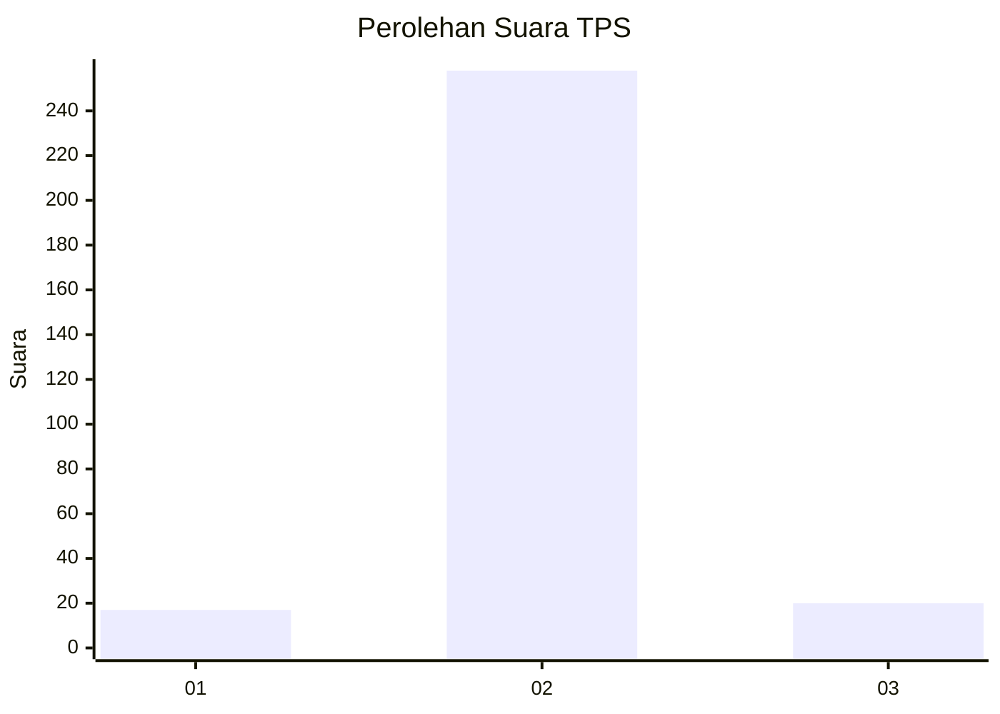
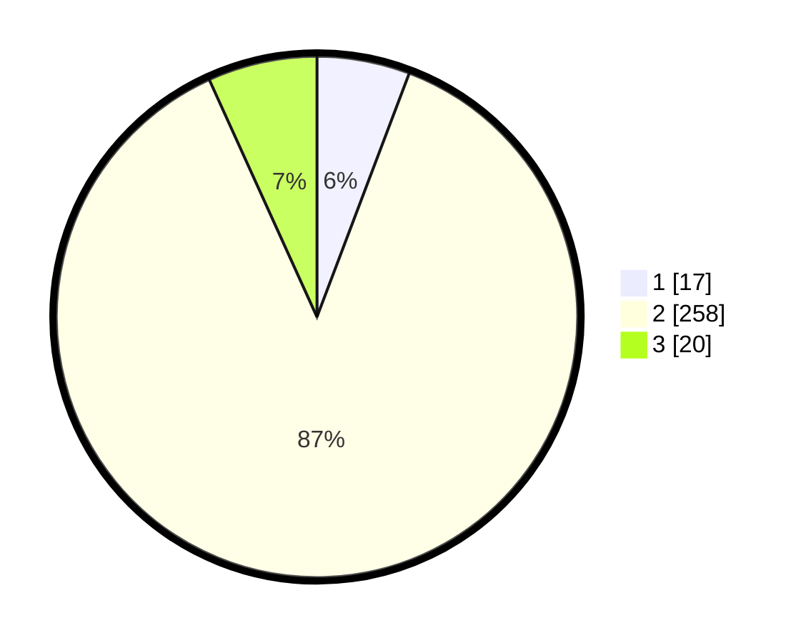

# Hasil

## Grafik

## Tabel

| No. | Nama Paslon    | Suara | Suara (raw) | Persentase |
|:--- |:-------------- | -----:| -----------:| ----------:|
| 1   | ANIES MUHAIMIN | 17    | [17][p-1]   | 5,76       |
| 2   | PRABOWO GIBRAN | 258   | [258][p-2]  | 87,46      |
| 3   | GANJAR MAHFUD  | 20    | [20][p-3]   | 6,78       |

[p-1]: https://github.com/gigit-pemilu/pemilu-2024-91-papua/blob/main/pilpres/hitung-suara/sub/91-papua/sub/71-kota-jayapura/sub/03-abepura/sub/1011-abepantai/sub/005-tps/sub/paslon-1.txt
[p-2]: https://github.com/gigit-pemilu/pemilu-2024-91-papua/blob/main/pilpres/hitung-suara/sub/91-papua/sub/71-kota-jayapura/sub/03-abepura/sub/1011-abepantai/sub/005-tps/sub/paslon-2.txt
[p-3]: https://github.com/gigit-pemilu/pemilu-2024-91-papua/blob/main/pilpres/hitung-suara/sub/91-papua/sub/71-kota-jayapura/sub/03-abepura/sub/1011-abepantai/sub/005-tps/sub/paslon-3.txt

## Foto C Plano

https://sirekap-obj-formc.kpu.go.id/e6bf/pemilu/ppwp/91/71/03/10/11/9171031011005-20240219-135717--af640ae9-c78c-407e-8ce2-a0a07f28b96b.jpg

https://sirekap-obj-formc.kpu.go.id/e6bf/pemilu/ppwp/91/71/03/10/11/9171031011005-20240219-135821--a2ac967d-0be1-4451-bfc3-2b2f7a363644.jpg

https://sirekap-obj-formc.kpu.go.id/e6bf/pemilu/ppwp/91/71/03/10/11/9171031011005-20240219-135900--1ff27dc8-9043-4d72-aee3-b80fd5509c86.jpg

## Metadata

| Key        | Value               |
| ---------- | ------------------- |
| Time Stamp | 2024-02-22 12:00:00 |

