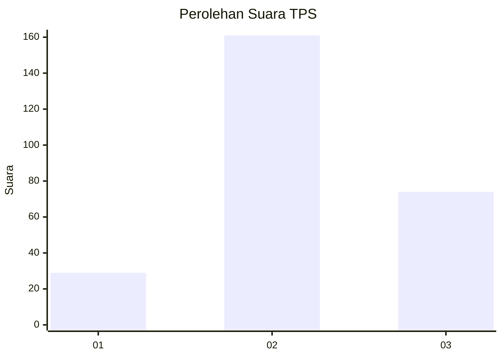
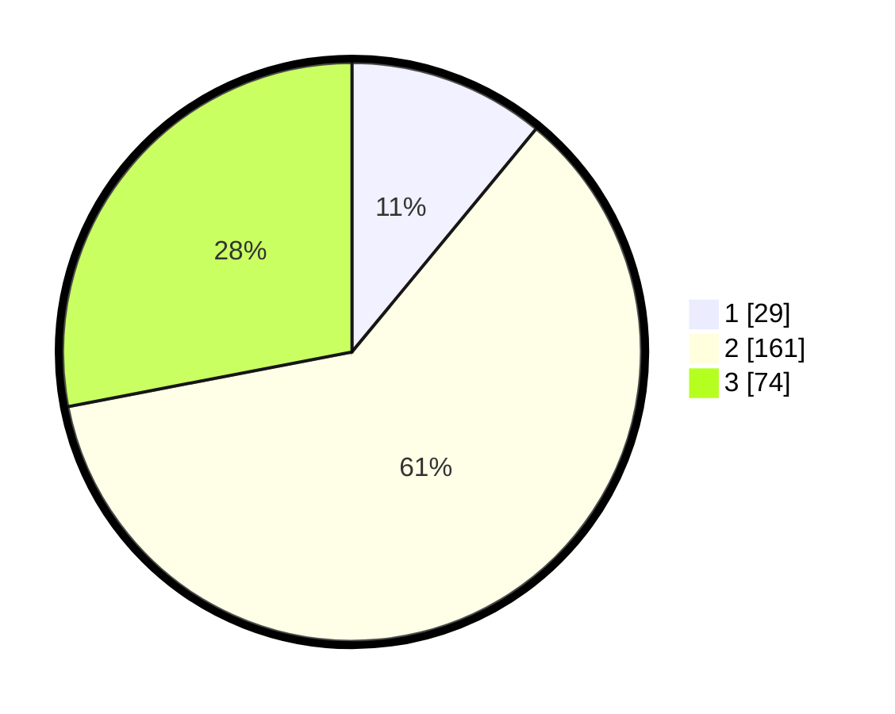

# Hasil

## Grafik

## Tabel

| No. | Nama Paslon    | Suara | Suara (raw) | Persentase |
|:--- |:-------------- | -----:| -----------:| ----------:|
| 1   | ANIES MUHAIMIN | 29    | [29][p-1]   | 10,98      |
| 2   | PRABOWO GIBRAN | 161   | [161][p-2]  | 60,98      |
| 3   | GANJAR MAHFUD  | 74    | [74][p-3]   | 28,03      |

[p-1]: https://github.com/gigit-pemilu/pemilu-2024-91-papua/blob/main/pilpres/hitung-suara/sub/91-papua/sub/71-kota-jayapura/sub/03-abepura/sub/1012-kota-baru/sub/001-tps/sub/paslon-1.txt
[p-2]: https://github.com/gigit-pemilu/pemilu-2024-91-papua/blob/main/pilpres/hitung-suara/sub/91-papua/sub/71-kota-jayapura/sub/03-abepura/sub/1012-kota-baru/sub/001-tps/sub/paslon-2.txt
[p-3]: https://github.com/gigit-pemilu/pemilu-2024-91-papua/blob/main/pilpres/hitung-suara/sub/91-papua/sub/71-kota-jayapura/sub/03-abepura/sub/1012-kota-baru/sub/001-tps/sub/paslon-3.txt

## Foto C Plano

https://sirekap-obj-formc.kpu.go.id/3c78/pemilu/ppwp/91/71/03/10/12/9171031012001-20240214-203555--f4c6c6c6-5f64-45d1-b202-a48cc513644a.jpg

https://sirekap-obj-formc.kpu.go.id/3c78/pemilu/ppwp/91/71/03/10/12/9171031012001-20240214-203819--040d88d0-2f9e-453e-8dea-d408e5fdec4f.jpg

https://sirekap-obj-formc.kpu.go.id/3c78/pemilu/ppwp/91/71/03/10/12/9171031012001-20240214-204309--0e7ab5a1-29c8-45be-8a0c-c0753d1d22bf.jpg

## Metadata

| Key        | Value               |
| ---------- | ------------------- |
| Time Stamp | 2024-02-16 09:30:28 |

