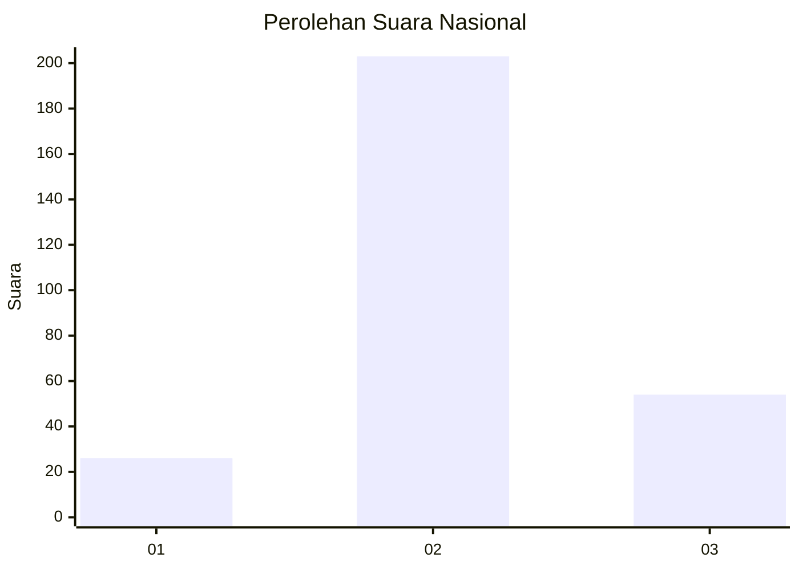
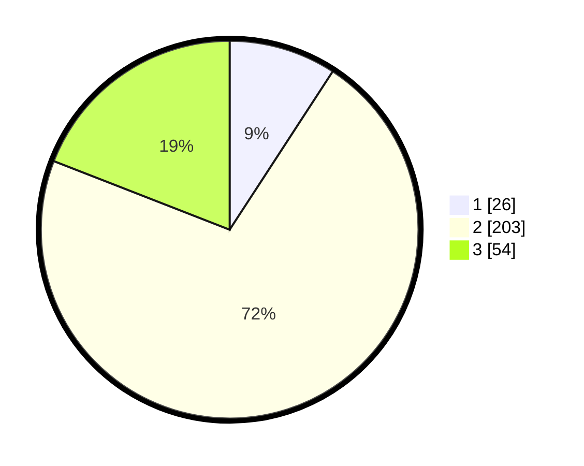

# Hasil

## Grafik

## Tabel

| No. | Nama Paslon    | Suara | Suara (raw) | Persentase |
|:--- |:-------------- | -----:| -----------:| ----------:|
| 1   | ANIES MUHAIMIN | 26    | [26][p-1]   | 9,19       |
| 2   | PRABOWO GIBRAN | 203   | [203][p-2]  | 71,73      |
| 3   | GANJAR MAHFUD  | 54    | [54][p-3]   | 19,08      |

[p-1]: https://github.com/gigit-pemilu/pemilu-2024/blob/main/pilpres/hitung-suara/sub/91-papua/sub/71-kota-jayapura/sub/03-abepura/sub/1012-kota-baru/sub/022-tps/sub/paslon-1.txt
[p-2]: https://github.com/gigit-pemilu/pemilu-2024/blob/main/pilpres/hitung-suara/sub/91-papua/sub/71-kota-jayapura/sub/03-abepura/sub/1012-kota-baru/sub/022-tps/sub/paslon-2.txt
[p-3]: https://github.com/gigit-pemilu/pemilu-2024/blob/main/pilpres/hitung-suara/sub/91-papua/sub/71-kota-jayapura/sub/03-abepura/sub/1012-kota-baru/sub/022-tps/sub/paslon-3.txt

## Foto C Plano

https://sirekap-obj-formc.kpu.go.id/aa54/pemilu/ppwp/91/71/03/10/12/9171031012022-20240215-023145--a6f7a429-b557-4467-a5da-5ebc48e860ff.jpg

https://sirekap-obj-formc.kpu.go.id/aa54/pemilu/ppwp/91/71/03/10/12/9171031012022-20240215-013537--01fa3ce8-d930-46e3-a5f7-492499750f11.jpg

https://sirekap-obj-formc.kpu.go.id/aa54/pemilu/ppwp/91/71/03/10/12/9171031012022-20240214-194550--577ccbfd-629e-42db-89a0-ced255cce856.jpg

## Metadata

| Key        | Value               |
| ---------- | ------------------- |
| Time Stamp | 2024-02-25 17:00:00 |

